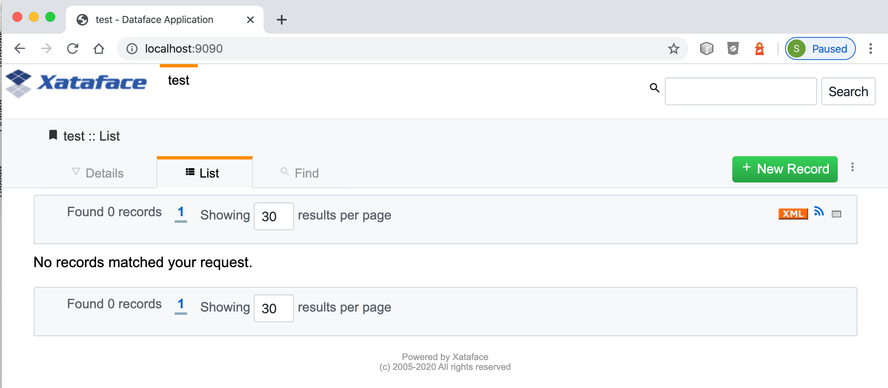
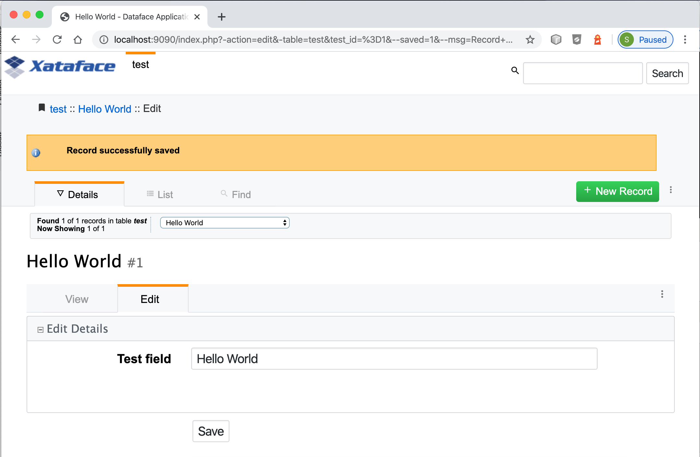
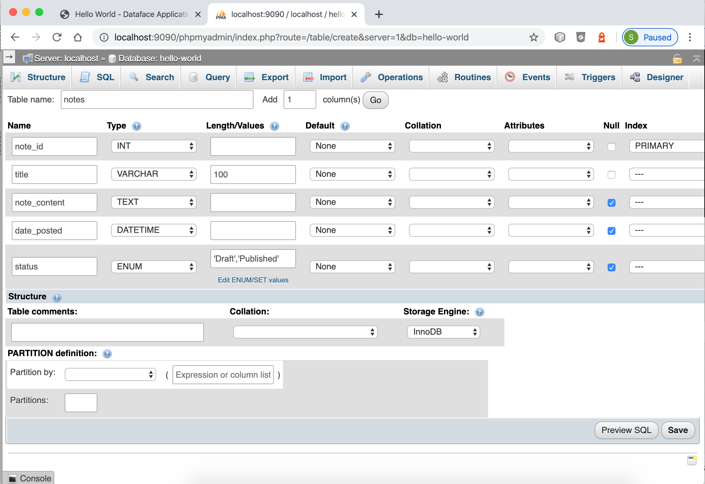
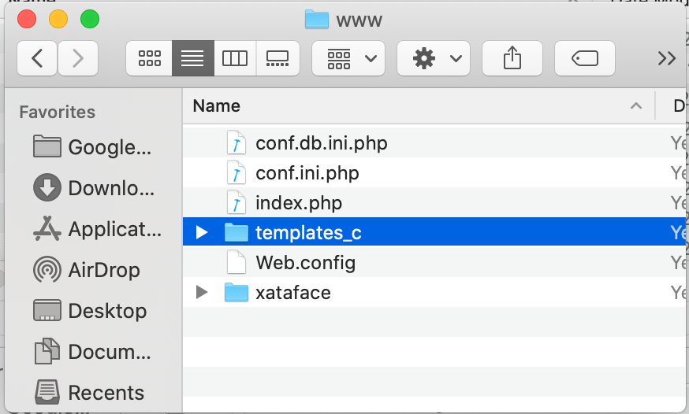

= Creating your first Xataface app

Now that you have xataface installed, we can proceed to create our first app.

[IMPORTANT]
====
Please ensure that you have both `mysql` and `apachectl` in your PATH.  If you are using XAMPP for your server, this can be accomplished with the following command:

[source,bash]
----
export PATH=/Applications/XAMPP/xamppfiles/bin:$PATH
----
====

Open a command prompt and enter:

[source,bash]
----
xataface create hello-world
----

The output will be as follows:

[source,console]
----
$ xataface create hello-world
Create project at hello-world
Setting up scaffold at hello-world ...Done
Checking for PHPMyAdmin installation...Found.
Linking /Users/shannah/.xataface/phpmyadmin to hello-world/lib/phpmyadmin ...Done.
Copying xataface to hello-world/www/xataface ...Done.
Removing hello-world/www/xataface/site_skeleton ...Done.
Initializing database ... 
Starting mysql server...Started Successfully
Bootstrapping database...Done
Stopping mysql server...Stopped
Done
----

At this point, you should have a new directory named "hello-world", which contains our application's directory structure.

We can launch our app by "cd"ing into our new "hello-world" directory and running:

[source,bash]
----
xataface start
----

This will fire up MySQL and Apache with document root at "www" and the database stored in "data"

The console output will be something like:

[source,console]
----
Starting apache on port 9090
No services added.
Starting MariaDB
PID FILE /Users/shannah/Vagrant/hello-world/bin/../data/Steves-MacBook-Pro-2.local.pid

Waiting for ready
kill -0 says wait some more...
.Waiting for ready
We are ready
 SUCCESS! 
About to touch lock file /Users/shannah/Vagrant/hello-world/bin/../tmp/mysql
Exiting with return value 0
Did start mysql server
No services added.
Did start apache server
----

Now, point your web browser to "http://localhost:9090"

You should see something like:

.A vanilla Xataface application created with the "xataface create" command. 

This database has only a single table named "test", which contains a single column named "test_field".  You can add new record by clicking "New Record".

You'll see a "new record" form:

.Xataface new record form for the default "test" table.
image::images/Image-210320-074221.388.png[]

Enter "Hello World" into the test field and press "Save".

You should see a message saying "Record successfully saved".

== Creating A New Table

Xataface provides an installation of PHPMyAdmin to assist you in building a database for your application.  You can access PHPMyAdmin at the URL:  `http://localhost:9090/phpmyadmin`

Open a new browser tab with this URL, and you should see something like:

image::images/Image-210320-074835.666.png[]

The database for this app is named "hello-world", and it is listed in the left-hand menu for PHPMyAdmin.  Click on that node to expand, it, then select "New":

image::images/Image-210320-075036.734.png[]

Let's add a table called notes, by filling in the new table form as follows:

IMPORTANT: Be sure to check the "A/I" box for the "note_id" field so that it will be an auto increment field.

Press "Save" when done.

Now we want to tell Xataface to use this table in our application.  Open the `www/conf.ini.php` file in our app.  The contents will look like:

[source,ini]
----
;<?php exit;
__include__=conf.db.ini.php

[_tables]
    test=test
----

The `[_tables]` section is used by Xataface to generate the top menu in your application.  Let's tell it to use our new "notes" table by adding the following:

.The conf.ini.php file after adding the "notes" table to the list of tables for our app to use.
[source,console]
----
;<?php exit;
__include__=conf.db.ini.php

[_tables]
    test=test
	notes=Notes <1>
----
<1> The left "notes" indicates the table name.  The right "Notes" indicates the label that should be used in our tables menu.

Save this file and reload the application in the web browser.

You should now see a "Notes" tab on the top.

image::images/Image-210320-075955.851.png[]

Click on this tab, then press "New Record" to see our form for adding records.  You should see something like:

image::images/Image-210320-080256.754.png[]

This form includes inputs for all of the columns in our table, except the "note_id" column.  This is because "note_id" is an auto-increment field and doesn't require user input.

Each field uses a different type of widget according to the type of the underlying database column.  E.g. the "Title" field is a text field because it is a VARCHAR column.  The "note_content" field is a text area because it is a TEXT column, etc...  You can override the widget that is used to edit any field very easily by editing the "fields.ini" file for the "notes" table, which we'll do in the new section.  

For now we will use this application as is while we explore the application interface.

Enter some dummy data into this form and press "Save".  Then press "New Record", and enter another new record.  Create 3 or 4 notes with different content so that we have something to play with.

Once you've entered a few notes, click on the "Notes" tab to return to the "List" view of the "notes" table.  My app looks like the following screenshot, as I've entered 3 notes:

image::images/Image-210320-081024.587.png[]

=== Filtering the List

Xataface provides a few different ways to filter the list view.  We can:

1. Click on a column header to search by column content.
2. Enter a keyword search into the top right search box, which will look for matches in *any* column of the table.
3. We can do an advanced "Find" by clicking on the "Find" tab.

Later we'll also learn how to add "filter" drop-down lists.

.Clicking on the column heading in list view will reveal search boxes to search on one or more columns.
image::images/Image-210320-081432.732.png[]

.Entering keywords into the top-right search box will allow you to look for matches in any column of the table.
image::images/Image-210320-081559.817.png[]

.The "Find" tab includes an advanced search form which includes a field for each column in the table.
image::images/Image-210320-081653.719.png[]

== Development Environment

At this point we have a fully-functional database application, and you didn't have to write a single line of code.  Let's pull the curtain back a little and see what's going on in our application under the hood.

The "hello-world" directory that was created by xataface when we ran "xataface create hello-world" contains the following folders:

.The root application directory generated by `xataface create hello-world`
image::images/Image-220320-071850.431.png[]

This root directory comprises a mini development environment for our application.  The application itself is entirely contained inside the "www" directory, and when it comes time to deploy the app to production, we will likely *only* be uploading this directory to the web server.

The subdirectories in this folder include:

. **app** - This is a symlink to the www directory, however, in cases where the Xataface app is actually contained in a subfolder of "www", this symlink will point to that subdirectory.  The Xataface maintenance scripts always use "app" as the app's document root (i.e. the directory containing conf.ini).
. **bin** - This directory contains a set of maintenance scripts that can be used to automate certain maintenance tasks.  This is for the development environment only, and does not need to be copied to the production web server.
. **data** - This directory stores the development mysql database files.  This is for the development environment only.  On the production server, there will likely be a single central MySQL/MariaDB server where your database will reside.
. **etc** - This directory stores apache and mysql config files used for the development environment only.
. **install.sql** - This stores the SQL to recreate the database. 
. **lib** - This directory stores some additional libraries that may be useful for the development environment, such as PhpMyAdmin.  This is for the development environment only, and should not be copied to the production web server.
. **log** - Apache and MySQL log files for the development environment.
. **tmp** - The temp directory for the development environment.
. **www** - This is the actual directory containing our application.  When we deploy to a production, this is the only folder that needs to be copied to the web server.

=== Application Structure

As mentioned above, the "www" directory contains the meat of our application.  Let's take a look at its contents now.

.The www directory contains the document root of our application.

Let's take a look at the files that were generated and placed in this directory.

. **conf.db.ini.php** - Config file containing *only* the database connection information.
. **conf.ini.php** - Config file containing application-wide configuration.
. **index.php** - The entry point to your application.
. **templates_c** - This directory containes compiled Smarty templates.  This needs to be writable by the web server.
. **Web.config** - A security file for IIS to prevent it from serving ".ini" files.  This is really only necessary when using Xataface on IIS.  The .htaccess file provides the equivalent functionality for Apache.
. **xataface** - The actual xataface library used by the app.  Updating your application to a newer version of Xataface later will be as simple as replacing this directory with the latest version.
. **.htaccess** - This file is omitted by the screenshot, but the app also contains an .htaccess file which prevents Apache from serving ".ini" files.

NOTE: In this tutorial you'll notice that all .ini files have a .php extension.  E.g. we have "conf.ini.php" rather than "conf.ini".  Xataface supports both notations, but you should choose one and stick to it.  The benefit of using the ".php" extension, is that you can block any PHP-enabled web server from serving the file by adding `;<?php exit;` on the first line of the file.  We also include an .htaccess file and Web.config file for blocking .ini files, but these only apply to IIS and Apache web servers respectively.  If you're using a different web server, such as NginX or the PHP development server, then these .htaccess will be ignored and your .ini files may get served to the public - which you don't want.

== Changing Field Labels

Out of the box, Xataface will assign appropriate labels to its form fields based on the underlying columns.  However, you can override these labels very easily.

To customize labels for the "notes" table we need to create a file at `www/tables/notes/fields.ini.php`

The `xataface` CLI script will generate this file for us via the command:

[source,console]
----
$ xataface create-fieldsini notes
Created tables/notes/fields.ini.php
----

As the output indicates, this created a file at tables/notes/fields.ini.php.  Let's open it up to take a look at the contents.

.The fields.ini file generated for the "notes" table.
[source,ini]
----
;<?php exit; <1>
[note_id] 

[title]

[note_content]

[date_posted]

[status]
----
<1> First line for security.  It will block any php-enabled web server from serving this file.

It has generated empty sections for each field in the "notes" table.  All configuration options for a field should go in its section. 

Now let's customize some field labels and descriptions.  We can set a field's label using the "widget:label" property, and we can add some "help" text using the "widget:description" property.  Let's customize the labels and descriptions for this form by adding these properties.

After making a few changes, my fields.ini file now looks like:

[source,ini]
----
;<?php exit;
[note_id]

[title]
  widget:label=Note title
  widget:description=Enter a descriptive title for this note

[note_content]
  widget:label=Contents
  widget:description=Enter the full content of the note here

[date_posted]

[status]
----

Now, open your browser again and try to add a new note.  You'll notice that the form has changed:

.New record form includes custom labels and descriptions based on the `widget:label` and `widget:description` properties I added to the fields.ini file.
image::images/Image-220320-075604.685.png[]
