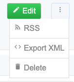
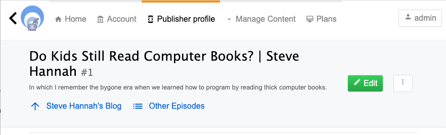
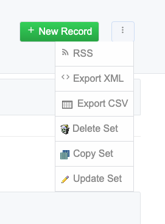
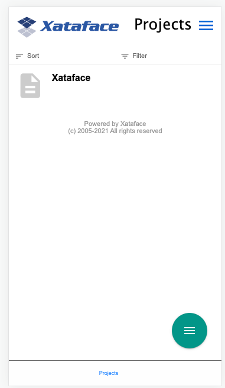
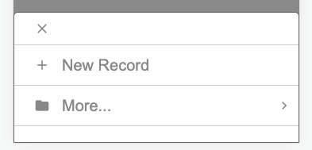
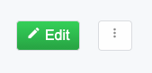
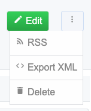
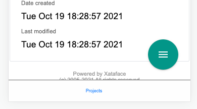
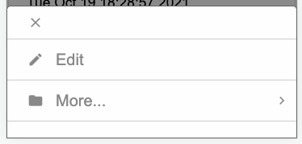
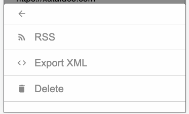

[#actionsini-directives]
== Actions.ini Directives

The actions.ini file stores information about the various action?s that can be performed by your application. An action may be manifested in two ways:

. As a web page
. As a menu item

And there is no reason why an action cannot serve in both capacities simultaneously. All menu items and functions that Xataface performs are defined in the Xataface actions.ini file (in the root of the Xataface installation dirctory). You can also create an actions.ini file in your application's root directory to override existing Xataface actions, or to create your own.

[TIP]
====
This section refers to "actions.ini" file, Xataface supports adding a .php extension to all .ini files to increase security.  I.e. Instead of actions.ini, you can name your file actions.ini.php.  The benefit of the .php extension is that you can have a line at the beginning of the file:

[source,ini]
----
;<?php exit;
----

which will be ignored by Xataface's INI file parser, but will result in the web server not serving the file - so the malicious snoopers can't access the file directly.
====

If you want to modify an existing action instead of overriding it, you can use this syntax:

[source,ini]
----
[browse > browse]
label = Browse
----

The &gt; symbol simply means to inherit from the existing browse action. All the attributes are the same, and we just override the label to Browse (originally was Details)

=== Syntax

As with the <<fieldsini-directives, fields.ini file>> and the valuelists.ini file, the actions.ini file uses the simple INI file syntax to define its actions. Each action is defined in its own section, and can have a number of directives to specify the action's behavior.

Here is a snippet from the Xataface actions.ini file to give you an idea:

[source,ini]
----
;; Show the details of the current record
[browse]
label = Details
category = table_tabs
url = "{$this->url('-action=view')}"
accessKey = "b"
mode = browse
permission = view
order=0

;; Show a list of the records in the current found set
[list]
label = List
category = table_tabs
url = "{$this->url('-action=list')}"
accessKey = "l"
mode = list
template = Dataface_List_View.html
permission = list
order=0.5

;; Show a "Find Record Form"
[find]
label = Find
category = table_tabs
url = "{$this->url('-action=find')}"
accessKey = "f"
mode = find
permission = find
template = Dataface_Find_View.html
order=0.75
----

This snippet shows the definition of the browse, list, and find actions - three of the most central actions in a Xataface application. Notice how each action has its own section (according to INI file syntax?) with a number of directives which specify how the action behaves. For instance, each action has a "category" value of "table_tabs", which tells Xataface to display the actions as part of the table tabs in the user interface.

=== Directives

ajax::
Indicates this this is an ajax action.  See <<ajax_actions>>.

allow_override::
An optional directive to indicate that this action can be overridden by more specific directives in another ini file. Currently there is only support for a value of "relationships.ini" indicating that the settings can be overridden in the relationships.ini file. In order for this to work, related=1 must also be set.
+
Since 1.3rc4

label::
The label to display if the action is used as a menu item.

category::
The name of the action's category which can be used to group this action together with other similar actions to be used in a menu in the user interface.
+
*See* <<action-categories>>

url::	If the action appears as a menu item, this is the URL that the menu item points to. This may contain PHP expressions inside curly braces.

onclick::
A javascript snippet to call when the user clicks on the action.  This can be used as an alternative to the `url` directive.  See <<javascript-action>>.
+
Since 2.0

accessKey::
The key code to automatically select this action if it is included as a menu item. I.e. ALT+accessKey calls the action.

materialIcon::
The name of a material Icon to use for the action menu item.  See <<material-icons>>
+
Since 3.0

mode::
This indicates which tab of the table tabs (find, details, list, etc...) that this action should appear to be part of when the action is viewed as a web page. If this is left undefined, or it does not match any existing visible action in the table tabs, then no tab will appear to be selected.

permission::
The name of a permission required to both see the action as part of a menu and to access the action as a web page.

visible::
A boolean value indicating whether the action should be visible as a menu item.

condition::
A boolean value or a PHP expression evaluating to a boolean value to indicate whether the action should be visible as a menu item.

url_condition::
A PHP expression evaluating to a boolean value to indicate whether the URL directive should be evaluated. This basically checks to make sure that its OK to evaluate the "url" expression, just in case the current state of affairs would cause it to throw a fatal error.

order::
A numeric value indicating the order in which the action should be displayed as part of a menu. Low numbers result in higher placement in the menu.

icon::
The path to an icon that should be used when the action appears as a menu item.  If possible, prefer the `materialIcon` directive to this one as they are far mor flexible with respect to styling.

scaler.depends::
Used by <<scaler>>, this is a comma-separate list of table names that are used by the action.  This will override the `-table` GET parameter in so far as it is used to invalidate the cache for the request.  This is often used in conjunction with the _scaler.trackUsedTables_ directive.

scaler.trackUsedTables::
Overrides the _trackUsedTables_ setting of the <<scaler>> for this action.

template::
The path to the template that should be used when the action is displayed as a web page.

description::
Mouseover text for the action (when displayed as a menu item).

=== PHP Expression Context

Notice that the `url`, `condition`, and `url_condition` directives allow you to use a PHP expression for their values. In order for this to be helpful, you should know a little bit about the context and environment in which these expressions will be executed. All expressions are evaluated immediately prior to being rendered, so the same action can be displayed multiple times in the same page, but have very different resulting values for their urls and conditions.

These expressions are all executed within the context of the `Dataface_Application::parseString()` method, with the following variables loaded in the local symbol table (i.e. you can use the following variables in your expressions).

$site_url::
The URL to the current application's directory (not including "index.php")
$site_href::
The URL to the current application including "index.php"
$dataface_url::
The URL to the xataface installation directory.
$table::
The name of the current table (i.e. the value of the "-table" request parameter"
$tableObj::
The `Dataface_Table` object for the current table.
$query::
An associative array of the current query variables.
$app::	A reference to the current `Dataface_Application` object. Alias of `$this`
$authTool:: A reference to the `Dataface_AuthenticationTool` instance.
$relationship:: If the action is being rendered in the context of a related record or a relationship request, this will be the corresponding `Dataface_Relationship` object.
$resultSet::
A reference to the `Dataface_QueryTool` object for the current query.

$record::	A reference to the current `Dataface_Record` object.

$context::	An associative array of context variables that are passed to the action from the context in which the action is called.

[TIP]
====
If your action expression contains any fatal errors, you may find yourself in a position where your app won't load at all (e.g. the white screen of death).  The error log may provide no clues because Xataface suppresses warnings and errors when evaluating the PHP expressions.

You can debug these issues by adding the `debug=1` directive to the beginning of your conf.ini file.  That will cause the action expressions to be evaluated "noisily", and you should see the the error either in your PHP error log or in the browser window when you reload the app.

====

[#action-categories]
=== Action Categories

The `category` directive of the _actions.ini_ file is used to specify _where_ an action should be displayed in the UI.  Xataface includes a number of built-in categories that you can leverage to inject menu items and buttons into various parts of the UI.  Some of these are:

==== Global Menus

find_actions::
Actions that are rendered as a drop-down selector in the search field, and allow you to create custom "find" actions.

personal_tools::
Actions that are rendered in the personal tools menu.  E.g. Login, Logout, Change Password, etc...

status_bar_right::
Actions rendered on the right side of the top status bar.  Currently this includes only the "Login" action and the "Personal Tools" menu, which loads items from the `personal_tools` category.

table_tabs::
Actions added as the root level tabs within a table.  E.g. `list`, `view`, `find`.

==== Record Details View Menus

record_actions::
Actions that can be performed on the current record.  This category is used for the overflow menu of the `record_actions_menu` category, which is the <<page-actions-category,Page actions category>> for the `view` action, so it is rendered as an overflow menu in the upper right in the desktop theme, and in the FAB (floating action button menu) on mobile in the _record`details_ views.
+
.Items in the overflow menu come from `record_actions` category.

record_actions_menu::
Actions that can be performed on the current record.  This category is the  <<page-actions-category,Page actions category>> for the `view` action, so it is rendered as an overflow menu in the upper right in the desktop theme, and in the FAB (floating action button menu) on mobile in the `details` view.
+
*See also* The `record_actions` category, which is used for the menu items of the overflow menu.

record_nav_actions::
Menu in the record view that is displayed just below the record title and description.  Useful for providing quick navigation links to related records.
+
****
*Example: Adding link to parent record*

.actions.ini file
[source,ini]
----

[up_to_podcast]
    ;Link to the parent "Podcast" record from a podcast episode
    category=record_nav_actions
    condition="$record and $record->_table->tablename == 'publisher_podcast_episodes'"
    url="?-table=publisher_podcasts&publisher_podcast_id={$record->val('publisher_podcast_id')}&-action=view"
    url_condition="$record and $record->_table->tablename == 'publisher_podcast_episodes'"
    label="{$record->val('podcast_title')}"
    label_condition="$record and $record->_table->tablename == 'publisher_podcast_episodes'"
    materialIcon=arrow_upward

[up_to_podcast_episodes]
    category=record_nav_actions
    condition="$record and $record->_table->tablename == 'publisher_podcast_episodes'"
    url="?-table=publisher_podcasts&publisher_podcast_id={$record->val('publisher_podcast_id')}&-action=related_records_list&-relationship=episodes"
    url_condition="$record and $record->_table->tablename == 'publisher_podcast_episodes'"
    label="Other Episodes"
    label_condition="$record and $record->_table->tablename == 'publisher_podcast_episodes'"
    materialIcon=list
    order=2
----

*Result:*

."Steve Hannah's Blog" and "Other Episodes" links inserted into the record header using the `record_nav_actions` category.

****
+
_Since 3.0_

record_tabs::
Tabs in the detail record view.  This is where the _view_ tab is rendered, as well as related lists.

==== List View Menus

list_settings::
Actions for managing list settings.  E.g. "Sort" and "Filter" options.

result_list_actions::
The actions related to a result list.

selected_result_actions::
Actions that operate on the currently selected rows in list view.

summary_actions::
Actions that operate on a row in the summary list view.

table_actions::
Actions that can be performed on the current table.  This category is used for the overflow menu of the `table_actions_menu` category, which is the default <<page-actions-category,Page actions category>>, so it is rendered as an overflow menu in the upper right in the desktop theme, and in the FAB (floating action button menu) on mobile, throughout most of the app - specifically in the `list` view.
+
Actions in this category include `rss`, `export_xml`, `export_csv`, `delete_set`, `copy_set`, and `update_set`.  These actions are displayed only when in list view.  The `record_actions`, `edit_record_actions`, `new_record_actions`, and `new_related_record_actions` categories
+
TIP: Actions in this category may use the `class=featured-action` to take on a "Featured" look.   In the default theme featured actions are rendered green with an inner shadow, in contrast to regular action buttons that are rendered white with a gray border.
+
****
*Example: Default Actions in table_actions category*

The core Xataface actions.ini file defines several actions in the `table_actions` category.  These actions are shown in the screenshot below:

.table_actions overflow menu on desktop.  Note that the "New Record" button uses the `table_actions_menu` category.  The menu items in the overflow menu use the `table_actions` category.

The above screenshot is from a stock install.  Notice that the _New Record_ button makes use of the `class=featured-action` directive to appear as a featured button.

.On Mobile, the table actions are included in the FAB (floating action button) in the lower right.

.Expanding the FAB reveals the actions in the table_actions category.

****

table_actions_menu::
Used for the default <<page-actions-category, page actions category>>.  Used in most actions, notably "list".  Includes an overflow menu whose menu items come from the `table_actions` category.  Rendered in top right on desktop, and in the FAB (floating action button) on  mobile.

==== Related List Menus

related_export_actions::
Actions available on the export related records form.

related_list_actions::
Actions that operate on a related list.

related_list_settings::
Actions for managing related list settings.  E.g. "Sort" and "Filter" options.

relationship_actions::
Actions which operate on a particular related list.  E.g. `new_related_record`.

selected_related_result_actions::
Actions that operate on the currently selected rows in a related list.

==== Edit Form Menus

edit_record_actions_menu::
The default <<page-actions-category>> for the `edit` action.

new_related_record_actions_menu::
The default <<page-actions-category>> for the `new_related_record` action.

==== New Form Menus

new_record_actions_menu::
The default <<page-actions-category>> for the `new` action.

==== View Related record Menus

view_related_record_actions::
Default <<page-actions-category>> for the view_related_record action.

==== Edit Related Record Menus

existing_related_record_actions_menu::
The default <<page-actions-category>> for the `add_existing_related_record` action.  Overflow menu items from the `edit_related_record_actions` category.

edit_related_record_actions::
Actions appearing in the `edit_related_record` action.  By default there is only a "Cancel" action.

==== Login Menus

login_actions::
Actions rendered on the login page.  E.g. `forgot_password`.

==== Management Menus

management_actions::
Actions that are available in the "Manage" section.

==== Other Menus

ajax_actions::
Actions for saving and loading records over AJAX. These don't appear in any menu.

event_actions::
Actions that operate on an event.  These are used in the calendar view.

history_record_actions::
Actions related to a history record.

password_changed_actions::
Actions that appear after the user has changed their password.

[#page-actions-category]
==== Page Actions Category

Xataface 3.0's default theme has attempted to consolidate actions into fewer menus that are shown contextually.  Typically on any given "page", there are a set of actions that the user can perform on the subject of that page.  On desktop these actions are rendered in the upper right in a "more" menu, and on mobile, they are rendered in a FAB menu (floating action button menu).

.Page actions on desktop displayed in upper right.

.On Mobile, the table actions are included in the FAB (floating action button) in the lower right.

.Expanding the FAB reveals the actions in the table_actions category.

When in list view, these "page actions" come from the `table_actions` category.  When in the _details_ view for a record, they come from the `record_actions` category.  Some special actions, such as `edit` and `new` define their own categories for the actions that should be displayed in this spot: `edit_record_actions` and `new_record_actions` respectively.

If you create a custom action, you can specify the category that should be used for the "page menu" via the `page_menu_category` directive of the actions.ini file.

===== Example: View Action

The `view` action uses the `record_actions` category for its page actions.  Its action definition is as follows:

.The `view` action definition from the xataface actions.ini file.  It uses the `page_menu_category` directive to specify that the "page actions" should be populated from actions in the `record_actions_menu` category.
[source,ini]
----
[view]
    label = View
    url = "{$this->url('-action=view&-relationship=')}"
    template = Dataface_View_Record.html
    permission = view
    mode = browse
    category = record_tabs
    selected_condition = "$query['-action'] == 'view'"
    order=-2
    page_menu_category=record_actions_menu
    rel=sibling
----

Above is the full action definition, but our interest in this example is the `page_menu_category` directive, which says that the "page menu" should be populated using actions in the `record_actions_menu` category.

===== Creating an Overflow Menu

Generally the "page actions" will display one or two buttons directly, and additional actions will be placed in an overflow menu.  If you are creating your own "page actions category", and you want to achieve this kind of grouping, you can achieve it by creating two categories:

1. A category for the top-level items.
2. A category for the overflow menu.

Then create an action in the top level category with `subcategory` set to the category of the overflow menu.

*Example: The View Action*

The `view` action uses the `record_actions_menu` category for its page actions, and the `record_actions` category for its overflow menu.

So the `view` action is defined as follows:

.The view action (some directives omitted for clarity)
[source,ini]
----
[view]
  page_menu_category=record_actions_menu
----

It then defines the `record_actions` action in the `record_actions_menu` category, which will be manifested as the overflow menu button.  Defined as follows:

.The `record_actions` action creates an overflow button.
[source,ini]
----
[record_actions]
	label=""
	materialIcon="more_vert"
	subcategory=record_actions
	category="record_actions_menu"
----

The secret sauce of this action is the `category` directive, which adds this action to the `record_actions_menu` category, combined with the `subcategory` directive, which specifies the category that is used for its menu items.  It is the `subcategory` directive that turns this button into a menu.

Finally, there are a few actions that are registered to the overflow menu, by assigning them to the `record_actions` category.  E.g.

E.g. The `view_xml` action.
[source,ini]
----
[view_xml]
	label = Export XML
	description = "Export an XML representation of this record"
	url = "{$record->getURL('-action=export_xml')}&--single-record-only=1"
	url_condition="$record"
	permission=view xml
	mode=browse
	category=record_actions
	materialIcon=code
	condition="$record"
----

.The  `record_actions_menu` menu.

.The `record_actions_menu` menu with the overflow menu showing.  The actions in the overflow menu come from the `record_actions` category.

On mobile the page actions are shown in the FAB (floating action button) in the lower right.

.The `record_actions_menu` FAB in the mobile theme.

.The `record_actions_menu` FAB expanded.  The "More..." menu item is where the overflow menu items from the `record_actions` category are located.

.The `record_actions` category (the overflow menu).

