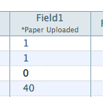
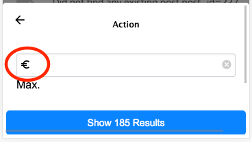
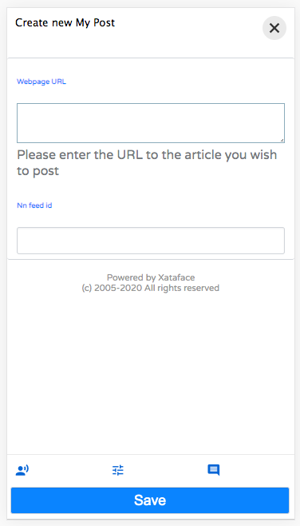
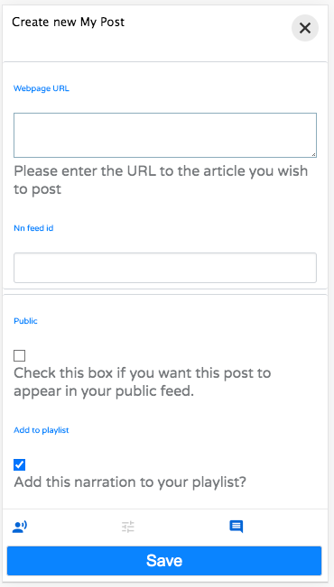

[#fieldsini-directives]
== Fields.ini Directives

[discrete]
=== Overview

The fields.ini file is a configuration file which is associated with a single table of a database application. It provides metadata about the table's fields to help Xataface dictate how they should be included in the application. This includes metadata such as

. *Widget type* - To specify the type of widget that should be used to edit content in the field (e.g. text, select, checkbox).
. *Label* - The labels that can be used in column headers and on forms.
. *Help text* - for forms to inform the user how data should be entered.
. *Field Groupings*
. *widget:atts* - To use javascripts in event handlers
. and more

Although a table doesn't need to have an associated fields.ini file in order for the application to work, each table can have one; and it is always located in the "tables" directory. For example, the fields.ini file for the "people" table would be located at `tables/people/fields.ini` file.

[TIP]
====
All ini files can also contain the ".php" file extension.  E.g. "fields.ini.php".  Using a .php extension can be helpful for security as it allows you to easily prevent the contents of the INI file from being served by the web server by adding the following to the first line of the file:

[source,ini]
----
;<?php exit;
----

If you do not use the ".php" extension, ensure that your .htaccess file blocks access to .ini files.  A sample .htaccess file is bundled with Xataface https://github.com/shannah/xataface/blob/master/site_skeleton/.htaccess[here].  The contents are:

[source,bash]
----
<FilesMatch "\.ini$">
    # Apache 2.2
    <IfModule !mod_authz_core.c>
        Deny from all
    </IfModule>
    
    # Apache 2.4
    <IfModule mod_authz_core.c>
        Require all denied
    </IfModule>
</FilesMatch>
----

.htaccess files are only supported by Apache web server, however.  If you're using a different server, like IIS or Nginx, you're better off using the ".php" extension to limit access to your INI files.
====

[discrete]
=== Syntax

The fields.ini file uses standard INI syntax (just like the php.ini file), where each section corresponds to a column in the table.

For example, consider a table "people" with columns "first_name", "last_name", and "age". The fields.ini file for the people table could then contain sections for each of its columns as follows:

[source,ini]
----
[first_name]

[last_name]

[age]
----

In this example the sections are empty (i.e. they have no directives, but we could easily add some directives:

[source,ini]
----
[first_name]
    widget:description="Please enter your first name"
    widget:label="Given Name"

...etc...
----

Here we have told Xataface that the first name field should include some help text (using the `widget:description` directive) on its edit form.

[discrete]
=== Example fields.ini file

[source,ini]
----
;; Global directives applied to every field
[__global__]
    visibility:list=hidden

[isbn]
widget:label = ISBN
visibility:list=visible

[copyright_year]
widget:label = "Year"
widget:atts:size=4
visibility:list=visible

[categories]
widget:type=checkbox
vocabulary = book_categories

[media]
widget:type=checkbox
vocabulary = book_media

[borrower_id]
widget:type=select
vocabulary=users

[due_date]
widget:description = "The date that the book is due to be returned to the library"
visibility:list=visible

[cover_art_url_small]
visibility:browse=hidden

[cover_art_url_medium]
;visibility:browse=hidden

[cover_art_url_large]
visibility:browse=hidden
visibility:find=hidden

[amazon_description]
widget:label = Description

[amazon_reviews]

[amazon_url]

[amazon_refresh_timestamp]
widget:type=static

[date_created]
timestamp=insert
widget:type = static

[date_modified]
timestamp=update
widget:type=static

[created_by]
widget:type=static

[modified_by]
widget:type=static

[notes]
----

[discrete]
=== Field Directives

The following directives may be added to a field's section of the fields.ini file to customize the field's behavior. Some directives are not applicable to all fields.

actions::
Optional actions category for actions which should be rendered next to the field on the edit form.  See <<field-actions>> for a usage example.
+
*Since 2.0*

ajax_value::
Make the field dynamically update whenever one or more other fields on the same form is changed. When a change is detected, the field will load new data from a JSON web service specified by the URL in the property.  See <<recipe-auto-updating-field>> for a usage example.
+
*Since 3.0*

ajax_preview::
A URL to content that should be displayed just below the field.  By default the content is updated whenever the field content is changed, but the `ajax_preview_event` directive can be used to specify a different event.  See <<display-field-preview-using-ajax>> for example usage.
+
*Since 3.0*

ajax_preview_event::
The event that triggers the `ajax_preview` content to be updated.  Default is "change", but any valid Javascript event name may be used.  The event is triggered by the field itself.  E.g. set this to "input" to update the content as the user types into the field.
+
*Since 3.0*

column:label::
Specifies a custom label to use in list view for the column. If this is not specified, then the value of `widget:label` will be used.	
+
*Since 1.3*

column:legend::	
Adds a small amount of help text to the column header for this field in list view. Default is blank. E.g.
+

+
In this photo it shows the text "*Paper Uploaded" set as the `column:legend` for "field 1".	
+
*Since 1.3*

date_format::	
Specifies how the field should be formatted when displayed. Takes same parameters as PHP strftime function.	
+
*Since 2.0*

display::	
Specifies the layout of the field on the edit form. Most fields have an implicit value of "inline" meaning the widget and its label appear on the same line. Textareas and htmlareas have an implicit value of "block" meaning that the label and widget appear in separate rows (label above the widget). You can set this value explicitly also to override the layout of a field.	
+
*Since 0.8*

display_format::
A pattern that can be used to define the display format of the field. This takes the same parameters as the PHP sprintf function.	
+
*Since 2.0*

encryption::	
Primarily used with password fields, indicates the type of encryption that should be used to save the field. Supports "md5", "sha1", "encrypt", and "password".	
*Since 0.6*

event.date::
For use by the Calendar Action. Indicates that the field stores the date of the record when interpreted as an event. Possible values "0" or "1".	
+
*Since 1.0*

event.start::
For use by the Calendar Action. Indicates that the field stores the start time of the record when interpreted as an event. Possible values "0" or "1".	
+
*Since 1.0*

event.end::
For use by the Calendar Action. Indicates that the field stores the end time of the record when interpreted as an event. Possible values "0" or "1".	
+
*Since 1.0*

event.location::	
For use by the Calendar Action. Indicates that the field stores the location of a record when interpreted as an event. Possible values "0" or "1".	
+
*Since 1.0*

filter::	
Boolean value (0 or 1) indicating whether this field should be filterable? in list view?.	
+
*Since 0.8*

filter.type::
The type of filter to use.  Options include "text", "range", "min", "max", and "filter".  See <<filter_types>>.
+
*Since 3.0*

filter.label::
The label to use for the filter.  This defaults to the `widget:label` for the field.
+
*Since 3.0*

filter.icon::
Icon to use in the text field when using the "text" filter type.  This should be the name of a material icon.  See <<material-icons>> for details about material icons in Xataface.
+
*Since 3.0*

filter.min.icon::
Optional icon to use inside the "min" field for min and range filters.  The icon should be a valid material icon name.  See <<material-icons>> for details about material icons in Xataface.  
+
.*Example* `filter.max.icon=euro_symbol`

+
*Since 3.0*

filter.max.icon::
Same as `filter.min.icon` except for the "min" field.
+
*Since 3.0*

filter.input.type::
Specify the `type` attribute of the `<input>` tag used in the "text", "range", "min", and "max" filter types.  This will be "text" by default in most fields.  It will be https://developer.mozilla.org/en-US/docs/Web/HTML/Element/input/date[date] by default for date fields, and https://developer.mozilla.org/en-US/docs/Web/HTML/Element/input/datetime-local[datetime-local] for datetime fields.
+
*Since 3.0*

filter.sort::
Used for the "filter" filter type.  This specifies the column to use for sorting the options in the fitler.
+
*Since 3.0*

filter.placeholder::
Placeholder text used for the "text" filter type.  Placeholder text is only displayed when the field is empty.
+
*Since 3.0*

filter.min.placeholder::
Placeholder text used the "min" field.  Placeholder text is only displayed when the field is empty.
+
*Since 3.0*

filter.max.placeholder::
Placeholder text used the "max" field.  Placeholder text is only displayed when the field is empty.
+
*Since 3.0*

filter.input.*::
Specify HTML attributes on the `<input>` element used in the "text" filter type.  E.g.`filter.input.maxlength=5`
+
*Since 3.0*

filter.min.input.*::
Specify HTML attributes on the `<input>` element used in the "min" field. E.g. `filter.min.input.maxlength=5`
+
*Since 3.0*

filter.max.input.*::
Specify HTML attributes on the `<input>` element used in the "max" field. E.g. `filter.max.input.maxlength=5`
+
*Since 3.0*

filter.vocabulary::
A valuelist that can be used to provide "common" search options.  These are displayed before the text or range fields to allow the user to easily select common searches.
+
*Since 3.0*

frozen_description::	
The field description shown when the widget is frozen (i.e. uneditable). If this is not specified, no field description is shown in this case.
+
*Since 1.2* 

group::	
The name of the field group that this field belongs to. Fields with the same "group" value will be rendered in the same field group on the form.	
+
*Since 0.5*

Key::	
If you are using a View for the table you need to explicitly mark the fields that comprise the primary key. E.g. Key=PRI	
+
*Since 0.6*

label_link::
An optional URL for the field label to link to. This would usually be some "help" page that explains what the field is for. The link will be a link in both the view and edit tabs.	
+
*Since 1.1.3*

ignore::	Boolean value (0 or 1) indicating whether this field should be ignored on the edit form. This is handy if the field is going to be constantly updated in the background (via a cron job perhaps) and you don't want the edit form to interfere.	
+
*Since 1.0*

logo::	Boolean value (0 or 1) to indicate if this field should be treated as a logo field. Logo fields are displayed in the upper left of the view tab for a record, and are assumed to contain an image. If no logo field is explicitly specified, Xataface will make a best guess as to which field should be used.	
+
*Since 0.7*

money_format::	
For fields containing monetary amounts, this specifies the format. Takes same parameters as PHP money_format function.	
+
*Since 2.0*

noLinkFromListView::	Boolean value (0 or 1) to indicate if this field should be linked when in list view (or in a related list). Default value is 0 to indicate that the field IS linked. It is common to use this directive when using a custom xxx__renderCell() method that contains its own links.	
+
*Since 1.1*

not_findable::	
A flag to indicate that this field can not be used as part of a query. This is helpful if you want a field to remain completely confidential to prevent people from finding records based on the value of this field. This flag is even necessary if the permissions for the field don't permit viewing the value of the field.	
+
*Since 1.1*

number_format::	
For numeric fields, this indicates the number of decimal places to display when displaying this field. E.g. 2	
+
*Since 2.0*

order::
The order of the field when laid out on forms and lists. Can contain any floating point number or integer (e.g. 0, 10, -10, 235.4)	
+
*Since 0.6*

prefs.key::
The name of a preference to set with the value of this field in the currently logged-in user record.  See <<preferences-directives>> for more information about preferences.  See <<user-selected-color-scheme>> for an example using `prefs.key=user_stylesheet`.
+
*Since 3.0*

relationship::	
Used only with complex fields that involve editing related records (e.g. grid). This is the name of the relationship that the field should be edited.	
+
*Since 0.8*

repeat::	Boolean value (0 or 1) used in conjunction with a select widget to indicate whether to enable a multi-select.

section::	The name of the section that this field should belong to in the view tab.	
+
*Since 0.7*

secure::	
A boolean flag for use with container fields? to indicate that it should use secure URLs for the file downloads (i.e. it will obey the application permissions). Without this directives, uploaded files are served directly by apache and don't obey the Xataface permissions defined per record.	
+
*Since 1.3*

sortable::
A boolean flag that indicates whether a column is sortable.  This does not affect permissions (i.e. the user can still sort on the column by including it in the `-sort` request parameter.   This only affects whether the column is sortable in the UI.  Currently this is only used for the mobile UI.  On the desktop UI, all columns visible in list view are sortable.
+
NOTE: If no columns in the table define the `sortable` property, then all columns are treated as `sortable=1`.  If at least one column in the table has `sortable` defined, then the remaining columns are assumed to be `sortable=0`.  One way of thinking about this that you need to opt in to this behaviour to use it.  Otherwise Xataface will just guess at which columns the usezr should be able to sort on.
+
*Since 3.0*

sortable+::
A boolean flag that enables or disables sorting on this column in ascending order.
+
*Since 3.0*

sortable-::
A boolean flag that enables or disables sorting on this column in descending order.

sort.label::
The label that should be used for sorting on this field.
+
*Since 3.0*

sort+.label::
The label that should be used for sorting on this field in ascending order.
+
*Since 3.0*

sort-.label::
The label that should be used for sorting on this field in descending order.
+
*Since 3.0*

struct::	A boolean (0 or 1) value indicating whether this field is considered a structure. A value of 1 indicates that this field is a structure and should not be truncated under any circumstances. Normally fields are truncated at 255 chars in list view. This is useful if the field contains XML or other structured data so that attempts to truncate it would destroy integrity.	
+
*Since 1.1.2*

tab::	If tabbed forms are enabled, then this specifies the name of the tab that this field belongs to on the edit form.	
+
*Since 0.8*

timestamp::	Indicates when a timestamp should be set in the field (only applicable for date and time fields). Possible values are "insert" and "update"	
+
*Since 0.7*

title::	Boolean value (0 or 1) indicating whether this field should be treated as a title field.	
+
*Since 0.7*

transform::
String defining rules for generating thumbnails for uploaded images.  This directive is only used with Container fields.  
+
====
*Syntax*

  transform=name1 [op1:]w1xh1; ...;nameN [opN:]wNxhN

Where:

. `name1` ... `nameN` are names of the thumbnail sizes you wish to resize images to. 
. `w1` ... `wN` are corresponding widths in pixels, 
. `h1` ... `hN` are corresponding heights in pixels, and 
. `op1` ... `opN` are the corresponding operations to perform for resizing.  Currently the only operations supported are "fit" and "fill".  "fit" will cause the image to be resized to "fit" completely inside the dimensions of the thumbnail size, and "fill" will cause the image to fill the thumbnail space completely, possibly cropping some off edges to make it fit. 

*Example*

`transform="itunes300 fill:300x300; itunes1400 fill:1400x1400"`

Defines two thumbnail types "itunes300" and "itunes1400" with sizes 300x300 pixels and 1400x1400 pixels respectively. This means that images uploaded to this container field will automatically have thumbnails generated in those two sizes.  Both of these thumbnail types use the "fill" operation so images will be resized to fill the space, and may have some cropped off the edges.
====
+
This directive is commonly used with `thumbnail.ACTIONNAME` directives which specify which thumbnail should be used in which action.
+
See <<generating-thumbnails>> for a recipe on how to use this directive.
+
*Since 3.0*

transient::	Boolean value (0 or 1) indicating whether this field is a transient field or not. A transient field is a field that is defined in the fields.ini file but not in the database. Hence the values that are input into this field on the edit form are not saved to the database.	
+
*Since 0.8*

Type::	The data type of the field (note the capital "T" as Xataface is case sensitive). This value is only overridden for container? fields, however its value can be accessed programmatically for any field.	
+
*Since 0.5*

userid::
Marks the field as containing a User ID, which corresponds to the userId of the users table. This is used by caching solutions, such as <<scaler>>, to be able to invalidate the cache if only a particular user's records are modified in a table.  See https://github.com/shannah/xataface-module-scaler/blob/master/README.adoc#table-subset-dependencies[Table Subset Dependencies] in the Scaler module readme file for more information.
+
*Since 3.0*

username::
Marks the field as containing a username, which corresponds to the username of the users table. This is used by caching solutions, such as <<scaler>>, to be able to invalidate the cache if only a particular user's records are modified in a table.  See https://github.com/shannah/xataface-module-scaler/blob/master/README.adoc#table-subset-dependencies[Table Subset Dependencies] in the Scaler module readme file for more information.
+
*Since 3.0*

uuid::
Marks a field as storing a UUID (universal unique identifier).  This works similar to the `timestamp` and `ownerstamp` directives, in that it will automatically generate a UUID at the time the record is inserted if one is not supplied.  It will also apply appropriate defaults to hide this field on the edit form.
+
*Since 3.0.1*
validators:VALIDATOR_NAME::	
A prefix for a validation type on the current field. (Replace "VALIDATOR_NAME" with the name of the validator to be used. e.g. required). There are many validators available to be used.	
+
*Since 0.5*

validators:VALIDATOR_NAME:message::	
The message the should be displayed if the form fails to validator due to the "VALIDATION_NAME" validation rule.	
+
*Since 0.5*

viewgroup::	The name of the field grouping that this field will belong to in the view tab. If this is not present, then it will be grouped according to the group directive.	
+
*Since 1.0*

visibility:browse::	Indicates whether the field should be visible in browse mode (i.e. in the "view" tab). Possible values are "visible" and "hidden".	
+
*Since 0.6*

visibility:csv::	Indicates whether the field should be included in CSV exports. Possible values are "visible" and "hidden". 
+
*Since (1.0 beta 4)	1.0b4*

visibility:find::	
Indicates whether the field should be visible in find mode. Possible values are "visible" and "hidden"	+
*Since 1.0*
visibility:list::	
Indicates whether the field should be visible in list view. Possible values are "visible" and "hidden".	+
*Since 0.6*

visibility:update::	
Indicates whether the field should be included in update and copy/replace forms. Possible values are "visible" and "hidden".	
+
*Since 1.3*

vocabulary::	The valuelist that should be used as the options to select. This is only applicable for fields that have options to select like a select list or a checkbox group.	
+
*Since 0.5*

widget:atts::	
A namespace for attributes that should be added to the HTML widget. This allows you to specify things like javascript events, styles, widget size, etc..	
+
*Since 0.5*

widget:columns::	For checkbox groups, this specifies the number of columns to use for laying out the checkboxes.	
+
*Since 1.0*

widget:description::
Help text to give the user a hint about how to edit the field's content.	
+
*Since 0.1*

widget:editor::	
The type of HTML editor that should be used. This is used only when widget:type is set to htmlarea
+
Acceptable values include:
+
. fckeditor (default)
. tinymce (version 0.6 or higher)
. nicedit (version 1.0 or higher)
. all

widget:editvalues::	
Used with select lists to allow users to add values to the select list. E.g. widget:editvalues=1	
+
*Since 0.8*

widget:focus::	
Sets default focus. 0 or 1. (Javascript focus in a form)	
+
*Since 0.6*
widget:label::	
The label that should be used for the current field on edit forms, column headings, and other relevant locations.	
+
*Since 0.1*

widget:question::	
Text displayed just before the widget. This is almost the same as widget:description except that this text is guaranteed to be displayed before the widget, whereas widget:description may be displayed below or beside the widget.	
+
*Since 0.1*

widget:type::	
The type of widget that should be used (e.g. checkbox, select, text, etc..)	
+
*Since 0.1*

xml::	
A flag for use with calculated fields (i.e. fields defined in the delegate class via the field__fieldname method) that will include the field in XML output produced by the export xml action. Default is 0, but setting this value to 1 wil cause the field to be included.	
+
*Since 1.2.7*

[discrete]
=== Applying Directives to All fields (`\\__global__`)

Xataface 1.2.6 includes support for a `\\__global__` section that allows you to specify directives that should be applied to all fields. These directives can be overridden on a field by field basis. The `\\__global__` section can take all the same directives that a normal field section takes.

[discrete]
=== `widget:atts:class` Values

The `widget:atts:class` directive allows you to assign a CSS class to a field's widget. There are certain CSS classes that have meaning to Xataface and will cause additional functionality to automatically be added to the field. These built-in classes are listed below:

passwordTwice::
Applicable only to password fields. If you set `widget:atts:class=passwordTwice`, then this will convert the password field into two fields whereby both fields need to match in order for submission to continue on the edit form. This operates as a password verification field.	
+
*Since 1.3rc2*

[discrete]
=== Global Directives

The following directives can be added to the beginning of the fields.ini file (before any field sections) to customize field groups and the table as a whole.

\\__dependencies__::	A comma-delimited list of tables that this table is dependent upon for caching purposes. E.g. if any table in this list is modified, then the query cache is cleared for queries on this table. See this blog article for more information about query caching.	
+
*Since 1.2*

\\__isa__::	
The name of the parent table of the current table. This directive allows you to have a heirarchical structure amongst the tables in your application.	
+
*Since 0.8*

\\__source_tables__::	A comma-delimited list of tables that this table/view is derived from. This is used with the query caching feature and is necessary to use this directive if the table is actually a view. If this directive is not set, then any queries involving this view will not use the query cache because Xataface would have no way to discern the update time of the view. See this blog article for more information about query caching.	
+
*Since 1.2*

\\__sql__::	Defines a custom select query to override the default select query for the current table. (The default select query is generally "select * from tablename").	
+
*Since 0.7*

\\__prefs__::	
Sets preferences for this table and its records. This directive is an array, so it must be enclosed in square brackets, i.e. `[\\__prefs__]`, unlike the other global directives listed above.	
+
*Since 1.0b4*

scaler.trackUsedTables::
Boolean (0 or 1) indicating whether requests on this table should track the tables used in the request.  Used with <<scaler>>.  See https://github.com/shannah/xataface-module-scaler/blob/master/README.adoc#tracking-used-tables[Tracking Used Tables] in the Scaler module readme.
+
*Since 3.0*

table.default_sort::
Sets the default sort column for the table.  See <<default-sort>>.
+
*Since 3.0*

table.default_sort.RELATIONSHIPNAME::
Sets the default sort column for the given relationship.  E.g. `table.default_sort.posts=date posted desc`.  See <<default-related-sort>>.
+
*Since 3.0*

table.label::	
Sets the friendly name for this table. This is the equivalent of using the [_tables] section in the conf.ini file, except without imposing the requirement that these tables appear in the application's primary navigation menu. E.g. label = "Table Name"

table.title::	
A string SQL select expression that is used to describe the title of records. This is the equivalent of the `titleColumn()` function used in Delegate_class_methods.

table.list_template::
An alternative template to use for rendering the list view of this table. This can either be the path to a template (relative to the template path roots), or some special values including `@grid`, which will be expanded to `xataface/actions/list/grid.html`  See <<grid-view>>.

table.listStyle::
Setting this to "mobile" will cause the list view to use the "mobile" list style in desktop mode also.  This will also affect one-to-many relationships to this table - i.e. related lists where this table is the domain table will be rendered with the mobile style, if this is set to "mobile". See <<list-style-mobile>>

table.row_style::
Setting this to "external-link" will cause the mobile list view (and related list view) to render rows as links to an external link, similar to how Twitter renders tweets that contains links.  See <<row-style-external-link>>

table.depends::
A comma-delimited list of tables on which this table depends.  When using <<scaler>>, this helps Xataface determine which tables were used in generating a response for a request, and thereby know when the cache for that page should be invalidated.  This directive is usually used for MySQL views or temporary tables Xataface won't automatically increment their version numbers when their underlying tables are modified.
+
Since 3.0

[discrete]
=== Field Groups

The "group" directive allows you to group multiple fields together so that they will be rendered in the same field group on forms. You can also configure these groups as a whole by defining a section named "[fieldgroup:GROUPNAME]" (where GROUPNAME is the name of the field group, corresponding to the group directive values for the fields) in the fields.ini file. This section provides a few basic directives to customize some aspects of the field group:

. label
. order
. description
. template
. more...

The most common use of these sections is to customize the label or order of groups, especially when there are multiple field groups in the table. For example, suppose we have a table "people" with fields "first_name", "last_name", "phone", "fax", "email", "address", "city", and "country". Suppose these fields are grouped as follows:

. "first_name" and "last_name"
. "phone", "fax", and "email"
. "address", "city", and "country"

so that the fields.ini file looks like:

[source,ini]
----
[first_name]
    group=name
    
[last_name]
    group=name
    
[phone]
    group=contact
    
[fax]
    group=contact
[email]
    group=contact
    
[address]
    group=address
    
[city]
    group=address
    
[country]
    group=address
----

By default, the "name" group will appear first in the form, followed by "contact" and "address". If we want to place "address" first we could add the following section to our fields.ini file:

order::	Specifies the order of the group with respect to other groups on the form. Accepts any numerical value (e.g. 0, 1, -1, 25.43), with lower values appearing first. Default value is 0.	
+
*Since 0.6*

hidden::
A value of "1" causes the field group to be hidden by default.  Hidden groups will have a button placed along the bottom of the form which can be used to reveal the field group.  If this directive is used, the `materialIcon` directive must also be used to provide the icon that is used in this button.
+
.Form with 3 hidden field groups.  Users can click on the corresponding buttons at the bottom of the form to reveal a field group.

+
.After user clicks on a field group's button, it will be shown on the form, and the button will become grayed out.

+
*Since 3.0*

[#fieldsini-table-label]
label::	
Specifies the label that should be used for the field group.	
+
*Since 0.6*

label_link::	
Specifies a URL that the field group label should link to.	
+
*Since 1.1.3*

label_prefix::
Specifies a prefix for the label.  This can be useful if the label of the action has been localized using the language files, but you want a prefix (which may include a PHP expression).
+
*Since 3.0*

label_suffix::
Specifies a suffix for the label.  This can be useful if the label of the action has been localized using the language files, but you want a suffix (which may include a PHP expression).
+
*Since 3.0*

materialIcon::
A material icon to use for the field group's button when the group is hidden via the `hidden` directive.  See <<material-icons>> for more information about material icons.  See `hidden` directive docs for information about the hidden directive.
+
*Since 3.0*

noheader::
A value of "1" hides the usual collapsible header for the field group so that the fields are just rendered directly on the form.
+
*Since 3.0*

template::	
The path to a custom template that should be used to render the fields of the field group.	
+
*Since 1.0*

collapsed::	Boolean value (0 or 1) indicating whether the field group should be collapsed by default (user can expand it).	
+
*Since 1.0*

