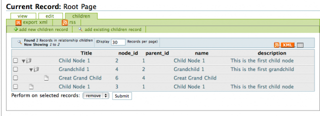

[#relationshipsini-directives]
== Relationships.ini Directives

=== Overview

The _relationship.ini_ file is a configuration file which is associated with a single table of a database application. It provides metadata about the table's relationships to other tables to help Xataface dictate how they should be included in the application.

=== Field Directives

The following directives may be added to a field's section of the relationship.ini file to customize the field's behavior. Some directives are not applicable to all fields.

__sql__::
The SQL query that defines this relationship.
+
_Since: 0.1_

action:visible::
A boolean value (0 or 1) that indicates whether this relationship should be visible in the record tabs.
+
_Since 0.1_

action:condition::
An expression that evaluates to a boolean that determines at runtime whether the relationship's tab should appear in the record tabs.
+
_Since 0.1_

action:permission::
An array that determines at runtime whether the relationship's tab should appear in the record tabs for the logged in user.
+
Also see: <<relationship-permissions,Relationship Permissions>>
+
_Since 0.1_

action:label::
The label that appears in the relationship tab for this relationship. Default is to use the relationship name.
+
_Since: 0.1_

action:order::
An integer value that specifies the order of this relationship tab in relation to the other tabs.
+
_Since: 0.1_

action:delegate::
The name of an alternative action that can be used instead of the standard related records list. One possible value for this would be "related_records_checkboxes" which would provide the user with a checkbox group to select the records that should be part of the relationship rather than the usual related record list.
+
_Since: 1.0_

actions:addexisting::
Boolean value (0 or 1) indicating whether the action to add existing records should exist in this relationship.
+
_Since: 0.1_

actions:addnew::
Boolean value (0 or 1) indicating whether the action to add new records should exist in this relationship.
+
_Since: 0.1_

actions:remove::
Boolean value (0 or 1) indicating whether the action to remove existing records should exist in this relationship.
+
_Since: 0.1_

list:type::
Optional type of list to use for the related record list. Possible value: "treetable"
+
****
*Example: Setting `list:type=treetable`*

*Prerequisites*

The TreeTable component needs to be able to figure out the logical children of each record in order to know what to show when a row is expanded. You can use either the `meta:class` directive of the _relationships.ini_ file to specify a relationship as a "children" relationship, or you can implement the <<delegate-getChildren,getChildren method>> of the table delegate class to manually define a record's child elements.

****
+
_Since:  0.8_

meta:class::	An optional special class to assign to the relationship, e.g. "parent" or "children".
+
****
The meta:class directive allows you to ascribe special meaning to a relationship which Xataface can use in various parts of your application to provide enhanced capabilities.

For example you can specify a relationship as a "parent" relationship, thereby using the relationship to obtain the "parent" of records of this table. This can be used to help build breadcrumbs.

You can also specify a relationship as a "children" relationship which would treat records in the relationship as children of the current record. This can be used in conjunction with the `list:type=treetable` directive of the _relationships.ini_ file to build a tree table that navigates all child records and subtrees.

The `Dataface_Record` class contains some methods for retrieving the parent and children of records and these methods will take into account any settings you make here.

*Allowed Values:*

parent::
Designates the relationship as a 'parent' relationship, meaning that the first record in this relationship will be treated as the parent of the current record. This setting can be overridden by the getParent? method of the table delegate class if implemented.
+
_Since 0.8_

children::
Designates the relationship as a 'children' relationship meaning that records of the the relationship will be treated as a children. This setting can be overridden by the getChildren method of the table delegate class if implemented.
+
_Since 0.8_

*See Also*

. <<delegate-getChildren,getChildren()>> delegate class method.
. <<delegate-getParent,getParent()>> delegate class method.

****
+
_Since 0.8_

metafields:order::
If the relationship should have a default order this specifies the field that should be used for this sort.
+
_Since: 0.1_

visibility:fieldName::
If given the value hidden will make that particular fieldName disappear in the relationship. This will only be applied for that particular relationship.
+
****
*Example: Hiding a Field*

[source,ini]
----
[myrelationship]
  conferences.ConferenceID = "$ConferenceID"
  visibility:ConferenceID = hidden
----

This will make the _ConferenceID_  field in the relationship list view disappear.

*Example: Showing a Field*

----
[myrelationship]
  conferences.ConferenceID = "$ConferenceID"
  visibility:ConferenceID = visible
----

This will make the _ConferenceID_ field in the relationship list view appear.

****
+
_Since: 0.1_

visibility:find::
If given the value hidden this will cause the related fields to not appear on the find form. Normally each relationship is provided a section of the find form to enable users to find records that contain at least one match in the related records.
+
_Since 1.3rc4_

vocabulary:existing::
Specifies a valuelist that can be used to provide the set of records that can be added to this relationship. If target table has a single column primary key then the valuelist should use the primary key for the value. If it has a multi-column primary key, then the value should be in the form `key1=value1&key2=value2` etc...
+
*See also* <<delegate-relationshipname__getAddableValues,relationshipname__getAddableValues delegate class method>> for a programatic solution.
+
_Since: 1.0_

=== Glance Lists

In the _view_ tab, related records are shown by default in the left column. These sections are called glance lists. The field directives below customize how the glance lists are displayed.

section:visible::
Boolean value (0 or 1) indicating whether the relationship information should appear as a section.
+
_Since 0.7_

section:condition::
An expression that evaluates to a boolean that determines at runtime whether the relationship information should appear as a section.
+
_Since 0.7_

section:permission::
An array that determines at runtime whether the relationship information should appear as a section for the logged in user.
+
*Also see*: <<relationship-permissions,Relationship Permissions>>
+
_Since 0.7_

section:class::
An optional value (main) to specify that this section should be in the main column instead of the left sidebar. Default is `left`.
+
****
*Example 1: A "Hello World" Section*

We'll start by adding a simple section that simply displays "Hello World" to the user. In the delegate class for your table, add the following method:

[source,php]
----
function section__hello(&$record){
    return [
        'content' => 'Hello World!!!',
        'class' => 'main'
    ];
}
----

Now if you reload our application and click on the "View" tab for any of the records in the database, you'll notice a section labelled hello with the text _Hello World!!!_ in it.

Let's dissect the above code so that we can better understand what is going on here.

. The `function section__hello()` defines a section named hello. If you wanted to define a section named `foo` you would call the function `section__foo()`
. This function returns an array with the keys _content_, and _class_.
. The content key points to the actual HTML content of the section. In this case it is simply the text _Hello World!!!_.
. The _class_ key defines where the section should be displayed. It accepts values of "left" and "main" only. If it is set to "left", then the section will be displayed in the _left_ column. A value of "main" indicates that it should be displayed in the _main_ column.

*Customizing the Section Label*

_hello_ is a boring label, so let's add our own custom label by adding the label key to the array returned by our method:

[source,php]
----
function section__hello(&$record){
    return [
        'content' => 'Hello World!!!',
        'class' => 'main',
        'label' => 'Message of the Day'
    ];
}
----

Now if you load the view tab of your application, you'll notice that the section has a heading "Message of the Day".

*Customizing the Section Order*

A section can also specify an order attribute to define the order in which this section should appear. It defaults to 0 which may cause the section to appear at the top of the view tab. You can push it to the bottom of the view tab by assiging a higher number to the order attribute:

[source,php]
----
function section__hello(Dataface_Record $record = null){
    return [
        'content' => 'Hello World!!!',
        'class' => 'main',
        'label' => 'Message of the Day',
        'order' => 10
    ];
}
----

Now if you reload the _view_ tab you'll notice that the section has moved to the bottom of the page.
****
+
_Section 0.7_

section:label::
The label that appears in the header of this related record section. Default is to use the relationship name or action:label if defined as documented above.
+
_Since 0.7_

section:order::
Integer. The order of this related record section in relation to the other sections. Default is `0`.
+
_Since 0.7_

section:limit::
Integer. The number of records to show in this related record section. Default is `5`.
_Since 0.7_

section:sort::
A comma-delimited list of columns and optionally direction to use in sorting this related record section, similar to an ORDER BY clause in SQL. E.g.
+
----
section:sort="some_column asc"
----
+
or
+
----
section:sort="col1 asc,col2 desc,etc..."
----
+
_Since 0.7_

section:filter::
A string SQL clause to be used to filter the results.
+
_Since 0.7_

=== Relationship Permissions

See <<relationship-permissions,Relationship Permissions>>

