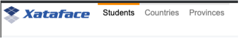
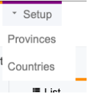
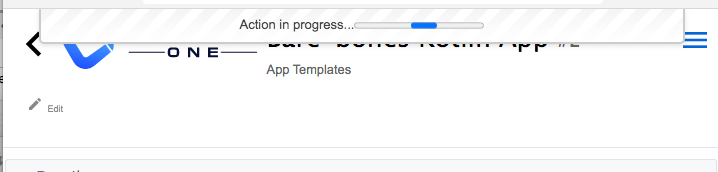

[#actions]
== Actions and Menus

The following sections pertain to actions in Xataface.  An action may either be a menu item, or an HTTP request handler.  Or it can be both.  They are defined in the actions.ini file (or actions.ini.php file) of your application, and their "handlers" are defined inside the "actions" directory of your application.

[#material-icons]
=== Using Material Icons

[discrete]
==== Problem

You want to use a https://material.io/resources/icons/?style=baseline[material icon] for a menu-item in your application, instead of an image.

[discrete]
==== Solution

The default theme of Xataface includes the material icons web font, so you can use any icons in that font on your actions via the `materialIcon` directive in your action.  For example, suppose we want to add a "Play" button to the rows of our table in list view.  We define our action as follows:

.A play action for the "songs" table.
[source,ini]
----
[play]
    condition="$query['-table'] == 'songs'" <1>
    category=list_row_actions <2>
    materialIcon=play_circle_outline <3>
    label="Play" <4>
    description="Play narration" <5>
    url="javascript:playSong()"
----
<1> The `condition` directive is used to limit our action so it only displays for the "songs" table.
<2> The `category` directive makes the action appear in the "list_row_actions" menu (which is displayed as icons in each row of the list view.
<3> The `materialIcon` directive specifies that we want to use the https://material.io/resources/icons/?search=play&icon=play_circle_outline&style=baseline[play_circle_outline] material icon.
<4> The label, which is hidden for this menu type because the stylesheet is set to show only icons for the "list_row_actions" action.  It is still a good idea to define the label though in case this action is used in other contexts.
<5> The description which is shown as tool-tip text if the user mouses over the action.

[discrete]
==== Finding the Right Material Icon

You can browse the available material icons https://material.io/resources/icons/?style=baseline[here].

.Material Icons website
image::images/Image-130620-080448.218.png[Material Icons site]

The label below the icon is the name of the icon, that you would use for your `materialIcon` directive.  If the lable is truncated, you can click the "Selected Icon" button in the lower left to get a more detailed view.

[#javascript-action]
=== Triggering Javascript Function with Action

[discrete]
==== Problem

You want to trigger a Javascript function when the user clicks on an action.

[discrete]
==== Solution

Use the `onclick` directive for the action definition in your actions.ini file.  The javascript you specify here will be executed when the user clicks on the action.  Perhaps the "hardest" part of this recipe is simply knowing where to put the javascript function that you wish to call.  There are many ways to include custom Javascript into your application.  My preferred way is to use the `xf_script($scriptpath)` inject your Javascript file.

I'll illustrate this process by way of an example.  I'm going to create a simple action called "hello_world" that pops up an Alert box that says "Hello World".

NOTE: This example is simple enough that it could have been achieved without having to include a separate Javascript file.  E.g. `onclick="alert('Hello World!');"` would do the trick in the action definition.  But, I'm going create a separate Javascript file with this functionality for educational purposes.

**Step 1: Create a Javascript File**

If you don't have a "js" directory in your application yet, create it now.  This is where you will place all Javascript files in your application.

Now create a file inside the "js" directory named "hello.js", with the following contents.

.hello.js, containing our helloWorld() function that we wish to call.
[source,javascript]
----
window.helloWorld = function() { <1>
    alert('Hello World!');
}
----

**Step 2: Include the Javascript File**

You can include this Javascript file into your application by calling:

[source,php]
----
xf_script('hello.js');
----

IMPORTANT: Notice that we include 'hello.js', and not 'js/hello.js'.  This is because the Javascript tool always looks in its "include" paths for Javascript files, and it treats all paths as relative to the include path root.  

*Where* you choose to call this code depends on *when* it will be needed.  If your Javascript file is only needed inside a particular page of your app, then you are probably best to call this inside the action for that page, or inside a block which only appears on that page.

If you want it to be included application-wide, then you should call this inside a method that will be called for every request.  I usually place all "global" stuff inside the `beforeHandleRequest()` method of the Application Delegate class. 

In this case, I'm not sure yet, which pages will be displaying the menu item for my "hello" action, so I'll include it inside the `beforeHandleRequest()` method:

.Application delegate class (`conf/ApplicationDelegate.php`) with `beforeHandleRequest()` method defined.
[source,php]
----
<?php
class conf_ApplicationDelegate {
    function beforeHandleRequest() {
        xf_script('hello.js');
    }
}
?>
----

[TIP]
====
By default, `xf_script()` uses the JavascriptTool to include the script with the rest of the application's scripts, minified.  All of these scripts are included in the HTML page with a single script tag just before the `</body>` tag.  

If you need to include a Javascript file that is included in the `<head>` of the document for some reason, then you can pass `false` as the second parameter

[source,php]
----
xf_script('hello.js', false);
----

The down-side of adding the script to the `<head>` is that it isn't pre-compiled by the Javascript tool, and, thus, cannot use the `//require` directive to depend on other scripts.
====

**Step 3: Defining the Action**

Now that we have our script included, we can define our action:

.Action definition inside the actions.ini (or actions.ini.php) file.
[source,ini]
----
[hello]
    onclick="window.helloWorld();"
    category=record_actions <1>
----
<1> For demonstration we'll add this to the "record_actions" category, which are displayed in a drop-down menu on the record details page.

image::images/Image-140620-084043.111.png[]

Now, we can click on our "Hello" button to see the pay-off:

image::images/Image-140620-084139.249.png[]

[discrete]
==== Troubleshooting

Things never work the first time.  There are a couple of things that can go wrong in setting up this recipe for the first time:

**My "hello" Action doesn't appear in the menu** 

Things to check:

1. Double check the "category" directive of your action.  It be `category=record_actions`.  *Case-sensitivty matters!!*
2. Ensure that your actions.ini file is getting picked up.  Your actions.ini file should be located in the root directory of your application.  E.g. "/path/to/myapp/actions.ini".  Make sure it is named "actions.ini" and not "Actions.ini".  **Case-sensitivity matters!** (on Linux)
3. Check your PHP error log.  It is possible you have a syntax error in your actions.ini file, and the app isn't able to load it.
4. If nothing shows up in your PHP error log, add the "debug=1" directive to the beginning of your `conf.ini` file, then reload the page.  You'll see a whole bunch of warnings now when you look at your PHP error log.  See if there are any fatal errors on your actions.ini file.

**Nothing happens when I click on my "hello" Action**

Things to check:

1. Make sure you have the "onclick" directive in your action definition.  Check for typos.
2. Look at the Javascript error log in your browser.  E.g. Right click on your page, if using Chrome, and select "Inspect".  Then click on the "Console" tab.  This will show you errors.  If you see an error like "window.helloWorld is not a function", it means that your Javascript file did not get included.  If you see a syntax error listed, probably you have a Javascript error in your hello.js file.
3. Enable Debug mode in the Javascript tool.  This will cause your Javascript files to NOT be minified so it will be easier to debug in the browser.  You can do this by adding the following to your conf.ini file:
+
[source,ini]
----
[Dataface_JavascriptTool]
    debug=1
----

[#customize-action-label]
=== Customizing Action Labels

[discrete]
==== Problem

You want to customize the label for an existing action

[discrete]
==== Solution

If you want to customize the action for all tables, you can simply override the action in your app's actions.ini file, and set the `label` property.

.Overriding the "new" action in your app's actions.ini file
[source,ini]
----
[new > new]
    label=Insert New Record
----

TIP: To override the tooltip text for the action, you could set the `description` directive.

Alternatively, you can use Xataface's internationalization support to override the label.  E.g. in your app's "lang/en.ini" file (which contains your English translations), you can define the key "actions.[ACTION_NAME].label".  E.g.

.Overriding the "new" action's label in the lang/en.ini file
[source,ini]
----
actions.new.label="Insert New Record"
----

TIP: To override the tooltip text for the action, you can set the `actions.new.description` property.

[discrete]
===== Overriding Label on a Particular Table

The above examples would override the action label in the entire application.  If you want to specify the label in a particular table, you can define the "tables.[TABLENAME].actions.[ACTIONNAME].label" proeprty in your language file (e.g. lang/en.ini).

.Overriding the label for the "new" action in the "articles" table.
[source,ini]
----
tables.articles.actions.new.label="Insert Article"
----

TIP: You can also override the the tooltip text using `tables.[TABLENAME].actions.[ACTIONNAME].description`, and the material icon using `tables.[TABLENAME].actions.[ACTIONNAME].materialIcon`

[#tables-navigation-menu]
=== Customising Navigation Menu

[discrete]
==== Problem

You want to customize the options in the navigation menu

[discrete]
==== Solution

Define actions in the `_tables` category.  These will be used instead of the tables listed in the `_tables` section of the conf.ini to form the tables navigation menu.

[discrete]
==== Discussion

The top-level navigation menu in Xataface allows you to select which database table you with to work with.  By default, it is generated from the `[_tables]` section of the conf.ini file.

For example, given the following _tables section:

[source,ini]
----
[_tables]
    students=Students
    countries=Countries
    provinces=Provinces
----

Xataface will generate a menu that looks like:

In some cases, you may want to generate your own custom menu.  For example, you may want to group some tables together into a single drop-down menu.  You can do this by defining actions inside your actions.ini file in the `_tables` category.

For example:

.Defining actions in the `_tables` category in your actions.ini file.  These will be used to form the navigation menu instead of your app's tables.
[source,ini]
----
[menu_students]
    label=Students
    category=_tables
    url="?-table=students"
    selected_condition="$table=='students'"

[menu_setup]
    label=Setup
    category=_tables
    subcategory=_tables_setup
    order=10

[menu_countries]
    label="Countries"
    category=_tables_setup
    url="?-table=countries"
    selected_condition="$table=='countries'"

[menu_provinces]
    label="Provinces"
    category=_tables_setup
    url="?-table=provinces"
    selected_condition="$table=='provinces'"

----

In this case we have defined two top-level menus in the `_tables` category: "menu_students" and "menu_setup".  The "menu_setup" action has uses the "subcategory" property to assert that it is a drop-down menu.  Any actions in the "_tables_setup" category will be included in this drop-down menu.

The resulting menu for this setup would be:

If you hover over the "Setup" menu, it will expand:

[#ajax_actions]
=== Action to Trigger AJAX Request

[discrete]
==== Problem

You want your action button to trigger an AJAX (background) request rather than linking to another page.  Additionally you would like to provide some UI feedback to inform the user that the action is in progress.  And finally, when the action completes, you would like some UI feedback to the user to indicate the result of the action, and handle errors and failures gracefully.

[discrete]
==== Solution

There are two parts to this problem:

The server-side::
We need to write a PHP handler that your action should trigger.  Since we are using AJAX, this action will output JSON instead of HTML.

The client-side::
We need to provide a button or menu that the user clicks to trigger the action, as well as the user interface elements to keep the user informed on the progress of the action.

[discrete]
===== The Server-Side

For the Server-side, let's create a simple action that outputs JSON.  In your app's "actions" directory, create a file named "hello.php" with the following contents:

.actions/hello.php
[source,php]
----
<?php
class actions_hello {
    function handle($params = []) {
        df_write_json([ <1>
            'code' => 200, <2>
            'message' => 'Action succeeded' <3>
        ]);
    }
}
----
<1> We use the `df_write_json()` function to encode our output as JSON.
<2> The `code` is a status code that you create.  Generally follow the HTTP convension where codes from 200-299 indicate success.  400-499 indicate some sort of "not allowed" error.  500-599 indicate some sort of server error. Etc..
<3> The `message` Property will contain a human-readable message about the result of the action.

[discrete]
===== The Client-Side

I'll discuss two different solutions for the client side:

. <<ajax-action-solution-1, Writing a Custom Javascript Function>>
. <<ajax-action-solution-2, Using the `ajax` directive of the actions.ini>> file.

[discrete]
[#ajax-action-solution-1]
====== Solution 1: Writing a Custom Javascript Function

See <<javascript-action>> for details on triggering a Javascript function using an action.  After setting up your action, you'll have a definition in your actions.ini file like:

[source,ini]
----
[hello]
    onclick="window.helloWorld();"
    category=record_actions
----

Once you have your action linked up to your Javascript function you can use the `jQuery.post()` function to trigger your action handler as follows:

.hello.js, containing our helloWorld() function that we wish to call.
[source,javascript]
----
window.helloWorld = function() {
    jQuery.post(DATAFACE_SITE_HREF, { <1>
        '-action' : 'hello' <2>
    }, function(result) { <3>
        var message = (res && res.message) ? res.message : 'Server error';
        if (result && result.code == 200) {
            alert('Success: ' + message);
            return;
        }

        alert("Failed: " + message);

    });
}
----
<1> The `DATAFACE_SITE_HREF` constant is always available, and refers to the entry point of your Xataface application.  Uaually `index.php`.
<2> The 2nd parameter of `jQuery.post()` is a dictionary with the POST request variables.  In our case we want to call our custom handler so we reference it using the `-action` parameter.
<3> The 3rd parameter of `jQuery.post()` is a callback function that will be run with the action completes.  The JSON result of our action PHP handler is includd in the `result` argument.

The example above will perform an AJAX request to trigger our PHP action handler.  It will then display the result in an `alert()` dialog.

.The hello action displayed in the record actions menu.
image::images/Image-140620-084043.111.png[]

This example is overly simplistic.  You can improve it in a number of ways, including:

. Adding some sort of progress indicator to provide some feedback to the user while the action is processed.  This is especially important for long-running actions.
. Add a `fail()` callback to deal with the case where the HTTP request completely fails for some reason.  The callback in this example will only be called if the handler returns a non-error HTTP status code.

[discrete]
[#ajax-action-solution-2]
====== Solution 2: Using `ajax=1` Directive

Xataface provides a simpler alternative to providing your own Javascript function for triggering your action handler.  You can simply specify the `ajax=1` directive for our action:

[source,ini]
----
[hello]
    category=record_actions
    ajax=1
----

This directive instructs Xataface to treat this as an AJAX action.  When the user clicks on the action button, it will issue a POST AJAX request, and it will display the result in a status message.

When the action completes, it will display the contents of the "message" property of the JSON response in a similar status dialog.  If the action fails, it will display an error message.

It expects the following properties in the JSON response:

code::
The Status code.  It will interpret any code between 200 and 299 as a success.

message::
The message to display to the user.

silent::
Optional boolean parameter that will suppress the error or success message so that the action completes silently.

