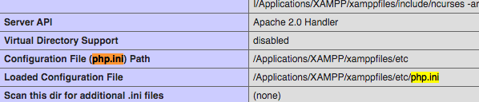

[#deployment-and-administration]
== Deployment and Administration

The following section includes recipes for administration and deployment of your Xataface applications.  This includes things like managing development, staging, and production servers, and dealing with versions and upgrades.

[#whereis-phpini]
=== Where is my php.ini file?

[discrete]
=== Problem

You need to change a setting in your php.ini file but you don't know where it is, or your server has multiple php.ini files and you don't know which one is the correct one.

[discrete]
=== Solution

Create a file inside your application directory named "phpinfo.php" with the following contents:

[source,php]
----
<?php
phpinfo();
----

Load this page in your web browser and search for "php.ini".

Now open that file and make your changes.

=== Using Different Config Files on Different Servers

[discrete]
==== Problem

You want your production server to use different configuration options than your development server.  For example, perhaps you want to enable the output cache on the production server, but not on the development server.

==== Solution

Use the <<confini-include-directive,`\\__include__`>> directive in your conf.ini file to load your server-specific configuration options from a different config file.  Use the `{host}` placeholder to specify a different config file depending on the host name of the current request.

E.g.

.conf.ini.php file
[source,ini]
----
;<?php exit;
__include__=hosts/{host}/{host}.conf.ini.php

[_tables]
  table1=My First Table
  table2=My Second Table
----

.`hosts/localhost/localhost.conf.ini.php` Config file when application is accessed via localhost.
[source,ini]
----
;<?php exit;
;; Development Server Config
[_database]
    host=localhost
    name=mydb
    user=root
    password=mypass

[_output_cache]
    enabled=0 ;; Disable output cache on development server
----

.`hosts/example.com/example.com.conf.ini.php` Config file when application is accessed via localhost.
[source,ini]
----
;<?php exit;
;; Production Server Config
[_database]
    host=localhost
    name=mydb
    user=mydbuser
    password=mydbuserpass

[_output_cache]
    enabled=1 ;; Enable output cache on production server
----

=== Application Versioning and Synchronization

[discrete]
==== Problem

You want to deploy the changes in the development version of your app to the production server, including database changes.

[discrete]
==== Solution

Increment the build number in your app's version.txt file, and implement corresponding `update_xxx()` methods in your `conf/Installer.php` file.

[discrete]
==== Discussion

One of the more annoying challenges involved with managing production web applications is keeping the development and production versions in sync. Git makes this task trivial for source code and file system changes, but changes to the database schema between versions still need to be handled with care, as these changes fall outside the watch of any version control system.

For example, suppose I am running an application that stores user profile information, and I want to add a column to the “users” table to store the user’s postal code. I add the column to my development database but I don’t want to add it to the production database until I am finished with the rest of my changes.

**The old way: Copy & Paste – text files**

The old way managing these changes was to make the change in the development database, then copy and paste the SQL query that I used to perform the update into a text file. I would repeat this process for each change that I made. When it came time to move the changes to the production application, I would just execute these statements manually one by one on the production server.

The down-side of this approach is that it didn’t scale very well. It works OK if I only have one production installation and one development server. But what if I have dozens of production servers all running the same application, and perhaps running different versions. It would become cumbersome if not impossible to keep track of all of these changes and manually apply them across all installations.

**The new way: Xataface Application Versioning**

Xataface allows you to track the version of your application with a text file named version.txt stored in your application’s directory. This file should contain one line like with two numbers separated by a space:

`1.0b1 345`

This example means that the application version is `1.0b1`, and that the build version is `345`. The build version must be an integer that is incremented every time there is a change to the source code. It is used by Xataface to figure out whether the file system version matches the database version.

IMPORTANT: The build version number is independent of the application version, and should only ever go "up" in value with new releases.

On every page request, Xataface checks the version.txt file to see what version of application is currently in the file system. It compares this with the version of the database. If the database version is lower, it will execute the necessary queries to update the database to the current version.

[discrete]
===== The conf/Installer.php file

Xataface looks for a class named `conf_Installer` located in your application’s "conf/Installer.php" file to find out what it needs to do to update between versions. You can define methods in this class of the form:

`function update_##(){}`

Where `##` is the build number of the update.

Xataface will execute all functions `update_XX()` to `update_YY()` in your `conf_Installer` class automatically if it finds that the database version is `XX` and the filesystem version is `YY`. This is where you can place your database updates that need to be performed between versions.

For example, suppose the production server is running build version `345`. That means that the version.txt file in your production server might look something like:

`0.5.1 345`

Now you want to add a `postal_code` column to the users table in the development version, so you’ll increment the version number on the development server:

`0.5.2 346`

And add a method to your `conf/Installer.php` file to perform the database change:

[source,php]
----
<?php
class conf_Installer {
    function update_346(){
        $sql[] = 'ALTER TABLE `users` ADD `postal_code` VARCHAR(32) AFTER `phone_number`';
        df_q($sql);
       }
    }
}
----

Then you can just update the source files to the production server using subversion. The first time you run the production app after updating the source files you’ll get a message saying that the application has been updated to version `346`.

That’s all it takes. You just keep on adding these methods for each update. Then even if you have an instance that is a couple of versions behind, all you need to do is update to the latest source revisions, and it will automatically update the database to the correct version.
