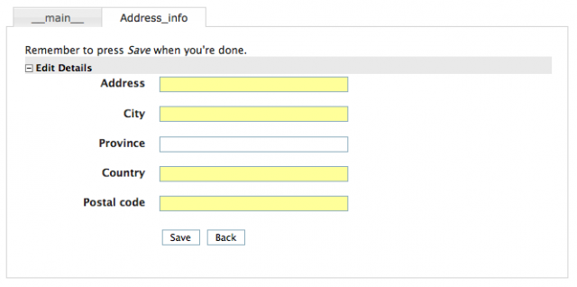
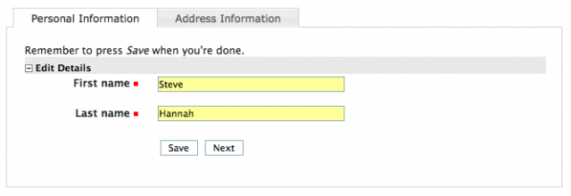
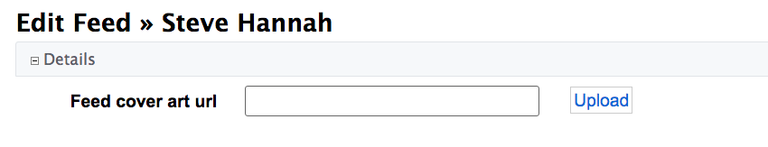

[#form_customization]
== Form Customization

The following chapters form a sort of cook book with recipes for customizing forms in Xataface.

=== Multiple Tabs in Forms

[discrete]
==== Problem

You want to split your edit/new record forms into multiple tabs

[discrete]
==== Solution

Use the `tab`directive in each field definition of the fields.ini file to specify the "tab" that each field should be placed in.

The tab directive of the fields.ini file specifies which tab of the record edit form a field should be displayed on. Xataface supports multiple tabs on the edit form by way of this tab directive. If no fields contain the tab directive then all fields are displayed in a single tab (named `__main__`).

**Example 1: Placing address info on separate tab**
Consider the following people table:

[source,sql]
----
CREATE TABLE `people` (
    person_id int(11) not null auto_increment primary key,
    first_name varchar(32) not null,
    last_name varchar(32) not null,
    address varchar(100),
    city varchar(100),
    province varchar(100),
    country varchar(100),
    postal_code varchar(20)
)
----

We want to split the fields into two tabs: "Personal Info" and "Address Info"

We'll do this in two steps. We use the `tab` directive to assign all address-related fields to the `address_info` tab.

.fields.ini file.  Assigning fields to the "address_info" tab.
[source,ini]
----
[address]
    tab=address_info

[city]
    tab=address_info

[province]
    tab=address_info

[country]
    tab=address_info

[postal_code]
    tab=address_info
----

Now, when we load the edit form of the people table, we see two tabs: "\\__main__" and "address_info"

image::images/Image-090620-092422.464.png[]

TIP: `\\__main__` is the name assigned to the default tab (for all fields that don't have a tab defined explicitly.

**Customizing the tab labels**

Next we will customize the tab labels by adding the following to the beginning of the fields.ini file:

.Defining the tabs in the fields.ini file.
[source,ini]
----
[tab:__main__]
    label="Personal Information"

[tab:address_info]
    label="Address Information"
---- 

http://media.weblite.ca/files/photos/Picture%2012.png?max_width=640

**Reordering the tabs**

If we want to reorder the tabs so that the "address_info" tab comes first, we would just reorder the definitions of the tabs:

[source,ini]
----
[tab:address_info]
    label="Address Information"

[tab:__main__]
    label="Personal Information"
----

=== Delegating "New Record Form" to a Different Table

Xataface allows you to delegate "new record" input to a different table.  E.g. Given a Table `A`, you can configure Xataface to use the "new record" form for a different table `B` for inserting new records.

**Why might you want to do this?**

Xataface forms are built around the data model of the underlying table.  It generates input fields for each column of the underlying table.  In some cases, the "new record" form may want to take data in a different form that allows you to generate the underlying data.

For example, if you have a "Contacts" table, but you want the user to be able to insert contacts by simply entering their employee ID - and this will be used in the back-end to fetch some initial data about the user from another database.  In this case, your "new record" form should really just include a single field: "Employee ID".

==== Instructions: Short Version

**Definitions**

. `SOURCE_TABLE` - The source table into which you wish to insert records.
. `TARGET_TABLE` - The target table whose "New Record" form you wish to use for the UI.

**Steps:**

1. Add the `new_record_table=TARGET_TABLE` directive to the beginning of the fields.ini file of the SOURCE_TABLE.
2. Add a column named `xf_inserted_record_id` of type `TEXT` into the TARGET_TABLE.
3. In either the `beforeInsert()` or `afterInsert()` hooks of the TARGET_TABLE, process the inputs, and programmatically insert the appropriate record into the SOURCE_TABLE.
4. Also inside the `beforeInsert()` or `afterInsert()` hooks of TARGET_TABLE, set the value of the `xf_inserted_record_id` to the record ID of the SOURCE table that you programmatically inserted in step 3.

==== Instructions By Example

Let's take the example I mentioned above.  We have a "contacts" table with lots of details about a contact, including `employee_id`.  When the user inserts a record, all they need to do is enter the "employee_id" and it will pull the rest of the data in from an external database.  So we will create a second "dummy" table that is only here to facilitate the creation of a new contact.  It includes only a single field "employee_id".

Our two tables might have the following definitions.

[source,sql]
----
CREATE TABLE contacts (
  employee_id VARCHAR(32) PRIMARY KEY,
  first_name VARCHAR(64),
  last_name VARCHAR(64), 
  ....
 )
 
 CREATE TABLE new_contact_form (
   employee_id VARCHAR(32) PRIMARY KEY,
   xf_inserted_record_id TEXT <1>
 )

----
<1> The `xf_inserted_record_id` field is a special field that will be used to pass the record ID of the corresponding contact record after insertion.

**Step 1: Set `new_record_table`**

At the beginning of the fields.ini file for the "contacts_table", add:

.tables/contacts/fields.ini file
[source,ini]
----
new_record_table=new_contact_form
----

This tells Xataface that the "new" action for the "contacts" table should redirect to the "new" action of the "new_contact_form" table.

**Step 2: Implement `beforeInsert()` Hook**

If we simply defined the `new_record_table` directive, it would result in the user being redirected to the `new_contact_form` table when they want to insert a new record into the `contacts` table, but it wouldn't actually insert anything into the contacts table.  Nor would it return them back to the contacts table when done.  It would just leave the user in the "new_contacts_form" table - and would insert the record there only.

If we want to actually insert a record into the "contacts" table, we just do this programmatically.  Preferably inside the `beforeInsert()` or `afterInsert()` hooks of the `new_contact_form` table.

In the delegate class for the `new_contact_form`, we'll do:

.tables/new_contact_form/new_contact_form.php file (Delegate class for the "new_contact_form" table).
[source,php]
----
<?php
class tables_new_contact_form {
    function beforeInsert(Dataface_Record $record) { <1>
        $employeeData = fetchEmployeeData($record->val('employee_id');
        // Assume that you've implemented fetchEmployeeData() elsewhere to get
        // the employee info from another database
        
        if (!$employeeData) {
            XFException::throwValidationFailure("Failed to find employee data for given employee ID.");
        }
        
        
        // Create a new contact record
        $contact = new Dataface_Record('contacts', array()); <2>
        $contact->setValues(array(
            'employee_id' => $employeeData['empid'],
            'first_name' => $employeeData['empFirstName'];
            ...
        ));
        $res = $contact->save(); <3>
        if (PEAR::isError($res)) {
            XFException::throwValidationFailure("Failed to insert contact: ".$res->getMessage());
        }
        
        // Store the record ID of the new contact record
        $record->setValue('xf_inserted_record_id', $contact->getId()); <4>
    }
}
----
<1> We implement the `beforeInsert()` callback, which is executed before the "new_contact_form" record is inserted.
<2> We create a new `Dataface_Record` object for the "contacts" table, and insert data for the contact.
<3> We call `save()` to store the "contacts" record.
<4> Get the ID of the newly inserted contact, and add it to the `xf_inserted_record_id` field of the "new_contact_form" record.  This will be used by Xataface after to redirect back to the original contact table record when it is done.

.Sequence diagram for inserting a new record in the Contacts table
image::images/Image-140420-010101.342.png[]

=== Using `ownerstamp` to Mark Record Ownership

[discrete]
==== Problem

You want to "stamp" a record with the username or user ID of the user who created a record automatically.

[discrete]
==== Solution

Use the `ownerstamp` fields.ini directive on the field that you wish to store the userid in.

For example, consider a table "posts" that stores posts that users of the system make.  This table has a `posted_by` field to record the user that posted it.  You want this field to automatically populated with the user ID of the user that is currently logged in, so you can add the `ownerstamp` directive in the fields.ini file.

[source,ini]
----
[posted_by]
  ownerstamp=1
----

Adding this directive does a number of things simulataneously:

. It will set the user ID of the currently logged in user at the time that the record is inserted.
. It will prevent the field from being updated later.
. It will hide the "posted_by" field from all forms.

[discrete]
==== Discussion

Before the "ownerstamp" directive existed, you could accomplish the same thing by implementing a `beforeSave()` trigger and setting the field value to the currently logged in user, changing the field permissions so it can't be changed after the fact, and setting the widget type to "hidden".  But since this is such a common requirement, it is much simpler to just set `ownerstamp=1` and be done with it.

=== Redirecting User to Different Page After Saving Record

[discrete]
==== Problem

By default, when the user presses "Save" on the "Edit record form", they will be redirected back to the edit record form again after the save is complete.  You want to redirect them to a different page, such as the "View" page.

[discrete]
==== Solution

Override the "edit" action in your actions.ini file to specify the "after_action" directive.

E.g. Add the following to your application's actions.ini (or actions.ini.php) file.

.the actions.ini file. Specifying that user should be directed back to the "view" action after editing the record.
[source,ini]
----
[edit > edit]
    after_action=view
----

If you only want to apply this rule to a particular table, you can use the `after_action.{TABLENAME}` instead.  E.g.

.Specifying an after_action directive that only applies to editing records of the "users" table.
[source,ini]
----
[edit > edit]
    after_action.users=view
----

[TIP]
====
The "new" action also supports the `after_action` and `after_action.tablename` directives.  E.g.

[source,ini]
----
[new > new]
    after_action=view
----
====

[#recipe-auto-updating-field]
=== Auto-Updating a Field When Other Fields are Changed

[discrete]
==== Problem

You want the contents of a field to be automatically updated when the value of another field on the same form is changed.  For example, you have a "Program Title" field that should automatically be populated when the user selects the program ID.

[discrete]
==== Solution

You can use the `ajax_value` fields.ini property to make a field dynamically update whenever one or more other fields on the same form is changed.  When a change is detected, the field will load new data from a JSON web service specified by the URL in the property.

**Syntax:**

`ajax_value=<url-template>#<json-path-query>`

`<url-template>` is a string that is used as a template for the URL to the web service from which to load the field's content.  The template should contain one or more placeholders of the form `{fieldname}` which are replaced by the form value of the corresponding field.  

`<json-path-query>` is a http://jsonpath.com/[jsonPath] query describing which part of the JSON response should be used as the new field value.

TIP: You can omit the json path query (everything from `#`), if the HTTP request will just return plain text or HTML.

**Triggers**

The field will be updated whenever the URL would be changed.  The URL template may include variables with the syntax `{fieldname}` that will be replaced by the corresponding field when generating the web service URL.  If the values of any of the fields marked as variables changes, it will trigger an update.

**Example**

Consider the following fields.ini file:

[source,ini
----
[ProgramID]
widget:type=select
vocabulary=programs

[ProgramTitle]
ajax_value="?-action=export_json&-table=Programs&ProgramID={ProgramID}#0.ProgramTitle
----

In the above example, whenever the `ProgramID` field is changed (say to a value of "1"), it will trigger an AJAX request to `index.php?-action=export_json&-table=Programs&ProgamID=1`.

The JSON response will look like:

[source,json]
----
[{"ProgramID":"1", "ProgramTitle":"Some program", ....}]
----

When it receives the response, it will take the `ProgramTitle` attribute of the first result in the JSON response, and place it in the ProgramTitle field.  In the above example, it would be "Some program".

[TIP]
====
You can use the `widget:atts:data-xf-update-condition=empty` directive to *only* update the field value if it is currently empty.  
====

[#display-field-preview-using-ajax]
=== Displaying Field Preview using AJAX

[discrete]
==== Problem

You want to display some richer feedback to the user based on the value entered into a field.  For example, on a field where the user enters a URL, you may want to display some information about the URL so that the user knows that they have entered the correct URL.  

[discrete]
==== Solution

Use the `ajax_preview` directive, which works just like the `ajax_value` directive, except that it displays the result of the AJAX request just below the field as a "preview", rather than in the field itself.

Consider the scenario where you have the following table structure:

[source,sql]
----
CREATE TABLE posts (
    post_id INT(11) PRIMARY KEY AUTO_INCREMENT,
    page_url TEXT,
    article_title TEXT,
    article_description
)

CREATE TABLE user_posts (
    user_post_id INT(11) PRIMARY KEY AUTO_INCREMENT,
    post_id INT(11),
    comment TEXT
)
----

The "posts" table is central repository of posts.  The user_posts table is for a user to "post" a comment about a post. The idea is that a particular URL should only be imported into the "posts" table once, but many users can post comments around a "post" in the "users_posts" table.  We will only give the user direct access to the "user_posts" table, where they will provide the URL they want to post along with a comment about the post.

The challenge here is that the user_posts table doesn't have a "page_url" field - just a post_id field.  We could use the depselect widget here, but this adds a step.  It would be better to hide the post_id field, and just provide a page_url field, which will automatically populate the "post_id" field with the correct post ID from the posts table.

So for our first step, we'll hide the "post_id" field and add a page_url transient field:

.Adding a transient field for the post_url in the users_posts fields.ini file
[source,ini]
----
[post_id]
    widget:type=hidden
    
[post_url]
    transient=1
    order=-1
    widget:description="Please enter the URL to the article you wish to post"
----

When the user enters a URL into the post_url field we want to trigger an AJAX request to a custom action that will:

. See if a post has already been added at that URL, and return the ID of the post if found.
. If the post hasn't been added yet, we add it, and return the ID.

In either case the AJAX request should obtain a post ID which can be inserted into the post_id field.

Such a custom action might look like the following:

.Sample Action (defined in actions/get_post_id.php) to get a Post ID for a given page url.
[source,php]
----
<?php
class actions_get_post_id {
    function handle($params) {
        header('Content-Type:text/plain');
        if (!@$_GET['page_url']) {
            return;
        }
        //echo $_GET['page_url'];exit;
        $user = getUser();
        $post = df_get_record('posts', array('page_url' => '='.$_GET['page_url']));
        
        if (!$post) {
            $post = new Dataface_Record('posts', array());
            $post->setValues(array(
                'posted_by' => $user->val('user_id'),
                'page_url' => $_GET['page_url']
            ));
            $res = $post->save();
        }
        echo $post->val('post_id');
    }
}
?>
----

We will use the `ajax_value` directive on the `post_id` field to automatically populate it from that AJAX action when the value of `page_url` changes.

.Add the ajax_value directive to populate the post_id field when post_url is updated.
[source,ini]
----
[post_id]
    widget:type=hidden
    ajax_value="?-action=get_post_id&page_url={post_url}"
----

Lastly, we want to display a preview of the page content below the page_url field.  We will use the `ajax_preview` directive for this.  First we'll create an AJAX action to display this preview, given the post ID.

[source,php]
----
<?php
class actions_ajax_post_preview {
    
    function handle($params) {
        if (!@$_GET['post_id']) {
            return;
        }
        $post = df_get_record('posts', array('post_id' => '='.$_GET['post_id']));
        if ($post) {
            df_display(array('post' => $post), 'ajax_post_preview.html'); <1>
        }
    }
}
?>
----
<1> "ajax_post_preview.html" template should be in the application's templates directory.

Now we can use this from our `ajax_preview directive:

.Adding the ajax_preview directive to update the preview automatically with post_id is changed.
[source,ini]
----
[post_url]
    transient=1
    order=-1
    widget:description="Please enter the URL to the article you wish to post"
    ajax_preview="?-action=ajax_post_preview&post_id={post_id}"
----

.Ajax preview displayed below the post_url field.
image::images/Image-070620-011602.097.png[]

**Bonus Points**

We're not quite done.  Our current setup works great for the new record form, because the user will be adding the URL.  But if they're editing an existing record, the post_id value will already by set, but the user hasn't entered anything the post_url field (because it is transient).  We need to add an `ajax_value` directive to the post_url field so that it auto-populates based on the value of the post_id field.

We'll use the export_json action as our AJAX action so we don't need to create a custom action.

.Adding the ajax_value directive to the post_url field so that it auto-populates on the edit form.
[source,ini]
----
[post_url]
    transient=1
    order=-1
    widget:description="Please enter the URL to the article you wish to post"
    ajax_preview="?-action=ajax_post_preview&post_id={post_id}"
    ajax_value="?-table=posts&-action=export_json&post_id=={post_id}&-mode=browse&-limit=1&--fields=page_url#0.page_url"
----

=== Disabling Client-side Validation

[discrete]
==== Problem

You want to disable client-side validation for a particular field, but keep the server-side validaton. 

[discrete]
==== Solution

Use the `widget:validation=server` fields.ini directive.

E.g.

[source,java]
----
[myfield]
  widget:validation=server
----

=== Setting Fixed Number of Rows in the Grid Widget

[discrete]
==== Problem

You have a grid widget for editing related records on a form.  Rather than have it start with only a single row, and have additional rows appear only as the user enters data into the last row, you want it to display a fixed number of rows and have some of the data pre-populated.

[discrete]
==== Solution

Use the `widget:fixedrows` directive to a specific number of rows, and you can implement the `fieldname__prepareGridData($record, $cols, $data)` delegate method to return the data to prepopulate the grid with.

.fields.ini file
[source,ini]
----
[exam_results]
  relationship=exam_results
  widget:type=grid
  widget:fixedrows=3
  widget:cols="exam_name,exam_grade"
----

.Delegate class
[source,php]
----
class tables_students {
    function exam_results__prepareGridData($record, $cols, &$data) {
        if (count($data) == 0) {
            $data[] = array('exam_name' => 'Midterm 1', 'exam_grade' => '');
            $data[] = array('exam_name' => 'Midterm 2', 'exam_grade' => '');
            $data[] = array('exam_name' => 'Final', 'exam_grade' => ''); 
        }
    }
}
----

[#field-actions]
=== Adding Actions to Fields

[discrete]
==== Problem

You want to add an an action button next to a field in your form.  For example, suppose you have a text field that stores the URL to a logo for the record, and you want to provide a link for the user to be able to upload an image, and then copy its URL into the field.  Ideally the field would have an "upload" button next to it.

[discrete]
==== Solution

Use the `actions` directive of the fields.ini file to specify an action category on the field, and then define an "upload" action with that category.

E.g.

.The fields.ini definition for our field.  Notice the `actions` directive.
[source,ini]
----
[feed_cover_art_url]
    logo=1
	group=details
	order=-10
	widget:type=text
	display=inline
    actions=feed_cover_art_url_actions
----

.The upload_feed_cover_art action definition in the actions.ini file.  Notice that it is added to the "feed_cover_art_url_actions" category.
[source,ini]
----
[upload_feed_cover_art]
    category=feed_cover_art_url_actions
    label="Upload"
    description="Upload cover art for this feed"
    url="javascript:void(0)"
    onclick="uploadCoverArt(this)"
----

And the result:

[TIP]
====
This example uses the `onclick` directive of the action to bind it to a Javascript function.  See <<javascript-action>> for details on triggering javascript functions with actions.  In this case, since the script is only needed on the edit form for this table, I would place `xf_script()` call inside the "before_feed_cover_art_url_widget" block:

.Defining the before_feed_cover_art_url_widget block inside the table delegate class.
[source,php]
----
function block__before_feed_cover_art_url_widget() {
    xf_script('uploadCoverArt.func.js');
}
----

Then, I would create my Javascript file inside at "js/uploadCoverArt.func.js":

.Implementing the uploadCoverArt function in js/uploadCoverArt.func.js
[source,javascript]
----
window.uploadCoverArt = function(source) {
     // Do the upload cover art stuff here.
};
----

====

