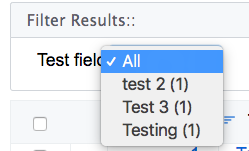
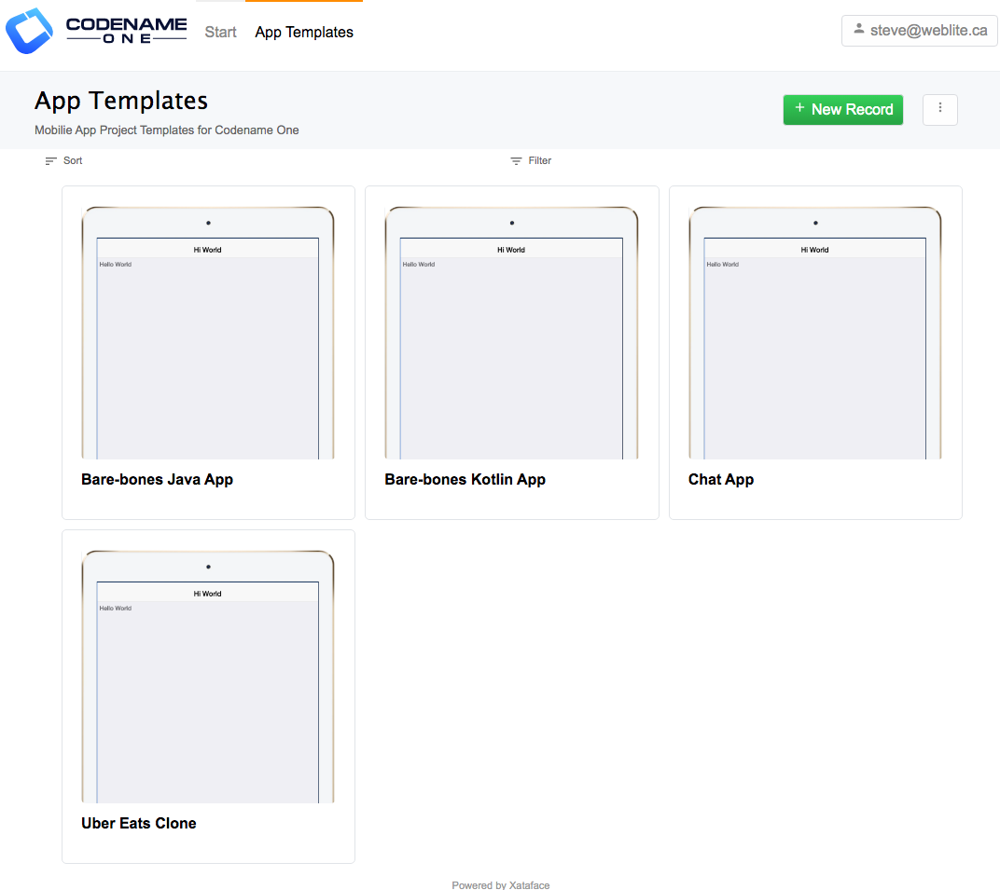
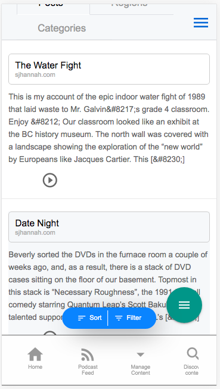
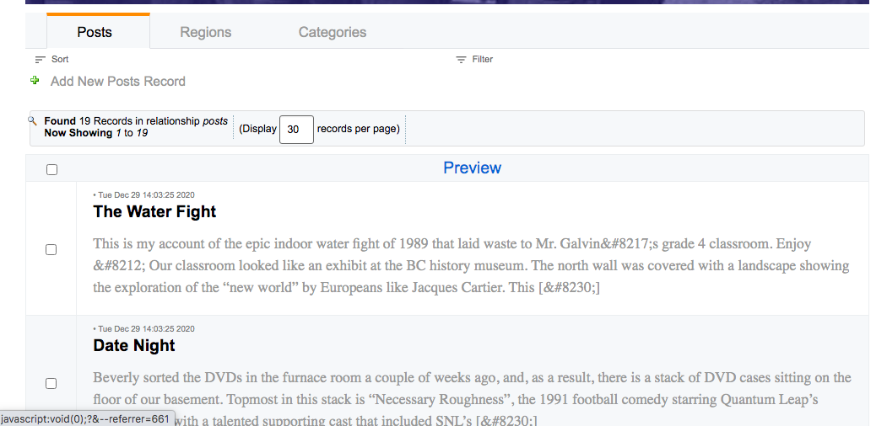
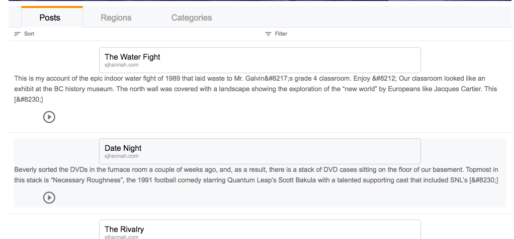
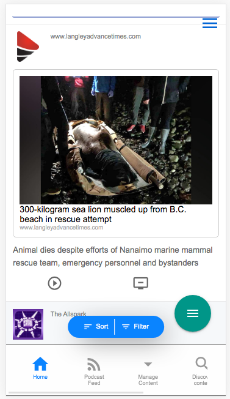

[#list_customization]
== List Customization

The following sections form a sort of cook book with recipes for customizing result lists in Xataface.

=== Adding Option to Filter Result LIst

[discrete]
==== Problem

You want to add a drop-down list for the user to select filters for the result set.

[discrete]
==== Solution

Use the `filter` directive in the fields.ini file on any field that you want the filter to be added for.

.Field definition in fields.ini file using the filter directive.
[source,ini]
----
[test_field]
  filter=1
----

Now, if you navigate to this table's list view, you'll see a drop-down list at the top of the results where you can select all of the distinct values in the `test_field` column.

.List View when a filter field defined.
image::images/Image-150520-070017.404.png[]

.Expanding the filter list, you can see all of the distinct values for the test_field column.
image::images/Image-150520-070032.226.png[]

If you select one of the options, it will filter the results to only show those results that match the filter.

=== Hiding Filter Counts

[discrete]
==== Problem

You want to hide the counts for each entry in the "filters" drop-down list on the list view.  By default when you add a filter list via the `filter` directive, each row has the "count" displayed beside it:

.A result filter list.  Notice each row has a (1) beside it indicating that there is 1 row matching that filter.

We want to hide this.

[discrete]
==== Solution

Use the `show_filter_counts` preferences directive to hide these counts as follows.  In the `_prefs` section of the `conf.ini` file, add:

[source,ini]
----
show_filter_counts=0
----

After this change, the filter lists will look like:

image::images/Image-150520-065357.583.png[]

=== Sorting Filter Results

[discrete]
==== Problem

Filter lists are sorted by the "filtered" field in alphabetical order.  You want to sort the filter lists on some other column.

[discrete]
==== Solution

Use the `filter.sort.` fields.ini directive to specify the field that the filter should sort on.

E.g.

.Sort the "city" filter in descending order
[source,ini]
----
[city]
  filter=1
  filter.sort="city desc"  
----

[#row-css-classes]
=== Adding CSS Classes to Rows

[discrete]
==== Problem

You want to add custom CSS classes to the rows of the table in list view.

[discrete]
==== Solution

Implement the `css__tableRowClass()` method in the table delegate class.  Have it return a string with the CSS classes you wish to add.

[source,php]
----
<?php
class tables_MyTable {
    ...
    
    function css_tableRowClass(Dataface_Record $rec) {
        if ($record->val('status') == 'approved') {
            return 'status-approved another-css-class';
        } else {
            return 'another-css-class status-pending';
        }
    }
}
----

In the above example, on rows where the 'status' field is a approved you'll see something like:

[source,html]
----
<tr class="status-approved another-css-class">
----

and in other rows you'll see 

[source,html]
----
<tr class="another-css-class status-pending">
----

=== Adding Row Actions

[discrete]
==== Problem

You want to add a button to each row of the list view to perform some action on that row.

[discrete]
==== Solution

Define an action with `category=list_row_actions` and `condition="$query['-table'] == 'tablename'`.

E.g.

.Defining an action named "play_post" that is displayed in each row of the list view for the `_tmp_newsfeed` table.
[source,ini]
----
[play_post]
    condition="$query['-table'] == '_tmp_newsfeed'" <1>
    category=list_row_actions
    materialIcon=play_circle_outline <2>
    label="Play"
    description="Play narration"
    url="{$record->getURL('-action=play_post')}" <3>
    url_condition="$record" <4>
    order=1
----
<1> Only display this action in the `_tmp_newsfeed` table.
<2> Uses a material icon for the action.
<3> The `url` directive specifies the URL where the action should go when the user clicks on it.  THe `$record` variable is a `Dataface_Record` object that encapsulates the current row.  We call the `getURL()` method to get the URL for that record with the `play_post` action.
<4> The `url_condition` directive is necessary to stop Xataface from trying to parse the `url` directive if `$record` is `null`.  It is interpretted as a boolean expression. When it evaluates to a falsey value, it will skip parsing the `url` directive.

IMPORTANT:  When the user clicks on this action, they will be directed to the URL `index.php?-table=_tmp_newsfeed&-action=play_post&....`.   You need to make sure to implement this action handler in `actions/play_post.php`.

.The "play_post" action appears in the left-most column of the list view
image::images/Image-140620-091333.203.png[]

[#custom-row-action-styles]
=== Customizing Row Action Styles

[discrete]
==== Problem

You want to customize the style on a particular action

[discrete]
==== Solution

Use the `class` directive on the action to specify a custom CSS class on the `<a>` tag of the action.  Then use this CSS class to target that button specifically from your stylesheet.

[source,ini]
----
[play_post]
    condition="$query['-table'] == '_tmp_newsfeed'"
    category=list_row_actions
    materialIcon=play_circle_outline
    label="Play"
    description="Play narration"
    order=1
    class=large-button
----

Then in your CSS file you can target this action directly:

[source,css]
----
.large-button {
    font-size: 150%;
}
----

=== Adding Javascript Row Actions

[discrete]
==== Problem

You want to trigger a Javascript function when the user clicks on a row action instead of just directing the user to a URL.

[discrete]
==== Solution

Use the `onclick` directive instead of the `url` directive.

See <<javascript-action>> for an introduction to Javascript actions with a detailed example using the `onclick` handler.  The only thing we need to add to make our Javascript action useful, is the ability to retrieve the record ID of the current row.  There are two ways to do this:

. Use the `$record` variable inside the `onclick` directive to obtain details about the record, and add them as parameters to your Javascript function.

e.g.

[source,ini]
----
[myaction]
    category=list_row_actions
    onclick="window.playPost('{$record->val('post_id')}');"
----

An alternative way is to make user of the `xf-record-id` attribute that can be found on the `<tr>` tag of the row in list view.  If you look at the resulting HTML source of the list view, and drill down to the individual rows of the table, you'll see something like:

[source,html]
----
<tr class="listing odd " xf-record-id="_tmp_newsfeed?post_id=73">
...
----

We can use this inside our Javascript function, as follows.  First we pass `this` as an argument to our function. `this` will refer to the `<a>` tag that was clicked.

[source,ini]
----
[myaction]
    category=list_row_actions
    onclick="window.playPost(this);"
----

.Javascript file definine the function that we want to call from our `playPost` function
[source,javascript]
----
(function(){
    var $ = jQuery;
    window.playPost = playPost;
    
    function playPost(el) {
        if (!$(el).attr('xf-record-id')) {  <1>
            var trTag = $(el).parents('[xf-record-id]').first();
            if (trTag.length == 0) {
                return new Promise(function(resolve, reject){ <2>
                    reject('Not found');
                });
            } else {
                el = trTag; <3>
            }
        }
        return new Promise(function(resolve, reject) { <4>
            // Do the actual playing here, and either call resolve() or reject()
            // when done.
        });
        
    }
})();
----
<1> Check to see if the HTML element that element contains the `xf-record-id` attribute.  If it doesn't we need to walk up the DOM until with find an element that does.
<2> If we didn't find *any* elements with the xf-record-id attribute, we'll just return a promise that rejects.
<3> If we found an element with `xf-record-id` we will just use this element instead of the one that was passed into the method.  Since our action is called with `window.playPost(this)`, it will always be passing the `<a>` tag to the `playPost()` method, and the `a` tag doesn't have the attribute.  The parent `<tr>` tag has the attribute, so this is where we crawl up to.
<4> We perform our action on the provided element.  In this case, I'm returning a Promise to get us prepared for performing asynchronous actions cleanly.

[#toggle-row-actions]
=== Making Row Actions Toggleable

[discrete]
==== Problem

You want to add an action to each row of the list view that can be toggled between two different states.  For example, we have functionality to add and remove rows from a playlist.  If the record is currently "on" the playlist, we want the action to display "Remove from playlist".  If the record is not on the playlist, we want the action to display "Add to playlist".

[discrete]
==== Solution

Use two different actions: "add_to_playlist" and "remove_from_playlist" and conditionally show either action depending on whether the record is currently "on" the playlist.

I'll include two different recipes here to achieve this:

1. A fully server-side solution using the `condition` directive.
2. A server *and* client-side solution using Javascript, CSS, and AJAX to add and remove rows from the playlist.

The 2nd option is more complex but yields a better user experience.

[discrete]
===== Solution 1: Using `condition` directive

We can define our actions as follows: (And assume that our table has an "on_playlist" field that indicates whether or not a record is on the playlist currently.

[source,ini]
----
[add_to_playlist]
    condition="$query['-table'] == '_tmp_newsfeed' and $record and !$record->val('on_playlist')"
    category=list_row_actions
    label="Add to Playlist"
    materialIcon="playlist_add"
    order=2
    onclick="window.addToPlaylist(this)"

[remove_from_playlist]
    condition="$query['-table'] == '_tmp_newsfeed' and $record and $record->val('on_playlist')"
    category=list_row_actions
    materialIcon="remove_from_queue"
    order=3
    onclick="window.removeFromPlaylist(this)"
    label="Remove from Playlist"
----

The key here is in the `condition` directives of these actions.  The `add_to_playlist` is set to appear only when we are on the `_tmp_newsfeed` table *AND* the record is not on the playlist.  The `remove_from_playlist` action is set to appear only when the record is on the playlist.

[IMPORTANT] 
====
In both actions we need to ensure that `$record` exists before calling `$record->val('on_playlist')` otherwise the application will crash in cases where there is NO record in the current context.  I.e. We need to have

[source,php]
----
$record and $record->val('on_playlist')
----

and not just 

[source,php]
----
$record->val('on_playlist')
----
====

There is a lot hidden in this solution inside the `addToPlaylist()` and `removeFromPlaylist()` Javascript functions.  These are responsible for actually adding and removing records from the playlist. See <<ajax-list-row-actions>> for an example using AJAX to do this.

[discrete]
===== Solution 2: Using CSS to Show/Hide Actions

The first solution relies on the `condition` directive to show or hide our actions.  However, this directive is processed on the server-side, so we would need to reload the whole page if we wanted to update state.  We can offer a better user experience by using CSS to show/hide the actions.

The gist of this solution is to:

1. Add a CSS class, `on-playlist`, to the  `<tr>` tag (i.e. each record row) to indicate whether that record is currently on the playlist. 
2. Add CSS classes to the two actions, so that we can easily target them from a stylesheet.
3. Add custom CSS to show/hide actions depending on whether the `<tr>` tag includes the `on-playlist` CSS class.
4. The `addToPlaylist()` function removes the `on-playlist` CSS class from the `<tr>` tag, and the `removeFromPlaylist()` adds it.

**Adding the CSS class to the `<tr>` tag:**

TIP: See <<row-css-classes>> for more details on adding CSS classes to rows.

.Method from the table delegate class that causes the `<tr>` tag to have the `on-playlist` CSS class if the record is on the playlist.
[source,php]
----
function css__tableRowClass(Dataface_Record $rec = null) {
    if ($rec->val('on_playlist')) {
        return 'on-playlist';
    }
    return '';
}
----

**Adding CSS classes to the two actions:**

TIP: See <<custom-row-actions-styles>> for more details on using the `class` directive to customize action styles.

[source,ini]
----
add_to_playlist]
    condition="$query['-table'] == '_tmp_newsfeed'"
    category=list_row_actions
    label="Add to Playlist"
    materialIcon="playlist_add"
    order=2
    onclick="window.addToPlaylist(this)"
    class="add-to-playlist" <1>

[remove_from_playlist]
    condition="$query['-table'] == '_tmp_newsfeed'"
    category=list_row_actions
    materialIcon="remove_from_queue"
    order=3
    onclick="window.removeFromPlaylist(this)"
    label="Remove from Playlist"
    class="remove-from-playlist" <2>
----
<1> We add the `add-to-playlist` CSS class to the `<a>` tag for the "add" action.
<2> We add the `remove-from-playlist` CSS class to the `<a>` tag for the "remove" action.

**Defining Styles to Show/Hide Actions**

Now that we have our CSS actions defined, we'll be dealing with HTML like:

[source,html]
----
<tr class="on-playlist">
  ....
  <a class="remove-from-playlist" ...> ... </a>
  
  <a class="add-to-playlist"...> ...</a>
----

Now we can target our `<a>` tags with the following CSS directives in our stylesheet.

[source,css]
----
/* Hide add-add-to-playlist when tr has on-playlist class */
tr.on-playlist .add-to-playlist {
    display:none;
}

/* Hide remove-from-playlist by default */
span.row-actions .remove-from-playlist {
    display:none;
}

/* Show remove-from-playlist when tr has on-playlist class */
tr.on-playlist .remove-from-playlist {
    display:block;
}
----

**Adding/Removing CSS classes using Javascript**

As we've seen above, our actions will trigger the `addToPlaylist()` and `removeFromPlaylist()` functions respectively.  We just need add/remove the CSS class as appropriate here.

e.g. 

[source,javascript]
----

function addtoPlaylist(el) {
    if (!$(el).attr('xf-record-id')) { 
        var trTag = $(el).parents('[xf-record-id]').first();
        if (trTag.length == 0) {
            return new Promise(function(resolve, reject){
                reject('Not found');
            });
        } else {
            el = trTag;
        }
    }
    $(el).addClass('on-playlist'); <1>
    return new Promise(function(resolve, reject) { 
        // Do the actual playing here, and either call resolve() or reject()
        // when done.
        
        addToPlaylistImpl(el.attr('xf-record-id')).then(function(data) {
            // success
            resolve(data);
        }).catch (function(data) {
            // Failed
            $(el).removeClass('on-playlist'); <2>
            reject(data);
        });;
    });
}

function removeFromPlaylist(el) {
    if (!$(el).attr('xf-record-id')) { 
        var trTag = $(el).parents('[xf-record-id]').first();
        if (trTag.length == 0) {
            return new Promise(function(resolve, reject){
                reject('Not found');
            });
        } else {
            el = trTag;
        }
    }
    $(el).removeClass('on-playlist');<3>
    return new Promise(function(resolve, reject) {
        // Do the actual playing here, and either call resolve() or reject()
        // when done.
        
        removeFromPlaylistImpl(el.attr('xf-record-id')).then(function(data) {
            // success
            resolve(data);
        }).catch (function(data) {
            // Failed
            $(el).addClass('on-playlist'); <4>
            reject(data);
        });;
    });
}
----
<1> Optimistically add the 'on-playlist' CSS class when user clicks the "add" button.  This will toggle the actions immediately.  
<2> If the action failed, we revert the CSS class back, by removing the "on-playlist" CSS class.
<3> Optimistally remove the 'on-playlist' CSS class when user clicks the "remove" button.  This will toggle the actions immediately.
<4> If the action failed, we revert the CSS class back, by re-adding the "on-playlist" CSS class.

[#ajax-list-row-actions]
=== Using AJAX To Modify Row Records

[discrete]
==== Problem

You need to perform a server-side action when the user clicks on a row action.  E.g. From <<toggle-row-actions>>, we needed to add and remove the row record from the playlist.

[discrete]
==== Solution

Create a custom action handler that performs the the function, and returns JSON, and write a Javascript function that calls this AJAX action.

TODO: Need to write this solution

[#default-sort]
=== Specifying Default Sorting

[discrete]
==== Problem

You want the records in a particular table to be sorted on a particular column by default.

==== Solution

Use the `table.default_sort` property of the fields.ini file.

.Using the `table.default_sort` property in the fields.ini file to sort records in descending order on the date_posted field.
[source,ini]
----
table.default_sort=date_posted desc
----

TIP: See <<default-related-sort>> to learn how to set the default sort order on a related tab.

[#grid-view]
=== Rendering List View as a Grid

[discrete]
==== Problem

You want to display the "list" view as a grid for one or more tables in your app.

[discrete]
==== Solution

Add `list_template=@grid` to the beginning of your table's `fields.ini` file.

This will cause the list to use the `actions/list/grid.html` template for rendering the list view.

.Example rendering list as a grid.

Note: For the "grid" layout to make sense, you should have at least one image column column in the table.  You can specify a column as an "image" column by adding the `image=1` fields.ini directive.

[#list-style-mobile]
=== Using Mobile List Template on Desktop

[discrete]
==== Problem

The Xataface list view is responsive, and renders lists differently on mobile devices than on desktop.  In some cases you may prefer to use the mobile list style on desktop also to achieve a unified look.

[discrete]
==== Solution

Set the `table.listStyle=mobile` directive in the table's fields.ini file.  This is a table-level directive, so it should be at the top of your fields.ini file, before any of the field definitions.

Let's look at a quick example.  Here is a list using the mobile theme.

Here is the same list when viewed on a desktop:

Now, I'll add the `table.listStyle=mobile` directive to the beginning of the table's fields.ini file.

The result is:

NOTE: This directive will also affect how related lists *to* this table are rendered, but only in one-to-many relationships to this table (i.e. where the rows are essentially records of this table).

[#row-style-external-link]
=== Rendering Row as Link to External URL

[discrete]
==== Problem

You want to render the rows of your table such that they summarize some external web page, and provide a link to it, similar to the way that Twitter renders tweets that contains a link to a webpage.

[discrete]
==== Solution

Use the `table.listStyle=mobile` fields.ini directive in conjunction with the `table.row_style=external-link` directive, and implement a calculated field on the table named `external_link` as I will describe below.  The result will be something that looks like:

[discrete]
===== Steps

. Add the following to the beginning of your fields.ini file (before any field definitions):
+
[source,ini]
----
table.listStyle=mobile <1>
table.row_style=external-link <2>
----
<1> The `table.listStyle` directive will make sure that the desktop version uses the mobile list theme, since the `external-link` style is only rendered in the mobile theme.
<2> The `table.row_style` directive tells the list view and related list views to render rows in the external-link theme.
. Define a method named `field__external_link()` in your table delegate class as follows:
+
[source,php]
----
function field__external_link(Dataface_Record $rec) {
    // return an array with url, title, and cover_image keys
    return [
        'url' => $rec->display('page_url'), <1>
        'title' => $rec->display('article_title'), <2>
        'cover_image' => $rec->display('article_image') <3>
    ];
}
----
<1> The `url` key should refer to the URL for the given record.  In this example we assume that the table has a column named `page_url` containing the URL to the link.
<2> The `title` key should refer to an article title to display.  In this example we assume that the table has a column named `article_title`.
<3> The `cover_image` key should refer to the URL for an image for the article. In this example, we assume that the table includes a field called `article_image` containing a URL - though this could also be a container or blob field in this example, as the `display()` method would get the URL to the container's image.

