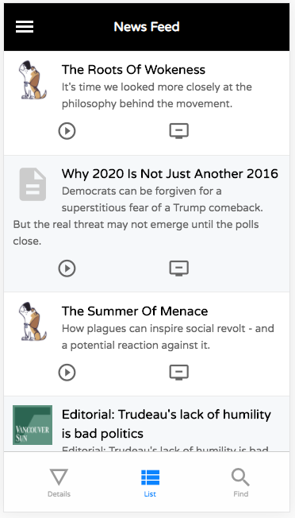

[#responsive-ui]
== Responsive UI

Starting in Xataface 3.0, the entire the user interface has been revamped to provide a good mobile experience out of the box.  Every aspect of the UI has been reviewed and improved to fit user expectations of a mobile application.  Elements that don't make sense in a mobile interface have been "hidden" and replaced with other more suitable elements.  

Here are a few snapshots of the new look:

.List view

.Details view

.New Record Form

.Hamburger Menu

.Login form
image::images/Image-060820-013629.481.png[]

You'll notice quite a few differences from the desktop theme:

. Instead of a table with columns, the "list" view renders similar to the view you would expect in a mobile news, mail, or social media app.  Each row includes a title, description, icon, and set of actions that can be performed.
. The familiar "Details", "List", and "Find" tabs are still there, but have been moved to the bottom of the screen and have been restyled to look more like the tabs in native mobile apps.
. The navigation menu (to select the *table*), and personal tools menu ("logout", "profile", etc..) are now contained in hamburger slide-out menu; a common pattern in mobile apps.
. Table actions (e.g. "New Record", "Delete", etc..) have been moved into a FAB (floating action button) in the lower right that hovers over the screen.  This is also a common element in mobile apps.
. Forms are laid out in a single column, and the "Save" button has been moved to a fixed position at the bottom of the screen to streamline usability.

=== Switching Between Mobile And Desktop Theme

The theme is fully responsive, meaning that it will automatically render the appropriate UI based on the size of the window.  Currently the threshold occurs as a window width of 768 pixels.  If the window is wider than that, it will render the desktop UI.  Narrower, and it will render the mobile theme.

When in "mobile" mode, the `body` tag will include the "small" CSS class.  When in "desktop" mode, it will include the "large" CSS class.  This will allow you to define CSS styles that target mobile or desktop separately.  E.g.

.Using CSS to target styles to mobile or desktop.  The following would render `<h1 class="mystyle">My heading</h1>` as blue on mobile and green on desktop.
[source,css]
----

/**
 * red style for h1 tags.  Not used at all because it is overridden
 * by following two rules on mobile and desktop.
 */
h1.mystyle {
    color:red;
}

/**
 * Blue style applied on mobile only.
 */
body.small h1.mystyle {
    color:blue;
}

/**
 * Green style applied on desktop only.
 */
body.large h1.mystyle {
    color:green;
}
----

A Javascript event is fired both when entering and exiting mobile mode.  You can use these events in your Javascript code to be notified when transitioning between modes.  E.g.

.The `xf-mobileenter` and `xf-mobileexit` events are fired when entering and leaving mobile mode respectively.
[source,javascript]
----
// Event that is fired when the window enters "mobile" mode
window.addEventListener('xf-mobileenter', function() {
    // Do stuff required to adjust to the change to mobile mode
});

// Event that is fired when the window exits "mobile" mode
window.addEventListener('xf-mobileexit', function() {
    // // Do stuff required to adjust to the change to desktop mode
});
----

For more information about these events, see <<javascript-events>>.

=== Mobile Header and Footer

The header and footer components of the mobile theme have "fixed" positions.

.The mobile header
image::images/Image-060820-022427.761.png[]

.The mobile footer

The size of these components may change as it is possible to add and remove contents from these components.  It is also possible to hide them in some contexts.

Xataface automatically configures the body padding so that these do not obscure other content on the page.  If you are using fixed or absolute positioning, you should be aware of these components.  You can use the `xf-viewport-changed` Javascript event be be notified when the size of the header or footer is changed.  For example, the FAB component is designed to hover in the lower right corner of the page, but it shouldn't overlap the bottom tabs, so it needs to be positioned relative to the "mobile-footer" component. It uses the following code to accomplish this:

.The FAB component makes use of the `xf-viewport-changed` event to reposition itself when the mobile footer or header is changed.
[source,javascript]
----
function updatePosition() {
    var zoom = document.querySelector('.zoom');
    
    if (zoom) {
        var footer = document.querySelector('.mobile-footer');
        if (footer) {
            zoom.style.bottom = (footer.offsetHeight + 10) + "px";
        }    
    }
}
window.addEventListener('xf-viewport-changed', updatePosition);
----

[discrete]
==== Hiding the Header and Footer

You can hide the mobile-header and/or mobile-footer components by adding "no-mobile-header" and "no-mobile-footer" CSS classes to the `body` tag respectively.

.Hiding the Header from Javascript
[source,javascript]
----
document.body.classList.add('no-mobile-header');
----

.Hiding the footer from Javscript
[source,javascript]
----
document.body.classList.add('no-mobile-footer');
----

[TIP]
====
You can use the `addBodyCSSClass()` method of the `Dataface_Application` class to add CSS classes to the `body` tag from PHP.  E.g.

[source,php]
----
$app = Dataface_Application::getInstance();
$app->addBodyCSSClass('-no-mobile-header');
----
====

NOTE: Certain Xataface actions hide the header, footer, and FAB by default.  Some examples include the login, edit, and new record forms.

[discrete]
==== Adding Content to the Footer

The mobile footer is a handy place to add content that you want to display in a fixed position at the bottom of the screen.  The following snippet shows how to add a component to the top/beginning of the mobile footer.

[source,javascript]
----
var mobileFooter = document.querySelector('.mobile-footer');
jQuery(mobileFooter).prepend(myElement);
----

=== Table Tabs

.The mobile table tabs.

The table tabs (i.e. "Details", "List", and "Find") are rendered in the mobile footer by default. These are taken from the same actions as the table tabs in the desktop UI.  You can add/remove options to this menu by adding actions to the "table_tabs" category.  

TIP: For best results, make sure that the action includes a `materialIcon`.  See <<material-icons>> for more details on material icons.

Like the header and footer, you can hide the table tabs in mobile using the "no-table-tabs" CSS class on the "body" tag.

For example, the "edit" action includes the following snippet to remove the header, fab, and table tabs.

[source,php]
----
$app->addBodyCSSClass('no-table-tabs');
$app->addBodyCSSClass('no-mobile-header');
$app->addBodyCSSClass('no-fab');
----
        
=== FAB (Floating Action Button)

.FAB with one action
image::images/Image-060820-025738.446.png[]

.FAB with more than one action is rendered with a menu icon.  Clicking on it expands it to show the individual actions.

.FAB expanded to show actions.
image::images/Image-060820-030005.881.png[]

The *table actions menu* is rendered using a floating action button.  You can hide this by adding the "no-fab" CSS class to the `body` tag.

To add options to the FAB, simply add actions to the `table_actions_menu` category, and make sure they have a `materialIcon` directive.  See <<material-icons>> for more about material icons.

[TIP]
====
Actions in the `table_actions_menu` category are shared between the desktop and mobile themes.  You can make the action desktop-only by adding "\#large#" to the `tags` property of the action. E.g.

[source,ini]
;An action that only shows up on desktop
[myaction]
    category=table_actions_menu
    label="My Action"
    tags="#large#"
====

=== Customizing the List View

The rows of the list view use different mark-up in mobile than in desktop.  Both versions are rendered in HTML, but only one of them is visible at any given time.

There are 4 core content elements of a row in the mobile theme:

.A row in the mobile theme.
image::images/Image-060820-031126.567.png[]

Logo::

A logo or icon that is rendered on the left side.  You can customize this image by setting a field of your data base as the "logo".  The logo field should contain the URL to an image.  You can use a container field for this, a regular field, or a calculated field. E.g.
+
.Logo field defined in fields.ini file.
[source, ini]
----
[mylogofield]
    logo=1
----

Title::

+
The title field. There are many ways to define the title field.  Xataface uses some heuristics to guess the field, but you can configure this explicitly using the `getTitle()` delegate method or the `title` fields.ini property.

Description::

+
The description field.  There are many ways to define the description field.  As with "title", Xataface uses some heuristics to guess the most appropriate field, but you can configure this explicitly using the `getDescription()` delegate method or the `description` fields.ini property.

Record Actions::
image:images/Image-060820-031958.143.png[]
+
Actions from the "list_row_actions" category are rendered in the south of the row.  For best results, the action should include the "materialIcon" directive.  See <<material-icons>> for more details about material icons.

[discrete]
==== Useful CSS Classes In Mobile List View

mobile-listing-row::
The `
` tag wrapping the row.  This tag will also include the `xf-record-id` attribute whose value is the record ID of the record.  This element is the analog of the `<tr>` tag of the desktop interface.

mobile-row-content::
Inner `
` tag containing the row content. 

mobile-logo::
`
` tag wrapping the logo.

mobile-title::
`
` tag wrapping the record title.

mobile-description::
`
` tag wrapping the record description.

