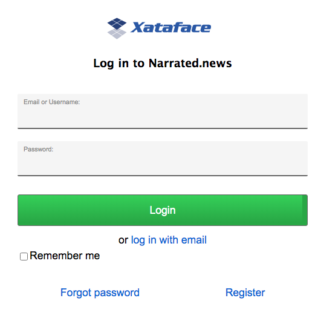

[#security]
== Security

The following chapters cover all things security-related in Xataface.

[#authentication]
=== Authentication

Xataface comes with authentication ready to roll out of the box. With a couple of configuration options in the conf.ini file, you can activate the default authentication scheme which uses a table (of your choice) in the database to authenticate against. It supports password encryption, and even includes a registration form if you choose to allow registrations for your application.

In addition Xataface's authentication is pluggable, meaning you can write your own plug-ins to integrate your application with any authentication scheme you choose. Some authentication modules that already exist include:

https://github.com/shannah/xataface-module-auth-cas[Yale CAS]::
A module to use https://developers.yale.edu/cas-central-authentication-service[Yale's Central Authentication Service] for authentication.

https://github.com/shannah/xataface-module-auth-ldap[LDAP]::
A module to use https://en.wikipedia.org/wiki/Lightweight_Directory_Access_Protocol[LDAP] for authentication.  There is also another, more advanced LDAP module developed by Viharm available https://bitbucket.org/viharm/xatafaceldapauth/[here].

https://github.com/shannah/xataface-module-auth-http[HTTP]::
A module to use standard HTTP basic authentication.

https://github.com/shannah/xataface-module-oauth[OAuth]::
A module to use an https://oauth.net/[OAuth] service for authentication.  This module provides all of the common infrastructure required to support OAuth.  There are also modules built on this module which provide authentication using a few popular web sites such as https://github.com/shannah/xataface-module-oauth-facebook[Facebook], https://github.com/shannah/xataface-module-oauth-twitter[Twitter], https://github.com/shannah/xataface-module-oauth-linkedin[LinkedIn], and https://github.com/shannah/xataface-module-oauth-instagram[Instagram].
+
See <<oauth>> for more information about setting up OAuth authentication.

==== Setting up Basic Authentication

. Create a table (if you haven't already) to store your application's users. At the bare minimum, this table should have fields to store the username and password (you may call these fields whatever you like). An example table might be:
+
[source,sql]
----
CREATE TABLE `users` (
   `username` VARCHAR(32) NOT NULL,
   `password` VARCHAR(32) NOT NULL,
   PRIMARY KEY (`username`)
)
----
. Add the following (`_auth` section) to your `conf.ini` file:
+
[source,ini]
----
[_auth]
    users_table=users
    username_column=username
    password_column=password
----
+
This tells Xataface which table you are storing your user accounts in, and the names of the username and password columns.
. Add a sample user record to the *users* table if one does not exist yet.
+
[source,sql]
----
INSERT INTO `users` (`username`,`password`) VALUES ('steve','mypass')
----
. Load your application in your web browser and you'll notice a "login" link in the upper right that allows you to log in.

==== Using Encryption for the Password

It is good practice to perform some type of encryption on passwords that you store in a database, so that they will be safe, even if your server's security is compromised. Some common forms of encryption are SHA1 and MD5. You can apply encryption to your passwords by defining the encryption property to the `password` field's section of the users table `fields.ini file`. E.g.

.fields.ini definition on the users table password field to store passwords with md5 encryption
[source,ini]
----
[password]
    encryption=md5
----

This tells Xataface to save data to the password field of the users table with MD5 encryption.

.fields.ini definition on the users table password field to store passwords with https://en.wikipedia.org/wiki/SHA-1[sha1] encryption
[source,ini]
----
[password]
    encryption=sha1
----

This tells Xataface to save data to the password field of the users table with https://en.wikipedia.org/wiki/SHA-1[SHA1] encryption.

[IMPORTANT]
====
In order to switch to MD5 or SHA1 encryption with an existing Xataface installation, all un-encrypted (plain text) passwords must be first converted to MD5. There are several ways to do this. One method is to directly convert the passwords in the database with the MySQL MD5 or SHA1 function. This can be done from the command-line or using a tool such as phpMyAdmin.
====

[TIP]
====
If you only have a small number of user accounts that require encryption to be updated, it may be easier to just change the passwords manually through Xataface by editing the user records.  They will be automatically encrypted according to the `encryption` directive in the fields.ini file.
====

==== Limiting Access Based on User

Authentication and permissions are distinct issues, but they are related. It is quite common to require a user to log in to access a section of an application. Permissions can be defined in either the Application delegate class or a table's delegate class - or both.

As an example, if we want to require users to log in to access our application we could define the following `getPermissions()` method to our application delegate class:

.Application delegate class with `getPermissions()` implemented.  This implementation allows ALL access to logged in users, and NO access otherwise.
[source,php]
----
<?php
class conf_ApplicationDelegate {
    function getPermissions(Dataface_Record $record=null){
        // $record is a Dataface_Record object
        $auth = Dataface_AuthenticationTool::getInstance();
        $user = $auth->getLoggedInUser();
        if ( $user ) return Dataface_PermissionsTool::ALL();
        else return Dataface_PermissionsTool::NO_ACCESS();
    }
}
----

==== Checking Who Is Logged In

The `Dataface_AuthenticationTool` class handles all of the dirty work of Xataface's authentication. It provides public methods to check who is logged in and perform authentication if necessary. Anywhere inside your Xataface application you can find out who is logged in using one of the following two methods:

* `getLoggedInUser()` - Returns a Dataface_Record object representing a record from the users table.
* `getLoggedInUsername()` - Returns a string.

It is quite useful in the `getPermissions()` method of your delegate classes to find out who is logged in:

[source,php]
----
function getPermissions(Dataface_Record $record=null){
    $auth = Dataface_AuthenticationTool::getInstance();
    $user = $auth->getLoggedInUser();
    if ( $user and $user->val('username') == 'shannah' ){
        // Steve is logged in so we give him special permissions
        return Dataface_PermissionsTool::ALL();
    } else {
        // Steve is not logged in so we give only read only permissions
        return Dataface_PermissionsTool::READ_ONLY();
    }
}
----

==== Checking Who is Logged In from a Template

All templates in Xataface have access to the `$ENV` array that contains references to lots of useful information, including the currently logged in user:

`$ENV.user`::
The user object of the currently logged in user (or null if nobody is logged in). This is a Dataface_Record object.

`$ENV.username`::
The name of the currently logged in user. A string.

For example:

[source,html]
----
<!-- 
     Print 'Hello Steve' if Steve is logged in,
     'Hello Helen' if Helen is logged in, or just 
     'Hello' if nobody is logged in. 
-->
Hello {$ENV.username}

<!-- Print some personal user info -->
{if $ENV.user}
    Phone number: {$ENV.user->val('phone')} 
    Email address: {$ENV.user->val('email')} 
{/if}
----

This example presumes that the users table has `phone` and `email` fields.

[#user-registration]
=== Allowing User Registration

By default, there is no way for users to create an account themselves.  A user account would need to be set up by the system administrator first.  If you want users to be able to register for accounts themselves, you can add the `allow_register=1` directive to the `_auth` section of the conf.ini file.

E.g.

[source,ini]
----
[_auth]
    users_table=users
    username_column=username
    password_column=password
    email_column=email <1>
    allow_register=1 <2>
----
<1> The `email_column` directive specifies the column that should store the user's email address. This is required for user registration since it needs to send an activation email to verify the user's email address.
<2> The `allow_register=1` directive turns on user registration.

With these settings, the login form will now contain a "Register" link as shown below:

image::images/Image-030121-074342.100.png[]

If the user clicks on this link, they'll be taken to a registration form, which is basically a "new record" form on the Users table.  

.A plain-Jane registration form which contains fields from the users table.
image::images/Image-030121-074655.819.png[]

The difference between the registration form and the New record form is that the registration form doesn't immediately add records into the database.  When the user submits the form, it stores the data in a special registrations table, and sends the user an email with a link to confirm their registration.  If the user clicks on this link, it will then copy the registration information into an actual record of the users table and save it.

====
**Recommended Users Table Permissions**

The registration form includes all fields of the users table that grants the "register" permission.  The register permission is the *only* permission that is part of the "NO ACCESS" role, and it is not included in any of the default roles.  Ideally you should be explicit about which fields of the users table you grant the "register" permission on.

The following is a snippet from the delegate class for the users table of an application which demonstrates one way to define permissions.

.Delegate class of users table which provides read-only access to the user record owner, and no access to other users.  It also grants the 'register' permission on the "username", "password", and "email" fields.
[source,php]
----
<?php
class tables_users {

    /**
     * Record/Table-level permissions.
     * Admins = ALL access
     * Owner (i.e. the user whose record this represents) = READ ONLY access
     * Non-logged in user = Only 'register' permission
     * Other users = NO ACCESS
     */ 
    function getPermissions(Dataface_Record $rec = null) { <1>
        if (isAdmin()) {
            // Admins get ALL access (this defers to application delegate class
            // which grants all access to admin).
            return null;
        }
        $user = getUser();
        if ($user and $rec and $rec->val('userid') == $user->val('userid')) {
            // This record is the user record for the current user.
            // give him read only access.
            return Dataface_PermissionsTool::READ_ONLY();
        }
        $user = getUser();
        if (!$user) {
            // User is not logged in.
            // Grant the 'register' permission to allow the register action
            // to work properly.
            return array('register' => 1);
        }
        
        // No access to anyone else.
        // This defers to the application delegate class which grants no 
        // access to non-admin users.
        return null;
    }
    
    /**
     * Default field permissions.
     * Non-Logged-in users = Deny the 'register' permission
     * All other users = Defer to record-level permissions.
     */
    function __field__permissions(Dataface_Record $rec = null) { <2>
        $user = getUser();
        if (!$user) {
            return array('register' => 0);
        }
    }
    
    /**
     * Permissions for username field.
     * Non-logged-in users = Allow the 'register' permission.
     * All other users = Default to default field permissions.
     */
    function username__permissions(Dataface_Record $rec = null) { <3>
        $user = getUser();
        if (!$user) {
            return array('register' => 1);
        }
    }
    
    /**
     * Permissions for password field.
     * Non-logged-in users = Allow the 'register' permission.
     * All other users = Default to default field permissions.
     */
    function password__permissions(Dataface_Record $rec = null) { <4>
        $user = getUser();
        if (!$user) {
            return array('register' => 1);
        }
    }
    
    /**
     * Permissions for the email field.
     * Non-logged-in users = Allow register permission.
     * All other users = Default to default field permissions.
     */
    function email__permissions(Dataface_Record $rec = null) { <5>
        $user = getUser();
        if (!$user) {
            return array('register' => 1);
        }
    }
    
    // ...
}
----
<1> `getPermissions()` defines record-level permissions. 
<2> `__field__permissions()` defines default field-level permission overrides.  In this case we are denying the "register" permission by default so that no fields appear on the registration form by default.
<3> `username__permissions()` overrides permissions of the "username" field to grant the "register" permission, so that it will appear on the registration form.
<4> `password__permissions()` overrides the permissions of the "password" field to grant the "register" permission, so that it will appear on the registration form.
<5> `email__permissions()` overrides permissions of the "email" field.

TIP: This snippet makes use of the `getUser()` and `isAdmin()` functions which are not a part of the Xataface public API.  They are defined separately in this app. You can see sample implementations of these functions https://github.com/shannah/xataface/blob/master/snippets/functions.inc.php[here].

====

==== Disabling Email Validation

By default the registration form doesn't create the account directly.  It will first send a validation email to the user.  When the user clicks on the "activation link" in this email, the account is created and the user is automatically logged in.

If you with to skip this step, and have the registration form create accounts directly, you can override the "register" action in your actions.ini file and override the "email_validation" directive as follows:

.actions.ini file overriding "register" action to skip the email validation step.
[source,ini]
----
[register > register]
  email_validation=0
----

[#email-login]
=== Enabling Email Login

I hate passwords.  I hate having to think of a new password every time I register for a website, as I know I won't remember it.  When visiting a website for the first time in a while, I almost always need to use the "Forgot Password" function.  This process is painful as it requires several extra steps, and, at the end of it all, I'm forced to create yet another password that I won't remember.

In many cases a better option is for the site to support "Email Login" directly.  The workflow for email login is simple:

. The login form has a single field for "Email", and a button "Email Login Link" as shown here:
+
image::images/Image-030121-082425.813.png[]
. The user enters their email address and presses "Email Login Link".
. An email is sent to the user's email with a single-use link to log into the app.  The email looks like the following:
+
image::images/Image-030121-071452.674.png[]
. The user clicks on the link and they are logged in directly without being hassled to enter a password.

To enable Email login, your users table must have an email field.  You may use the "username" field to store the email address if you like, but the `_auth` section of the conf.ini file needs to declare which field contains the email.

.conf.ini authentication settings which enables email login.
[source,ini]
----
[_auth]
    users_table=users
    username_column=username
    password_column=password
    email_column=email <1>
    allow_email_login=1 <2>
----
<1> `email_column` directive, specifying that the user email address is stored in the "email" column.
<2> `allow_email_login` directive enables Email login.

[WARNING]
====
If you are allowing users to log in with their email address, you should take some care to prevent duplicate emails.  Xataface puts some automatic safe-guards in place such as login won't work if it finds two user accounts with the same email address.  You should additionally add a Unique Key/Index on your email column to further prevent users from having the same email address.
====

[WARNING]
====
While you *can* use the same field for the username and email address, but I don't recommend this as users sometimes change their email address, and the username should stay unchanged to ensure referential integrity.
====

With these directives in place, the login form will look something like the following:

image::images/Image-030121-082425.813.png[]

Notice that there is a link to "log in with password".  Pressing this link will toggle back to the password login form:

image::images/Image-030121-082619.526.png[]

Also notice that there is still a "Forgot password" option, in case the user would prefer to log in with their password.

==== Disabling Password Login

If you have email login enabled, you can optionally disable password login entirely.  This may make sense for some services, in the spirit of "less is more" in terms of usability.  You can use the `allow_password_login=0` directive in the `_auth` section of the conf.ini file to achieve this:

.conf.ini file with password login disabled.
[source,ini]
----
[_auth]
    users_table=users
    username_column=username
    password_column=password
    email_column=email
    allow_email_login=1
    allow_password_login=0 <1>
----
<1> The `allow_password_login` directive disables password login so that email login is the only option.

With these options, the login form will not include the "or log in with password" link as shown below:

.Login form with password login disabled
image::images/Image-030121-082708.897.png[]

Also notice that the "Forgot Password" option is no longer displayed.  With `allow_password_login=0` you'll also notice that there is no "Change Password" option once logged in.

==== Requesting Short Login Code

In some cases a login link may not be the ideal format for the second step of email login.  For example, if you are requesting a login link for a mobile app, it may be easier to provide the user with a short login code in their email which they can enter in the app to complete the login.  This is disabled by default because a shorter login code is a little bit less secure than a full login token.

Short login codes can be enabled for <<api-authentication>> only using the following workflow:

. Add the `short_token_length` directive to the `[_auth]` section of the conf.ini file to set the number of characters in the login code. E.g.
+
.Setting login code length to 6 in conf.ini file.
[source,ini]
----
[_auth]
    ...
    short_token_length=6
----
. Send a _POST_ request to the _xf_email_login_ action with the following parameters:
+

|===
|Parameter |Value

|-action
| xf_email_login

|--redirectUrl
| Any URL

|--email
| The email address of the account

|--request-login-code
| 1

|--remember-me
| 0 or 1.  1 indicates that the login should be sticky.

|===
. This will trigger an email to the user with the login code.  The email will include the code as shown below.
+

+
The user would copy this code into your app
. Your app would then issue a login request with this code as the `--token` parameter, using a POST request with the following parameters:
+
|===
|Parameter |Value

|-action
|login

|--token
| The login code that the user entered as received in their email.

|--no-prompt
| 1
|===
+
[TIP]
====
The HTTP request should include the header `Content-type: application/x-www-form-urlencoded`
====
+
See <<api-authentication>> for more details about API authentication.

[#email-registration]
==== Email Registration

The email login examples shown thus far have not included user registration. (See <<user-registration>>), but it is fully supported.  If the user clicks on the "Email Login Link", and there is a valid email address in the Email field, it will always at least "pretend" to send a login email.  I.e. it will always display the following dialog:

image::images/Image-030121-083336.042.png[]

This is for security purposes to prevent malicious actors from testing different email addresses to see if they have an account.

However, depending on your authentication configuration, it will do something different.

If `allow_register=0` or `allow_register` is not set::
The system won't send an email at all, but it will log this to the PHP error log.

If `allow_register=1`::
The system will send an email, but instead of a login link, it will include a link to the registration form.  The email will look something like:
+
image::images/Image-030121-083758.534.png[]

==== Enabling Auto-Registration

Xataface supports an auto-registration feature that helps to minimize the amount of friction involved in creating a user account.  When Auto-registration is enabled, the "Email login link" will work (almost) identically for existing user accounts as they do for non-existent accounts. 

To enable auto-registration, you can add the `auto_register=1` directive to the `_auth` section of your conf.ini file.  E.g.

[source,ini]
----
[_auth]
    users_table=users
    username_column=username
    password_column=password
    email_column=email
    allow_register=1 <1>
    allow_email_login=1
    auto_register=1 <2>
----
<1> The `auto_register=1` directive turns on auto-registration.
<2> The `allow_register=1` directive is required for auto-registration to work.

Auto-registration pertains to the scenario when a user presses the "Email Login Link" and they don't already have an account on the system.  The "normal" workflow, in this case is to send a registration link (if `allow_register=1`), which takes the user to the registration form.

With `auto_register=1`, the register link simply creates an account for the user and logs them in directly, without visiting any registration form.

This presents the minimum amount of friction possible for creating new accounts.

====
**The Register Action**

If you have email authentication enabled (i.e. `allow_email_login=1`), password authentication disabled (i.e. `allow_password_login=0`), and auto registration enabled (i.e. `auto_register=1` and `allow_register=1`), then the "Register" link will still appear on the login form, *but* it will merly display a prompt advising the user to use the "Email Login Link" button to create an account.

====

[#session-config]
=== Session Configuration

By default, Xataface authentication uses https://www.php.net/manual/en/book.session.php[PHP sessions], which relies on a SESSION ID cookie to link requests to a session file on the server file system.  The logged in username is stored in the `$_SESSION['UserName']` variable.  If you want to log the user out programmatically, you could simply unset this variable, or destroy the session.  Most of the time, however, it is recommended that you just use the built-in Xataface workflows for login/logout.

The three most common aspects of sessions that developers want to configure are:

1. **The Cookie Timeout** - E.g. When should the cookie expire.  This can be configured using the `session_timeout` property in the `_auth` section of the conf.ini file.  The default value is "0", meaning that the cookie will persist in the browser until the browser is closed.
2. **The Cookie Path** - E.g. What path in your app's domain will have access to the session cookie.  By default the cookie is only availalble to the application root.  E.g. If your application is located at `http://example.com/path/to/myapp/index.php`, then the cookie path will be "/path/to/myapp/".  Therefore scripts running under "/path/to/anotherapp/" won't be able to access the cookie (and thus won't share sessions with this app).  Neither will scripts in a parent directory (e.g. `http://example.com/anotherscript.php`).  Only scripts under the path `/path/to/myapp/...` will have access to the session cookie.  This can be configured using the `cookie_path` property in the `_auth` secton of the conf.ini file.
3. **Garbage Collection Timeout** - E.g. How long after a session is idle, before the server will delete the session files.  By default this is set to 5 minutes longer than the cookie timeout, and thus, can be configured using the same `session_timeout` property.

**Example Settings**

.Example session configuration in conf.ini file
[source,ini]
----
[_auth]
  session_timeout = 86400   ; 1 day
  cookie_path=/             ; Session cookie available to whole domain
  session_name=my_app_sid   ; Optional custom session name to avoid collisions with other apps
----

[#auto-login]
=== Auto-Login Support

In some cases you may want your sessions to last "forever".  I.e. If the user logs in once, you want them to stay logged in forever- or until they explicitly log out.  Your first instinct might be to use the `session_timeout` directive to a really big number so that sessions last for 10 years.  This is problematic for two reasons:

1. Keeping session files lingering for 10 years can fill up your server disk space pretty quickly.  Especially on sites that get a lot of traffic.
2. Some servers may thwart your intentions and delete the session files despite your explicit intention to keep them.  Especially on a shared server, it can be difficult to get full cooperation of the server to *not* delete those session files.

A better alternative is to activate "auto-login" support in your app.  With auto-login support enabled, the login form will include a "Remember me" checkbox as shown below:

If the user checks this box, it will save a token on the server (in the `dataface__autologins` table), add a long-lived cookie.  If the user tries to load a page a few days later, Xataface will first try to load the session.  If none is found, it will look for an "autologin" cookie to and, if found, it will log the user in automatically, starting a new session seamlessly.

**Example**

.Sample conf.ini file with auto-login support enabled.
[source,ini]
----
[_auth]
    users_table=users
    username_column=username
    password_column=password
    email_column=email
    allow_register=1
    allow_email_login=1
    allow_password_login=1
    auto_register=1
    autologin=1 <1>
----
<1> The `autologin` directive which enables autologin support.

==== Auto-Login Configuration Directives

You can customize the behaviour of the auto-login support using the following directives, which all go in the `_auth` section of the conf.ini file.

`autologin_cookie`::
The name of the cookie to use for storing the autologin token.  Default is "xf_pulse"

`autologin.logout_all_devices`::
Set to "1" to cause the autologin tokens to be invalidated for ALL devices when the user logs out.  By default, when the user logs out, it will invalidate the autologin token in the current device, but if they are logged in on other devices, it will leave those untouched. 

[#oauth2]
=== OAuth2 Authentication

Xataface supports Oauth2 authentication via the https://github.com/shannah/xataface-module-oauth[oauth module].  This module provides all of core functionality to support OAuth2.  
There are also modules built to provide Oauth support for specific services, such as https://github.com/shannah/xataface-module-oauth-facebook[Facebook], https://github.com/shannah/xataface-module-oauth-twitter[Twitter], https://github.com/shannah/xataface-module-oauth-linkedin[LinkedIn], and https://github.com/shannah/xataface-module-oauth-instagram[Instagram]. These "sub" modules all depend on the core https://github.com/shannah/xataface-module-oauth[oauth module].  They simply provide a few specific configuration settings to support OAuth2 on those services.

[TIP]
====
OAuth 2.0 is the industry-standard protocol for authorization. OAuth 2.0 focuses on client developer simplicity while providing specific authorization flows for web applications, desktop applications, mobile phones, and living room devices. This specification and its extensions are being developed within the IETF OAuth Working Group.

For more information about the Oauth2 spec, see https://oauth.net/2/[the official OAuth 2.0 website].
====

[#oauth]
==== Adding OAuth2 Login Support

The first step toward adding OAuth2 support in your app, is to download the https://github.com/shannah/xataface-module-oauth[oauth module] into the `modules` directory of your application. E.g.

`modules/oauth/oauth.php`

And add a a corresponding entry to the `[_modules]` section of your conf.ini file:

[source,ini]
----
[_modules]
  modules_oauth=modules/oauth/oauth.php
----

You'll also need to add the `pre_auth_types` entry to the `[_auth]` section oc your conf.ini file:

.Adding `pre_auth_types=oauth_token` to the `_auth` section of your conf.ini file instructs Xataface to attempt authentication using the oauth
[source,ini]
----
[_auth]
    users_table=users
    username_column=username
    password_column=password
    pre_auth_types=oauth_token
----

[#api-authentication]
=== API Authentication

.Login sequence using example curl HTTP request.
image::images/Image-140420-113308.724.png[]

Xataface provides a REST API for authentication so that you can access your application using a REST client.  When using this API, you'll perform a request to the "login" action to obtain an authentication token.  You can then make authenticated requests to your app by adding this token in the Authorization header as a bearer token.

[discrete]
==== Login

To log in using the API, simply perform a POST request to `?-action=login&--no-prompt=1`

1. `UserName` - The username to log in with.
2. `Password` - The password to log in with.

If login succeeds, you'll receive a JSON response with a token.  E.g.

[source,json]
----
{
  "code":200,
  "token":"576646...2dDRuOGUycGI=",
  "message":"Logged in"
}
----

An unsuccessful login will look something like:

[source,json]
----
{"code":500,"message":"No UserName provided."}
----

[discrete]
==== Making Authenticated Requests

Once you have obtained a token, you should include this token in the `Authorization` header of HTTP requests.  E.g.

[source,bash]
----
curl -H 'Authorization: Bearer {TOKEN}' https://example.com?index.php
----

But replace `{TOKEN}` with your token received during login.

[discrete]
==== Logging Out

To log out, simply perform a POST or GET request to `?-action=logout&--no-prompt=1`

[#relationship-permissions]
=== Relationship Permissions

As relationships are a core feature of Xataface, it is helpful to understand how to handle permissions on related records. Even if you apply permissions to every table individually, you need to take into account the relationships that you have defined between tables, because they may open access to actions that you did not intend.

For example, suppose we have two tables: _people_ and _publications_, and we have a relationship from _publications_ table to the people table called publication_authors.

Suppose you give a user write access to a record of the _publications_ table, but no access to the _people_ table. If you are allowing the _add new related record_ permission on the _publications_ table record, then the user will still be able to add new people, via the "Add related people record" function of the database. This may or may not be desirable.

This section discusses the issues that arise due to relationships and permissions, and how to deal with them.

The Xataface <<permissionsini-file,permissions.ini file>> defines a handful of permissions that are related to the management of related records. These include:

add new related record::
Permission to add a new related record to a relationship.
+
*Roles:* `EDIT`, `DELETE`, `OWNER`, `ADMIN`, `MANAGER`

add existing related record::
Permission to add an existing record to a relationship.
+
*Roles:* `EDIT`, `DELETE`, `OWNER`, `ADMIN`, `MANAGER`

remove related record::
Permission to remove a record from a relationship. (This only allows removing a record from the relationship - not deleting the record from the database, so this is only really relevant in a many-to-many relationship).
*Roles:* `EDIT`, `DELETE`, `OWNER`, `ADMIN`, `MANAGER`

delete related record::
Permission to delete a related record. This allows both removing the related record from the relationship, and deleting the record from the database. This permission is not included in any default roles. A combination of permission for remove related record? in the source table and delete? in the target table, are equivalent to access to this permission. Use this permission only when you need to override the ability to delete records from the database based on membership in a relationship.

*Roles:* -

view related records::
Permission to view the records of a relationship.
+
Roles: `READ ONLY`, `EDIT`, `DELETE`, `OWNER`, `ADMIN`, `MANAGER`

related records feed::
Permission to access the RSS feed of a relationship.
+
*Roles:* `READ ONLY`, `EDIT`, `DELETE`, `OWNER`, `ADMIN`, `MANAGER`

==== Fine-grained, Per-relationship Permissions

You may often find that defining a flat set of permissions to all relationships on a record is insufficient for your purposes, because some relationships may demand different access levels than others. You can override the permissions for any particular relationship by implementing the `rel_relationshipname__permissions` method in the table's delegate class, where _relationshipname_ is the name of the relationship.

e.g. Consider the relationship manufacturers:

[source,php]
----
function rel_manufacturers__permissions($record){
    // $record is a Dataface_Record object
    return ['view related records' => 0];
}
----

This will tell xataface that users should not be able to view related records on the _manufacturers_ relationship. This will override any permissions that were defined in the `getPermissions` method.

==== More Complete Example

In the following example, we design a products database. We use two relationships on our products table.  One to keep track of the parts that are used in our product. The other to keep track of the users that are allowed to edit our products.

We want to make it so that only the product owner can manage the editors for a product, but anyone in the _product_editors_ relationship is allowed to edit the product or add/remove parts from the product.

We don't want to give any users access directly to the _parts_, _product_parts_, or _product_editors_ tables. We want all access to go through the relationships on the products table.

===== Database/Relationship Design

Consider a database with five tables:

. `products (product_id, product_name, owner_username)`
. `parts (part_id, part_name)`
. `product_parts (part_id, product_id)`
. `product_editors (product_id, editor_username)`
. `users (username, password, role)`

And we have the following relationships on the _products_ table:

----
[parts]
parts.part_id=product_parts.part_id
product_parts.product_id="$product_id"

[editors]
product_editors.product_id="$product_id"
----

===== Application Permissions : Very Restrictive

Like a good boyscout, we define our default permissions in the Application Delegate Class to be very restrictive: Don't let anyone do anything.

[source,php]
----
class conf_ApplicationDelegate {
    function getPermissions($record){
        return Dataface_PermissionsTool::NO_ACCESS();
    }
}
----

===== Products Table Permissions: Less restrictive
Now we open it up for our products table in the getPermissions() method of the products delegate class.

.In tables/products/products.php:
[source,php]
----
class tables_products {
    function getPermissions(Dataface_Record $record = null){
        $user = Dataface_AuthenticationTool::getInstance()
                ->getLoggedInUser();
        if ($user and $record and $record->val('owner_username') == $user->val('username')){
            // Give the record owner Edit permissions on the product
            return Dataface_PermissionsTool::getRolePermissions('EDIT');
        }

        // Everybody else gets read only access to the products table.
        return Dataface_PermissionsTool::READ_ONLY();
    }
}
----

===== Checking if the current User is an Editor

So far we have given the product owner _edit_ permissions and everyone else _read only_ permissions. We still need to allow editors to edit the product. In order to do this we need to be able to _efficiently_ find out if the current user is an editor of a particular product. There are a few different ways to do this, but some are better than others. Some strategies include:

Perform an SQL query inside the `getPermissions` method to see if the user is an editor for the product::
*THIS IS VERY BAD!!!* The `getPermissions` method should not include any IO or database queries because it is called a large number of times per request... making expensive calls in this method will slow down your app dramatically.

Create a function to load and cache all of the current user's products so that this can be easily checked at will.::
This is fine if the user is expected be able to edit only a few products. If he could be an editor for thousands of products, this may not be practical as it will cause you to have to load thousands of records into memory on every page request.

Use the `\\__sql__` method of the delegate class to create a grafted field on the products table indicating whether the current user is an editor for the product::
This results in a very quick and accessible indicator variable that can be used in the `getPermissions` method to check to see if the current user is an editor for the current product. E.g. In the _tables/products/products.php_ file (delegate class):
+
[source,php]
----
function __sql__(){
    return sprintf("select p.*, pe.editor_username from products p
            left join product_editors pe on p.product_id=pe.product_id
            where pe.editor_username='%s'",
            addslashes(Dataface_AuthenticationTool::getInstance()->getLoggedInUsername())
    );
}
----
+
This will result in a situation where product records will have an additional field editor_username which will either be blank if the current user is not an editor for the product; or will contain the current user's username if they are an editor for the product.

===== Table Permissions for Product Editors

Now that we have a reliable way to tell, for any given product, whether the current user is, in fact, an editor, we can ammend the `getPermissions` method of the products table to include our editor permissions.

[source,php]
----
class tables_products {
    function getPermissions($record){
        $user = Dataface_AuthenticationTool::getInstance()->getLoggedInUser();
        if ( $user and $record and $record->val('owner_username') == $user->val('username')){
            // Give the record owner Edit permissions on the product
            return Dataface_PermissionsTool::getRolePermissions('EDIT');
        }

        if ( $user and $record and $record->val('editor_username') == $user->val('username') ){
            // If the user is an editor, we give them edit permissions
            // also
            return Dataface_PermissionsTool::getRolePermissions('EDIT');
        }

        if ( $user ){
        // Other logged in users have read only access
            $perms = Dataface_PermissionsTool::READ_ONLY();
            $perms['new'] = 1; // We'll also let them add new products
            return $perms;
        }

        // Regular users just get the default permissions as
        // defined in the Application Delegate class
        return null;
    }
}
----

=====Removing Editor Access to the Editor Relationship

You'll notice that at this point, the product editor has exactly the same permission as the product owner. They both have permission to add and remove records from all relationships on the product. However, we don't want them to be able to access the editors relationship at all. We will use the `rel_relationshipname__permissions` method to override the permissions for the editors relationship.

.In the tables/products/products.php delegate class:
[source,php]
----
function rel_editors__permissions($record){
    $user = Dataface_AuthenticationTool::getInstance()->getLoggedInUser();
    if ($user and $record and $record->val('owner_username') == $user->val('username')) {
        // Owners should just get their normal permissions
        return null;
    }

    if ($user and $record and $record->val('editor_username') == $user->val('username')) {
        // If the user is an editor, we give them edit permissions
        // also
        return [
            'view related records' => 0,
            'add new related record' => 0,
            'add existing related record' => 0,
            'remove related record' => 0,
            'delete related record' => 0
        ];
    }

    // Other users just get their normal permissions
    return null;

}
----

===== Assigning product owner by default

With the current permissions, something funny would happen. Users have permission to add new records, but once the record is added they won't be able to edit it because they are neither an editor nor the owner of the product. We'll fix this by assigning the current user as the product's owner using the beforeSave trigger in the products delegate class:

[source,php]
----
function beforeSave($record){
    $user = Dataface_AuthenticationTool::getInstance()->getLoggedInUser();
    if ( $user ){
        $record->setValue('owner_username', $user->val('username'));
    }
}
----

===== Testing Out Our Solution

In your testing of the solution, you should find the following:

. Trying to access any table other than the products table should result in a permission denied error.
. If you access the products table, you should be able to see a list of existing products, and the "Add New Record" action.
. After you add a new product you should see that you are the product owner.
. As a product owner you should see both the parts and editors tabs in your product record. You should be able to view and add new records to both of these relationships.
. Add another user as an editor to your product, then log in as that user. You should be able to edit the product, but you shouldn't be able to see the editors tab for the product.

