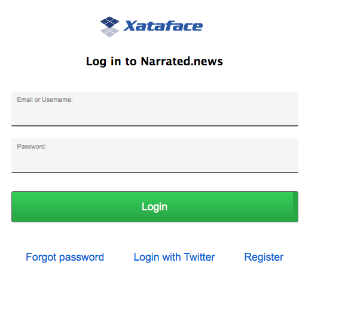
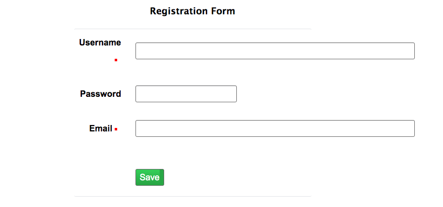
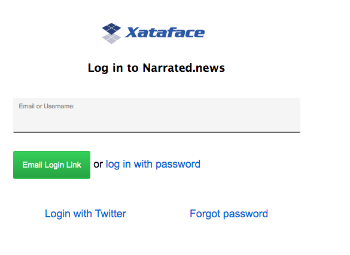
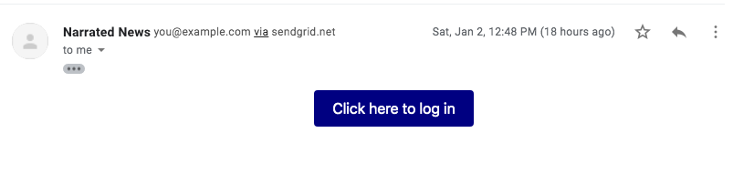
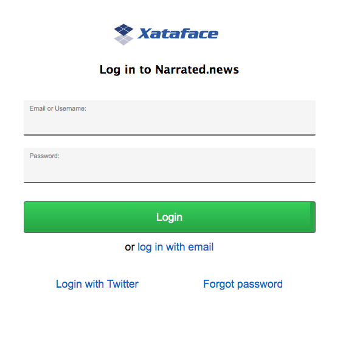
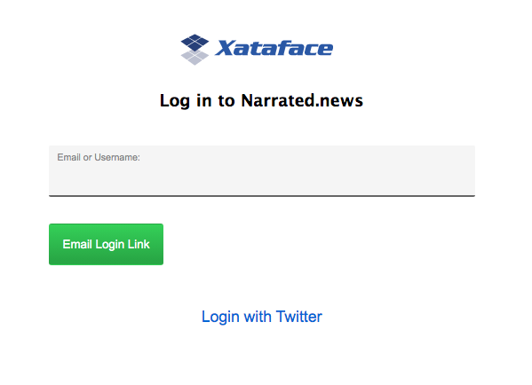
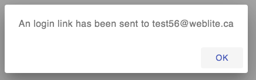
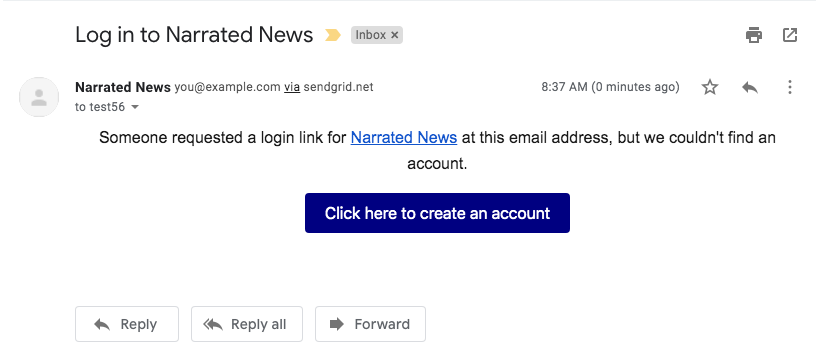

[#security]
== Security

The following chapters cover all things security-related in Xataface.

[#authentication]
=== Authentication

Xataface comes with authentication ready to roll out of the box. With a couple of configuration options in the conf.ini file, you can activate the default authentication scheme which uses a table (of your choice) in the database to authenticate against. It supports password encryption, and even includes a registration form if you choose to allow registrations for your application.

In addition Xataface's authentication is pluggable, meaning you can write your own plug-ins to integrate your application with any authentication scheme you choose. Some authentication modules that already exist include:

https://github.com/shannah/xataface-module-auth-cas[Yale CAS]::
A module to use https://developers.yale.edu/cas-central-authentication-service[Yale's Central Authentication Service] for authentication.

https://github.com/shannah/xataface-module-auth-ldap[LDAP]::
A module to use https://en.wikipedia.org/wiki/Lightweight_Directory_Access_Protocol[LDAP] for authentication.  There is also another, more advanced LDAP module developed by Viharm available https://bitbucket.org/viharm/xatafaceldapauth/[here].

https://github.com/shannah/xataface-module-auth-http[HTTP]::
A module to use standard HTTP basic authentication.

https://github.com/shannah/xataface-module-oauth[OAuth]::
A module to use an https://oauth.net/[OAuth] service for authentication.  This module provides all of the common infrastructure required to support OAuth.  There are also modules built on this module which provide authentication using a few popular web sites such as https://github.com/shannah/xataface-module-oauth-facebook[Facebook], https://github.com/shannah/xataface-module-oauth-twitter[Twitter], https://github.com/shannah/xataface-module-oauth-linkedin[LinkedIn], and https://github.com/shannah/xataface-module-oauth-instagram[Instagram].
+
See <<oauth>> for more information about setting up OAuth authentication.

==== Setting up Basic Authentication

. Create a table (if you haven't already) to store your application's users. At the bare minimum, this table should have fields to store the username and password (you may call these fields whatever you like). An example table might be:
+
[source,sql]
----
CREATE TABLE `users` (
   `username` VARCHAR(32) NOT NULL,
   `password` VARCHAR(32) NOT NULL,
   PRIMARY KEY (`username`)
)
----
. Add the following (`_auth` section) to your `conf.ini` file:
+
[source,ini]
----
[_auth]
    users_table=users
    username_column=username
    password_column=password
----
+
This tells Xataface which table you are storing your user accounts in, and the names of the username and password columns.
. Add a sample user record to the *users* table if one does not exist yet.
+
[source,sql]
----
INSERT INTO `users` (`username`,`password`) VALUES ('steve','mypass')
----
. Load your application in your web browser and you'll notice a "login" link in the upper right that allows you to log in.

==== Using Encryption for the Password

It is good practice to perform some type of encryption on passwords that you store in a database, so that they will be safe, even if your server's security is compromised. Some common forms of encryption are SHA1 and MD5. You can apply encryption to your passwords by defining the encryption property to the `password` field's section of the users table `fields.ini file`. E.g.

.fields.ini definition on the users table password field to store passwords with md5 encryption
[source,ini]
----
[password]
    encryption=md5
----

This tells Xataface to save data to the password field of the users table with MD5 encryption.

.fields.ini definition on the users table password field to store passwords with https://en.wikipedia.org/wiki/SHA-1[sha1] encryption
[source,ini]
----
[password]
    encryption=sha1
----

This tells Xataface to save data to the password field of the users table with https://en.wikipedia.org/wiki/SHA-1[SHA1] encryption.

[IMPORTANT]
====
In order to switch to MD5 or SHA1 encryption with an existing Xataface installation, all un-encrypted (plain text) passwords must be first converted to MD5. There are several ways to do this. One method is to directly convert the passwords in the database with the MySQL MD5 or SHA1 function. This can be done from the command-line or using a tool such as phpMyAdmin.
====

[TIP]
====
If you only have a small number of user accounts that require encryption to be updated, it may be easier to just change the passwords manually through Xataface by editing the user records.  They will be automatically encrypted according to the `encryption` directive in the fields.ini file.
====

==== Limiting Access Based on User

Authentication and permissions are distinct issues, but they are related. It is quite common to require a user to log in to access a section of an application. Permissions can be defined in either the Application delegate class or a table's delegate class - or both.

As an example, if we want to require users to log in to access our application we could define the following `getPermissions()` method to our application delegate class:

.Application delegate class with `getPermissions()` implemented.  This implementation allows ALL access to logged in users, and NO access otherwise.
[source,php]
----
<?php
class conf_ApplicationDelegate {
    function getPermissions(Dataface_Record $record=null){
        // $record is a Dataface_Record object
        $auth = Dataface_AuthenticationTool::getInstance();
        $user = $auth->getLoggedInUser();
        if ( $user ) return Dataface_PermissionsTool::ALL();
        else return Dataface_PermissionsTool::NO_ACCESS();
    }
}
----

==== Checking Who Is Logged In

The `Dataface_AuthenticationTool` class handles all of the dirty work of Xataface's authentication. It provides public methods to check who is logged in and perform authentication if necessary. Anywhere inside your Xataface application you can find out who is logged in using one of the following two methods:

* `getLoggedInUser()` - Returns a Dataface_Record object representing a record from the users table.
* `getLoggedInUsername()` - Returns a string.

It is quite useful in the `getPermissions()` method of your delegate classes to find out who is logged in:

[source,php]
----
function getPermissions(Dataface_Record $record=null){
    $auth = Dataface_AuthenticationTool::getInstance();
    $user = $auth->getLoggedInUser();
    if ( $user and $user->val('username') == 'shannah' ){
        // Steve is logged in so we give him special permissions
        return Dataface_PermissionsTool::ALL();
    } else {
        // Steve is not logged in so we give only read only permissions
        return Dataface_PermissionsTool::READ_ONLY();
    }
}
----

==== Checking Who is Logged In from a Template

All templates in Xataface have access to the `$ENV` array that contains references to lots of useful information, including the currently logged in user:

`$ENV.user`::
The user object of the currently logged in user (or null if nobody is logged in). This is a Dataface_Record object.

`$ENV.username`::
The name of the currently logged in user. A string.

For example:

[source,html]
----
<!-- 
     Print 'Hello Steve' if Steve is logged in,
     'Hello Helen' if Helen is logged in, or just 
     'Hello' if nobody is logged in. 
-->
Hello {$ENV.username}

<!-- Print some personal user info -->
{if $ENV.user}
    Phone number: {$ENV.user->val('phone')} 
    Email address: {$ENV.user->val('email')} 
{/if}
----

This example presumes that the users table has `phone` and `email` fields.

[#user-registration]
=== Allowing User Registration

By default, there is no way for users to create an account themselves.  A user account would need to be set up by the system administrator first.  If you want users to be able to register for accounts themselves, you can add the `allow_register=1` directive to the `_auth` section of the conf.ini file.

E.g.

[source,ini]
----
[_auth]
    users_table=users
    username_column=username
    password_column=password
    email_column=email <1>
    allow_register=1 <2>
----
<1> The `email_column` directive specifies the column that should store the user's email address. This is required for user registration since it needs to send an activation email to verify the user's email address.
<2> The `allow_register=1` directive turns on user registration.

With these settings, the login form will now contain a "Register" link as shown below:

If the user clicks on this link, they'll be taken to a registration form, which is basically a "new record" form on the Users table.  

.A plain-Jane registration form which contains fields from the users table.

The difference between the registration form and the New record form is that the registration form doesn't immediately add records into the database.  When the user submits the form, it stores the data in a special registrations table, and sends the user an email with a link to confirm their registration.  If the user clicks on this link, it will then copy the registration information into an actual record of the users table and save it.

====
**Recommended Users Table Permissions**

The registration form includes all fields of the users table that grants the "register" permission.  The register permission is the *only* permission that is part of the "NO ACCESS" role, and it is not included in any of the default roles.  Ideally you should be explicit about which fields of the users table you grant the "register" permission on.

The following is a snippet from the delegate class for the users table of an application which demonstrates one way to define permissions.

.Delegate class of users table which provides read-only access to the user record owner, and no access to other users.  It also grants the 'register' permission on the "username", "password", and "email" fields.
[source,php]
----
<?php
class tables_users {

    /**
     * Record/Table-level permissions.
     * Admins = ALL access
     * Owner (i.e. the user whose record this represents) = READ ONLY access
     * Non-logged in user = Only 'register' permission
     * Other users = NO ACCESS
     */ 
    function getPermissions(Dataface_Record $rec = null) { <1>
        if (isAdmin()) {
            // Admins get ALL access (this defers to application delegate class
            // which grants all access to admin).
            return null;
        }
        $user = getUser();
        if ($user and $rec and $rec->val('userid') == $user->val('userid')) {
            // This record is the user record for the current user.
            // give him read only access.
            return Dataface_PermissionsTool::READ_ONLY();
        }
        $user = getUser();
        if (!$user) {
            // User is not logged in.
            // Grant the 'register' permission to allow the register action
            // to work properly.
            return array('register' => 1);
        }
        
        // No access to anyone else.
        // This defers to the application delegate class which grants no 
        // access to non-admin users.
        return null;
    }
    
    /**
     * Default field permissions.
     * Non-Logged-in users = Deny the 'register' permission
     * All other users = Defer to record-level permissions.
     */
    function __field__permissions(Dataface_Record $rec = null) { <2>
        $user = getUser();
        if (!$user) {
            return array('register' => 0);
        }
    }
    
    /**
     * Permissions for username field.
     * Non-logged-in users = Allow the 'register' permission.
     * All other users = Default to default field permissions.
     */
    function username__permissions(Dataface_Record $rec = null) { <3>
        $user = getUser();
        if (!$user) {
            return array('register' => 1);
        }
    }
    
    /**
     * Permissions for password field.
     * Non-logged-in users = Allow the 'register' permission.
     * All other users = Default to default field permissions.
     */
    function password__permissions(Dataface_Record $rec = null) { <4>
        $user = getUser();
        if (!$user) {
            return array('register' => 1);
        }
    }
    
    /**
     * Permissions for the email field.
     * Non-logged-in users = Allow register permission.
     * All other users = Default to default field permissions.
     */
    function email__permissions(Dataface_Record $rec = null) { <5>
        $user = getUser();
        if (!$user) {
            return array('register' => 1);
        }
    }
    
    // ...
}
----
<1> `getPermissions()` defines record-level permissions. 
<2> `__field__permissions()` defines default field-level permission overrides.  In this case we are denying the "register" permission by default so that no fields appear on the registration form by default.
<3> `username__permissions()` overrides permissions of the "username" field to grant the "register" permission, so that it will appear on the registration form.
<4> `password__permissions()` overrides the permissions of the "password" field to grant the "register" permission, so that it will appear on the registration form.
<5> `email__permissions()` overrides permissions of the "email" field.

TIP: This snippet makes use of the `getUser()` and `isAdmin()` functions which are not a part of the Xataface public API.  They are defined separately in this app. You can see sample implementations of these functions https://github.com/shannah/xataface/blob/master/snippets/functions.inc.php[here].

====

==== Disabling Email Validation

By default the registration form doesn't create the account directly.  It will first send a validation email to the user.  When the user clicks on the "activation link" in this email, the account is created and the user is automatically logged in.

If you with to skip this step, and have the registration form create accounts directly, you can override the "register" action in your actions.ini file and override the "email_validation" directive as follows:

.actions.ini file overriding "register" action to skip the email validation step.
[source,ini]
----
[register > register]
  email_validation=0
----

[#email-login]
=== Enabling Email Login

I hate passwords.  I hate having to think of a new password every time I register for a website, as I know I won't remember it.  When visiting a website for the first time in a while, I almost always need to use the "Forgot Password" function.  This process is painful as it requires several extra steps, and, at the end of it all, I'm forced to create yet another password that I won't remember.

In many cases a better option is for the site to support "Email Login" directly.  The workflow for email login is simple:

. The login form has a single field for "Email", and a button "Email Login Link" as shown here:
+

. The user enters their email address and presses "Email Login Link".
. An email is sent to the user's email with a single-use link to log into the app.  The email looks like the following:
+

. The user clicks on the link and they are logged in directly without being hassled to enter a password.

To enable Email login, your users table must have an email field.  You may use the "username" field to store the email address if you like, but the `_auth` section of the conf.ini file needs to declare which field contains the email.

.conf.ini authentication settings which enables email login.
[source,ini]
----
[_auth]
    users_table=users
    username_column=username
    password_column=password
    email_column=email <1>
    allow_email_login=1 <2>
----
<1> `email_column` directive, specifying that the user email address is stored in the "email" column.
<2> `allow_email_login` directive enables Email login.

[WARNING]
====
If you are allowing users to log in with their email address, you should take some care to prevent duplicate emails.  Xataface puts some automatic safe-guards in place such as login won't work if it finds two user accounts with the same email address.  You should additionally add a Unique Key/Index on your email column to further prevent users from having the same email address.
====

[WARNING]
====
While you *can* use the same field for the username and email address, but I don't recommend this as users sometimes change their email address, and the username should stay unchanged to ensure referential integrity.
====

With these directives in place, the login form will look something like the following:

Notice that there is a link to "log in with password".  Pressing this link will toggle back to the password login form:

Also notice that there is still a "Forgot password" option, in case the user would prefer to log in with their password.

==== Disabling Password Login

If you have email login enabled, you can optionally disable password login entirely.  This may make sense for some services, in the spirit of "less is more" in terms of usability.  You can use the `enable_password_login=0` directive in the `_auth` section of the conf.ini file to achieve this:

.conf.ini file with password login disabled.
[source,ini]
----
[_auth]
    users_table=users
    username_column=username
    password_column=password
    email_column=email
    allow_email_login=1
    allow_password_login=0 <1>
----
<1> The `allow_password_login` directive disables password login so that email login is the only option.

With these options, the login form will not include the "or log in with password" link as shown below:

.Login form with password login disabled

Also notice that the "Forgot Password" option is no longer displayed.  With `allow_password_login=0` you'll also notice that there is no "Change Password" option once logged in.

[#email-registration]
==== Email Registration

The email login examples shown thus far have not included user registration. (See <<user-registration>>), but it is fully supported.  If the user clicks on the "Email Login Link", and there is a valid email address in the Email field, it will always at least "pretend" to send a login email.  I.e. it will always display the following dialog:

This is for security purposes to prevent malicious actors from testing different email addresses to see if they have an account.

However, depending on your authentication configuration, it will do something different.

If `allow_register=0` or `allow_register` is not set::
The system won't send an email at all, but it will log this to the PHP error log.

If `allow_register=1`::
The system will send an email, but instead of a login link, it will include a link to the registration form.  The email will look something like:
+

==== Enabling Auto-Registration

Xataface supports an auto-registration feature that helps to minimize the amount of friction involved in creating a user account.  When Auto-registration is enabled, the "Email login link" will work (almost) identically for existing user accounts as they do for non-existent accounts. 

To enable auto-registration, you can add the `auto_register=1` directive to the `_auth` section of your conf.ini file.  E.g.

[source,ini]
----
[_auth]
    users_table=users
    username_column=username
    password_column=password
    email_column=email
    allow_register=1 <1>
    allow_email_login=1
    auto_register=1 <2>
----
<1> The `auto_register=1` directive turns on auto-registration.
<2> The `allow_register=1` directive is required for auto-registration to work.

Auto-registration pertains to the scenario when a user presses the "Email Login Link" and they don't already have an account on the system.  The "normal" workflow, in this case is to send a registration link (if `allow_register=1`), which takes the user to the registration form.

With `auto_register=1`, the register link simply creates an account for the user and logs them in directly, without visiting any registration form.

This presents the minimum amount of friction possible for creating new accounts.

====
**The Register Action**

If you have email authentication enabled (i.e. `allow_email_login=1`), password authentication disabled (i.e. `allow_password_login=0`), and auto registration enabled (i.e. `auto_register=1` and `allow_register=1`), then the "Register" link will still appear on the login form, *but* it will merly display a prompt advising the user to use the "Email Login Link" button to create an account.

====

[#oauth2]
=== OAuth2 Authentication

Xataface supports Oauth2 authentication via the https://github.com/shannah/xataface-module-oauth[oauth module].  This module provides all of core functionality to support OAuth2.  
There are also modules built to provide Oauth support for specific services, such as https://github.com/shannah/xataface-module-oauth-facebook[Facebook], https://github.com/shannah/xataface-module-oauth-twitter[Twitter], https://github.com/shannah/xataface-module-oauth-linkedin[LinkedIn], and https://github.com/shannah/xataface-module-oauth-instagram[Instagram]. These "sub" modules all depend on the core https://github.com/shannah/xataface-module-oauth[oauth module].  They simply provide a few specific configuration settings to support OAuth2 on those services.

[TIP]
====
OAuth 2.0 is the industry-standard protocol for authorization. OAuth 2.0 focuses on client developer simplicity while providing specific authorization flows for web applications, desktop applications, mobile phones, and living room devices. This specification and its extensions are being developed within the IETF OAuth Working Group.

For more information about the Oauth2 spec, see https://oauth.net/2/[the official OAuth 2.0 website].
====

[#oauth]
==== Adding OAuth2 Login Support

The first step toward adding OAuth2 support in your app, is to download the https://github.com/shannah/xataface-module-oauth[oauth module] into the `modules` directory of your application. E.g.

`modules/oauth/oauth.php`

And add a a corresponding entry to the `[_modules]` section of your conf.ini file:

[source,ini]
----
[_modules]
  modules_oauth=modules/oauth/oauth.php
----

You'll also need to add the `pre_auth_types` entry to the `[_auth]` section oc your conf.ini file:

.Adding `pre_auth_types=oauth_token` to the `_auth` section of your conf.ini file instructs Xataface to attempt authentication using the oauth
[source,ini]
----
[_auth]
    users_table=users
    username_column=username
    password_column=password
    pre_auth_types=oauth_token
----

=== API Authentication

.Login sequence using example curl HTTP request.
image::images/Image-140420-113308.724.png[]

Xataface provides a REST API for authentication so that you can access your application using a REST client.  When using this API, you'll perform a request to the "login" action to obtain an authentication token.  You can then make authenticated requests to your app by adding this token in the Authorization header as a bearer token.

[discrete]
==== Login

To log in using the API, simply perform a POST request to `?-action=login&--no-prompt=1`

1. `UserName` - The username to log in with.
2. `Password` - The password to log in with.

If login succeeds, you'll receive a JSON response with a token.  E.g.

[source,json]
----
{
  "code":200,
  "token":"576646...2dDRuOGUycGI=",
  "message":"Logged in"
}
----

An unsuccessful login will look something like:

[source,json]
----
{"code":500,"message":"No UserName provided."}
----

[discrete]
==== Making Authenticated Requests

Once you have obtained a token, you should include this token in the `Authorization` header of HTTP requests.  E.g.

[source,bash]
----
curl -H 'Authorization: Bearer {TOKEN}' https://example.com?index.php
----

But replace `{TOKEN}` with your token received during login.

[discrete]
==== Logging Out

To log out, simply perform a POST or GET request to `?-action=logout&--no-prompt=1`

