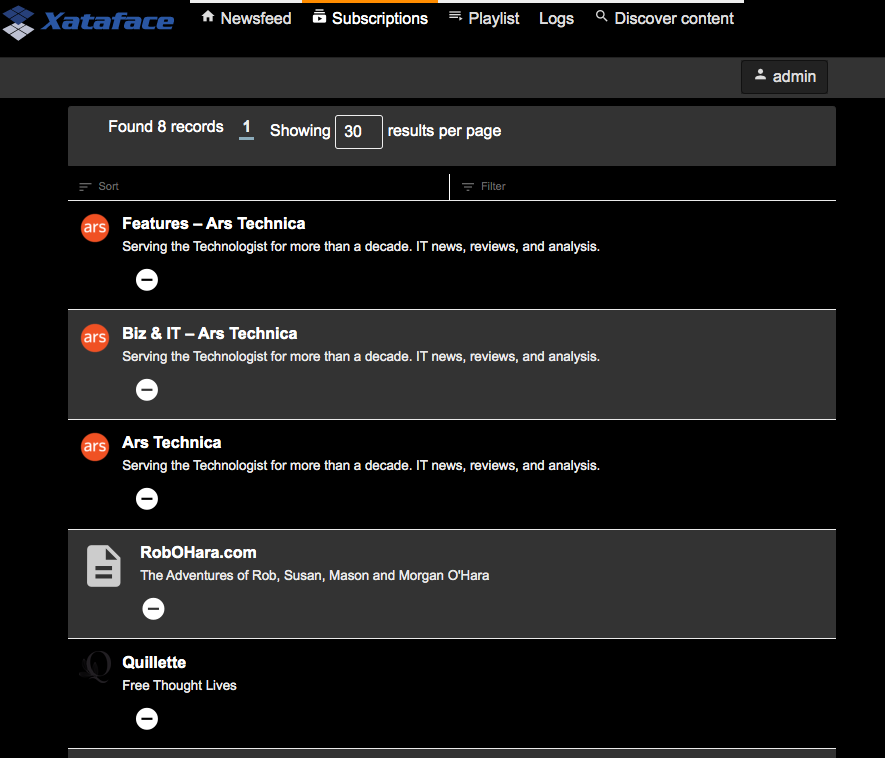
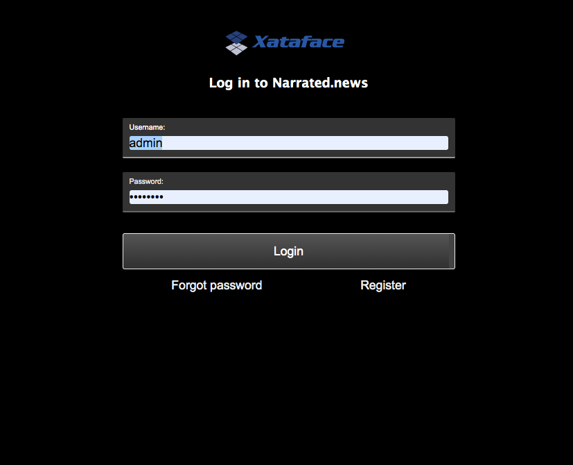
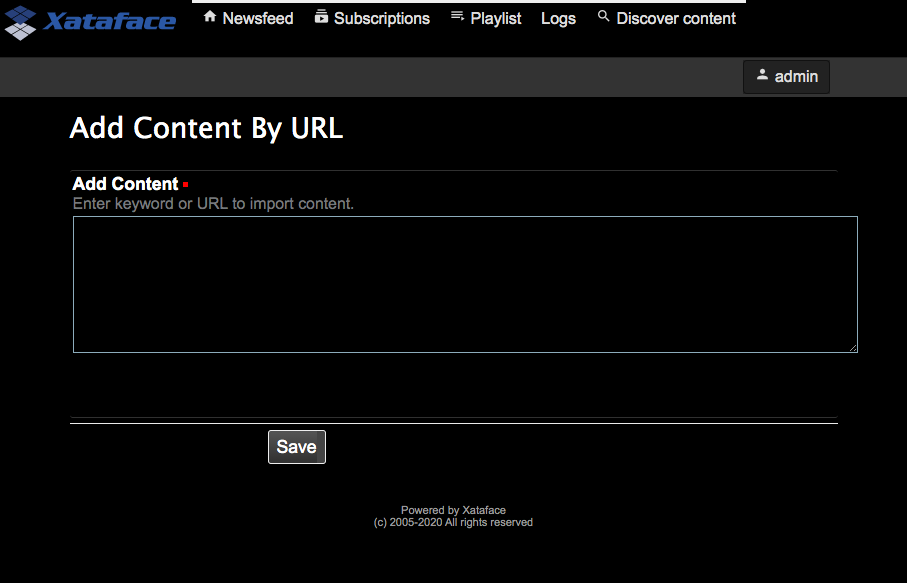

[#theme_customization]
== Theme Customization

The following sections form a sort of cook book with recipes for customizing themes in Xataface.

[#adding-a-custom-stylesheet]
=== Adding a Custom Stylesheet

[discrete]
==== Problem

You want to add a custom stylesheet to your application so that you can override the default styles, and provide styles for your custom elements.

[discrete]
==== Solution

The `xf_stylesheet()` function can be used to inject a stylesheet into either the `<head>` section of the app's page, or into the CSS bundle that is compiled by the `CSSTool`.  Let's start with the simplest case, where you want to include the stylesheet in the entire application (i.e. it should be loaded in every page of the app), and the stylesheet is hosted on a CDN (content-delivery network).  In this case, you should place the call to `xf_stylesheet()` inside the `beforeHandleRequest()` method of the application delegate class.

e.g. 

.The Application delegate class ("conf/ApplicationDelegate.php")
[source,php]
----
<?php
class conf_ApplicationDelegate {
    function beforeHandleRequest() {
        xf_stylesheet('https://example.com/styles.css');
    }
}
----

This will append a `<link rel="stylesheet"...>` tag  in the `<head>` section of every page.

[discrete]
===== Hosting Stylesheet

If you want to host the stylesheet as part of the app, it is customary to create a `css` directory in your application's main directory where you place your CSS files.  So we can copy our stylesheet into this directory:

----
myapp/
  css/
    mystylesheet.css
----

And use embed it just as before in the `beforeHandleRequest()` method.

[source,php]
----
<?php
class conf_ApplicationDelegate {
    function beforeHandleRequest() {
        xf_stylesheet('mystylesheet.css');
    }
}
----

[discrete]
===== The CSS Tool and Include Paths

`xf_stylesheet()` takes an optional 2nd parameter which is a flag to indicate whether the stylesheet should be included directly in the `<head>` section, or bundled by the CSS tool, and injected dynamically on page load.

[source,php]
----
xf_stylesheet('mystylesheet.css')
----

is the same as

[source,php]
----
xf_stylesheet('mystylesheet.css', true)
----

Which means that the stylesheet will be bundled by the CSS tool. All stylesheets in a particular request that are included using the CSS tool are bundled together into a single minified file, which is added to the document on load.  The CSS tool has a set of include paths where it looks for CSS files to include, and these paths are treated as "roots" for all CSS files.  The "css" directory is one of these "roots" by default.  This is why we only need to specify "mystylesheet.css" in the path rather than "css/mystylesheet.css" - because all CSS files processed by the CSS tool are searched relative to the include path roots.

You can set the 2nd argument to `false` to simply include the CSS file in the `<head> of the document, and not have the CSS tool process it.  In this case, you would need to include the full relative path to the CSS file.  E.g.

[source,php]
----
xf_stylesheet('css/mystylesheet.css', false);
----

[discrete]
===== When to use the CSS Tool

With two different options for including stylesheets, you might be wondering when you should and should not use the CSS tool.  Generally, I'll use the CSS tool if I'm building a module and I want other modules and apps to be able to override the CSS file.  However, if I'm just including a CSS file that will be used for my application styles, I won't use the CSS tool.

[TIP]
====
If you specify the CSS file using a full URL (e.g. "http://..." or "https://...." or "//..."), `xf_stylesheet()` won't use the CSS tool.  If you specify it as a relative path, it *will* use the CSS tool unless you explicitly add `false` as the 2nd argument.

[source,php]
----
xf_stylesheet('mystylesheet.css');        // uses CSS tool
    // Will use ./css/mystylesheet.css
xf_stylesheet('mystylesheet.css', false); // does NOT use CSS tool
    // Will use ./mystylesheet.css
xf_stylesheet('//example.com/mystylesheet.css'); // does NOT use CSS tool
xf_stylesheet('http://example.com/mystylesheet.css'); // does NOT use CSS tool
xf_stylesheet('https://example.com/mystylesheet.css'); // does NOT use CSS tool
xf_stylesheet('https://example.com/mystylesheet.css', true); // Style Doesn't 
    // 2nd arg is ignored if URL is absolute
----

====

[#changing-color-scheme]
=== Changing the Color Scheme

[discrete]
==== Problem

You want to override the default color scheme with your own color scheme.

[discrete]
=== Solution

**Add a custom stylesheet that redefines Xataface's theme color variables**

Xataface uses CSS variables to define the colors for its theme.  You can create an entirely new color scheme by simply creating a custom stylesheet (see <<adding-a-custom-stylesheet>>) which redefines these variables.  Here is a bare-bones example of such a "theme" stylesheet:

[source,css]
----
:root {

    --mainBgColor: white; /* Body background color */
    --mainTextColor: black; /* Default text color */
    --secondaryTextColor: #666666; /* Used for descriptions text*/
    
    /* Link text colors */
    --linkTextColor: #0366d6; 
    --linkTextVisitedColor: Purple;
    --linkTextActiveColor: Red;
    
    /* Colors used for block borders */
    --highlightColor: rgb(225, 228, 232);
    --highlightColorLight: rgb(236, 239, 241);
    
    --trimBgColor:#f6f8fa; /* Alt background color used for striping or providing contrast */
    
    /** Color of text in main buttons and menu items **/
    --buttonColor: rgb(118, 118, 118);
    --buttonBgColor: #28a745;
    
    /** Color of text in main buttons and menu items when selected */
    --buttonSelectedColor: black;
    
    /** Navigation tab top border color when tab is selected */
    --tabRidgeSelectedColor: darkorange;
    --menuSelectedColor: black;
    --menuBorderColor: rgb(218, 220, 224);
    --menuBgColor: #fefefe;
    --menuColor: #888888;
    
    /** Navigation tab top border color when hovering over the tab. */
    --tabRidgeHoverColor: purple;
    
    /** The navigation tab ridge color when not selected. */
    --tabRidgeColor: #eeeeee;
    
    /** Bg color of tab when hovering */
    --tabHoverBgColor: rgb(244, 246, 250);
    
    --inputBgColor: var(--mainBgColor);
    --inputTextColor: var(--mainTextColor);
    --inputBorderColor: #666666;
    --inputFocusedBorderColor: #ffa500;
    
    /** Login Form-specific Colors */
    --loginFieldBgColor: #f5f5f5;   /* Input fields background */
    --loginFieldUnderlineColor: #666666;  /* Input fields underline */
    --loginFieldUnderlineFocusedColor: #28a745;
    --loginFieldLabelColor: #888888;    
    --loginFieldLabelFocusedColor: #28a745;
    
    /* Submit buttons */
    --submitButtonBgColor: #28a745;
    --submitButtonBgImage: linear-gradient(-180deg,#34d058,#28a745 90%);
    --submitButtonTextColor: #fff;
    
    /* Alert and error message colors */
    --messageBorderColor: #222;
    --messageBgColor: #eaeaea;
    --messageTextColor: #333;
    
    /* Mobile theme footer colors.  E.g. for bottom tabs */
    --mobileFooterBgColor: #fefefe;
    --mobileFooterBorderColor: #666666;
    --mobileTabIconColor: #999999;
    --mobileTabLabelColor: #999999;
    --mobileTabIconSelectedColor: rgb(10,132,255);
    --mobileTabLabelSelectedColor: rgb(10,132,255);
    
    /* Mobile theme status bar/titlebar */
    --mobileStatusBarBgColor: black;
    --mobileStatusBarBorderColor: black;
    --mobileTitleTextColor: white;
    
    
    /* Mobile theme sidebar */
    --sidebarMenuTextColor: #fff;
    --sidebarTextColor: rgba(255, 255, 255, 0.50);
    
}

----

NOTE: The list of CSS variables may grow or change over time.  Refer to the plone.css file in the Xataface root directory for a definitive list of styles.

The following is an example "dark" theme for Xataface defined wholly overriding CSS color variables:

[source,css]
----
:root {
    --mainBgColor: black;
    --trimBgColor:#333333;
    --stripeBgColor: #333;
    --mainTextColor: white;
    --secondaryTextColor: #eaeaea;
    --buttonColor:white;
    --menuColor:#ddd;
    --highlightColor: #333;
    --highlightColorLight: #222;
    --menuBorderColor: #111;
    --menuBgColor:#222;
    --tabHoverBgColor: #444;
    --menuSelectedColor: white;
    --linkTextColor: #eee;
    --linkTextVisitedColor: #ddd;
    
    --loginFieldBgColor: #333;
    --loginFieldUnderlineColor: #666;
    --loginFieldUnderlineFocusedColor: #999;
    --loginFieldLabelColor: #eee;
    --loginFieldLabelFocusedColor: #fff;
    --submitButtonBgColor: #444;
    --submitButtonBgImage: linear-gradient(-180deg,#555,#333 90%);
    
    --mobileFooterBgColor: #333;
    --mobileFooterBorderColor: #555;
    
    --inputBgColor: #333;
    --inputBorderColor: #eee;
    

}
----

The result is:

[#user-specific-stylesheet]
=== Using Preferences to Override Color Scheme

[discrete]
==== Problem

You want to use a different color scheme depending on which user is logged in, or other run-time environment factors.

[discrete]
==== Solution

**Use the `user_stylesheet` preference to specify the name of a stylesheet to use.**

The "user_stylesheet" preference (See <<preference-directives>>) allows you to specify the name of a stylesheet to inject into the current request.  Since preferences can be dynamically defined using the Application delegate's `getPreferences()` method, you can easily use environment information such as the current user or the current URL to define a custom color scheme on a per-user basis.

For example:

.A `getPreferences()` method inside the conf/ApplicationDelegate.php file for an application that defines a custom stylesheet for user "fred".
[source,php]
----
<?php
function getPreferences() {
    $prefs = [];
    if (getUserName() == 'fred') {
        // Assuming you've defined your own getUserName() function somewhere
        $prefs['user_stylesheet'] = 'fred.css';
        
    }
    return $prefs;
}
----

Now add a CSS file as "css/fred.css" with your custom styles for fred.

See <<changing-color-scheme>> for details on changing the color scheme usinc CSS variables.

[TIP]
====
Since preferences can also be defined statically in the conf.ini file, you can also provide a custom default stylesheet by specifying the "user_stylesheet" preference there.  E.g.

[source,ini]
----
[_prefs]
    user_stylesheet=fred.css
----

In this case every user would receive the fred.css file. 
====

[#user-selected-color-scheme]
=== Allowing Users to Choose Their Own Color Scheme

[discrete]
==== Problem

You want users to be able to select their own preferred color scheme.

[discrete]
==== Solution

**Add a field to the "users" table with the `prefs.key=user_stylesheet` fields.ini property.**

Xataface allows you to override preferences values using data from the currently logged in user's record.  The `prefs.key` fields.ini directive allows you to specify that the value of the field, in the currently logged in user record, will be used as a value for the specified preference.

As an example, let's add a `VARCHAR(100)` column named "stylesheet" to the "users" table.

Add the following to the "tables/users/fields.ini" file:

.fields.ini file definition for "stylesheet" field.
[source,ini]
----
[stylesheet]
    prefs.key=user_stylesheet
    vocabulary=stylesheets <1>
    widget:type=select
    widget:label="Theme"
    widget:description="Select your preferred theme"
----

NOTE: I specify the location as "tables/users/fields.ini", but, of course, your path will depend on the name of your users table.

Notice that we specified a vocabulary for the vield.  We'll define that in the valuelists.ini file.

E.g.

."stylesheets" vocabulary defined in the valuelists.ini file; used as options in the stylesheet select list.
[source,ini]
----
[stylesheets]
dark.css="Dark Theme"
ocean.css="Ocean Theme"
.. etc..
----

And, finally, ensure that we have added our stylesheets (dark.css and ocean.css) into the "css" directory of our app.

For details on creating custom color schemes using CSS, see <<changing-color-scheme>>.

Now the user can change their own color scheme, by simply editing their profile inside the app.

[IMPORTANT]
====
The user will require edit permissions for the "stylesheet"  field of their own user record in order for this solution to work.
====

