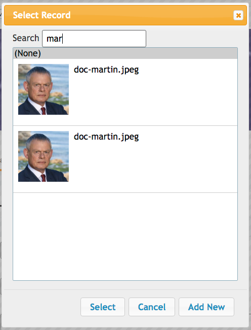
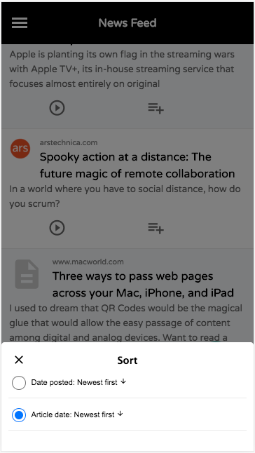

[part_appendix_javascript_environment]
= Appendix 3: Javascript Environment

Xataface defines a small set of Javascript events to notify subscribers of lifecycle events.

== Javascript Components

Xataface includes a set of Javascript components that can be reused in many different contexts.  This section lists some of theme.  

TODO: Add documentation on javascript components

=== window.xataface

The `window.xataface` object includes a number of utility classes and functions.  Some functions are always available.  Others require you to explicitly to load a script in order for them to be available.

[discrete]
==== Properties

viewport::
The current display viewport dimensions.  If the mobile footer and header are visible, then this viewport will be the bounds not covered by the header or footer.  Properties include `top`, `left`, `right`, `bottom`, `width`, and `height`.
+

.Example Using viewport to position an element
[source,javascript]
----
var viewport = xataface.viewport;
if (viewport) {
    // Position the settings wrapper 10 pixels above the footer
    settingsWrapper.style.bottom = (viewport.bottom + 10) + 'px';
}
----

=== xataface.InfiniteScroll

A component that supports infinite scrolling.  This is used by default in the mobile theme's list view.

**Since 3.0**

[discrete]
==== Bootstrapping

.Loading Script in PHP
[source,php]
----
xf_script('xataface/components/InfiniteScroll.js');
----

.Loading Script in Javascript using `require`
[source,javascript]
----
//require <xataface/components/InfiniteScroll.js>
----

[discrete]
==== Properties

scrollEl::
HTMLElement to which the scroll listener should be added.  Defaults to `<body>`

parentEl::
HTMLElement that should have elements added to it.  Defaults to the `.mobile-listing` div, which is the result list in mobile view.

action::
The Xataface action to use for fetching new rows.

pageSize::
The number of records to load each time.  Default is 30.

[discrete]
==== Methods

loadMore()::
Loads the next page of results.  If either no rows are loaded, or there is a problem loading rows (due to a network error), the InfiniteScroll's `reachedEnd` flag is set, which will prevent it from attempting to load any more records.

[discrete]
==== Usage Example

[source,javascript]
----
new xataface.InfiniteScroll({
   scrollEl : $('body').get(0),
   parentEl : $('.mobile-listing').get(0) 
});
----

[#recordbrowser]     
=== xataface.RecordBrowser

A component for selecting a record from the database.  This is used by the lookup widget for selecting records, but can be used directly via its Javascript API.

**Since 1.0**

[discrete]
==== Bootstrapping

.Loading Script in PHP
[source,php]
----
xf_script('RecordDialog/RecordDialog.js)');
----

.Loading Script in Javascript using `require`
[source,javascript]
----
//require <RecordDialog/RecordDialog.js>
----

[discrete]
==== Initialization Options

Use `new RecordBrowser(options)` to create a new dialog, and display it with the `display()` method.  The options are:

table::
The name of the table from which to select records.

value::
The name of the column to use for the value in the select list.  Set this value to `\\__id__` to use the record ID.  Default, if left blank:  If primary key of table is a single column then it will use the primary key column. If the table has a compound primary key, then it uses `\\__id__` as the default.
+
You can use the optional `display:` prefix for the value to use the result of `Dataface_Record::display()` for the field rather than simply `Dataface_Record::val()`.  E.g.
+
[source,javascript]
----
new xataface.RecordDialog({
    value : 'display:file'
    //...
});
----

text::
The name of the column to use for the text/label in the select list.  Set this value to `\\__title__` to use the record title.  This is the default, if left blank.

image::
Optional column containing an image.  If you set this value, then each row in the select list will also display an image.

imageWidth::
Optional image width in pixels.

imageHeight::
Optional image height in pixels.

filters::
Dictionary if filters to add to the AJAX requests.  You can use Xataface's URL conventions here.

callback::
Callback function that is called when the user selects a record from the record browser. It will receive an Object with key/value pairs of the selected records, where the "keys" are the values and the values are the text.

editParams::
Dictionary of GET parameters to pass to the edit form for editing records in the record browser.

newParams::
Dictionary of GET parameters to pass to the new record form for adding new records.

allowAddNew::
boolean value indicating whether the record browser supports adding new records.  Default is `true`.  If true, then an "Add New" button is included in the dialog.  When the user clicks on it, it will open a New Record Form inside a `RecordDialog` component.

[discrete]
==== Methods

display()::
Displays the dialog.

[#recordbrowser-example, discrete]
==== Usage Example

.A simple example implementing  function, `uploadCoverArt()` which can be triggered to allow the user to select records from the `nn_media` table.
[source,javascript]
----
//require <jquery.packed.js>
//require <RecordBrowser/RecordBrowser.js>
(function() {
    var $ = jQuery;
    window.uploadCoverArt = function(button) {
    
        // Callback function that will be called with the user 
        // selects a record.
        function callback(data) {
            // the data will contain something like:
            // {'admin.php?-action=getBlob&...&-thumb=itunes300' : 'doc-martin.jpeg'}
            
            // Find the parent div with the "field" class.
            var fieldDiv = $(button).parents('.field');
            
            // Find the text input in this field.
            var textInput = fieldDiv.find('input[type=text]');

            for (var url in data) {
                // We put this in a for loop, but really
                // data should only contain one value.
                textInput.val(url);
            }
        }
        
        // Create a new record browser.
        new xataface.RecordBrowser({
            // Browse only records in the nn_media table
            table : 'nn_media',
            
            // The "file" column contains an image for the record.
            // use that in the browser.
            image : 'file',
            
            // The value column (which we are interested in) is the
            // file column.  We use the `display` operation to get the result of
            // $record->display('file') instead of just $record->val('file')
            value : 'display:file',
            
            // The callback to call when the user selects a record.
            callback : callback
            
        }).display();
        
    }
})();
----

NOTE: In the above example, we called this `uploadCoverArt()` by adding `onclick=window.uploadCoverArt(this)` to an action.  See <<field-actions>> for more details on this specific example.

=== xataface.Sheet

A component for displaying content in a Sheet.  Sheets can be displayed from the bottom, left, top, or right positions, and they transition in over top of the existing page content.

**Since 3.0**

[discrete]
==== Bootstrapping

.Loading Script in PHP
[source,php]
----
xf_script('xataface/components/Sheet.js');
----

.Loading Script in Javascript using `require`
[source,javascript]
----
//require <xataface/components/Sheet.js>
----

[discrete]
==== Initialization Options

Use `new Sheet(options)` to create a new sheet.  The following options are allowed:

position:: The position where the sheet should be displayed. `top`, `left`, `right`, `bottom`.

url:: The URL to load in the sheet.  *String*

[discrete]
==== Properties

installed::
A read-only property indicating whether the sheet is currently installed in the document.

position::
The position where the sheet should be displayed in the window. One of 'top', 'bottom', 'left', or 'right'.

[discrete]
==== Methods

load(url:string)::
Load the given URL inside the Sheet.  This will be loaded inside an iframe.

show()::
Show the sheet.

close()::
Close the sheeet

[discrete]
==== Usage Example

.Function that opens the sort options dialog inside a sheet.
[source,javascript]
----
//require <xataface/actions/Sheet.js>

// ...

function openSortDialog() {
    var qStr = window.location.search;
    if (qStr.indexOf('-action=') !== -1) {
        qStr = qStr.replace(/-action=[^&]*/, '-action=mobile_sort_dialog');
    } else {
        qStr += '&-action=mobile_sort_dialog';
    }
    var sheet = new xataface.Sheet({
        url : qStr
    });
    sheet.show();
}
----
    

[#javascript-events]
[discrete]
== Javascript Events

xf-mobileenter::
Triggered on the `window` object when transitioning from "desktop" mode to "mobile" mode.  See <<responsive-ui>> for more information about mobile mode.
+
[source,javascript]
----
window.addEventListener('xf-mobileenter', function() {
    // Entering mobile mode
});
----

xf-mobileexit::
Triggered on the `window` object when transitioning from "mobile" mode to "desktop" mode. See <<responsive-ui>> for more information about mobile mode.
+
[source,javascript]
----
window.addEventListener('xf-mobileexit', function() {
    // Exiting mobile mode
});
----

xf-viewport-changed::
Triggered in mobile mode when the viewport area is changed.  The viewport is considered the area below the *mobile-header* and *mobile-footer* blocks, which are positioned "fixed" at the top and bottom of the screen respectively.  This event will allow you to reposition components whose position should depend on the size of the view port.
+
One example use of this event is the FAB button that needs to be positioned in the bottom-right corner of the viewport.  The following Javascript code will reposition the FAB whenever the viewport size is changed.
+
[source,javascript]
----
function updatePosition() {
    var zoom = document.querySelector('.zoom');
    
    if (zoom) {
        var footer = document.querySelector('.mobile-footer');
        if (footer) {
            zoom.style.bottom = (footer.offsetHeight + 10) + "px";
        }    
    }
}
window.addEventListener('xf-viewport-changed', updatePosition);
----

