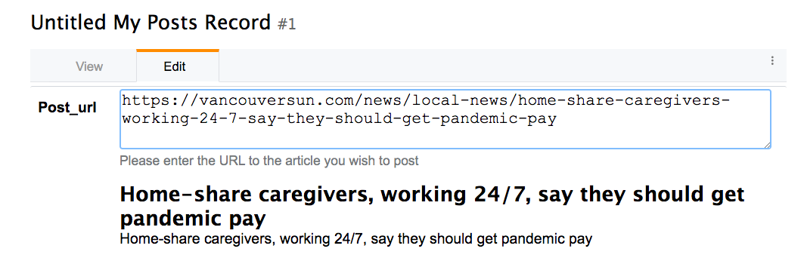

[form_customization]
= Form Customization

The following chapters form a sort of cook book with recipes for customizing forms in Xataface.

include::custom_new_record_form.adoc[]

include::using_ownerstamp_to_mark_record_ownership.adoc[]

== Redirecting User to Different Page After Saving Record

[discrete]
=== Problem

By default, when the user presses "Save" on the "Edit record form", they will be redirected back to the edit record form again after the save is complete.  You want to redirect them to a different page, such as the "View" page.

[discrete]
=== Solution

Override the "edit" action in your actions.ini file to specify the "after_action" directive.

E.g. Add the following to your application's actions.ini (or actions.ini.php) file.

.the actions.ini file. Specifying that user should be directed back to the "view" action after editing the record.
[source,ini]
----
[edit > edit]
    after_action=view
----

If you only want to apply this rule to a particular table, you can use the `after_action.{TABLENAME}` instead.  E.g.

.Specifying an after_action directive that only applies to editing records of the "users" table.
[source,ini]
----
[edit > edit]
    after_action.users=view
----

[TIP]
====
The "new" action also supports the `after_action` and `after_action.tablename` directives.  E.g.

[source,ini]
----
[new > new]
    after_action=view
----
====

== Auto-Updating a Field When Other Fields are Changed

[discrete]
=== Problem

You want the contents of a field to be automatically updated when the value of another field on the same form is changed.  For example, you have a "Program Title" field that should automatically be populated when the user selects the program ID.

[discrete]
=== Solution

You can use the `ajax_value` fields.ini property to make a field dynamically update whenever one or more other fields on the same form is changed.  When a change is detected, the field will load new data from a JSON web service specified by the URL in the property.

**Syntax:**

`ajax_value=<url-template>#<json-path-query>`

`<url-template>` is a string that is used as a template for the URL to the web service from which to load the field's content.  The template should contain one or more placeholders of the form `{fieldname}` which are replaced by the form value of the corresponding field.  

`<json-path-query>` is a http://jsonpath.com/[jsonPath] query describing which part of the JSON response should be used as the new field value.

TIP: You can omit the json path query (everything from `#`), if the HTTP request will just return plain text or HTML.

**Triggers**

The field will be updated whenever the URL would be changed.  The URL template may include variables with the syntax `{fieldname}` that will be replaced by the corresponding field when generating the web service URL.  If the values of any of the fields marked as variables changes, it will trigger an update.

**Example**

Consider the following fields.ini file:

[source,ini
----
[ProgramID]
widget:type=select
vocabulary=programs

[ProgramTitle]
ajax_value="?-action=export_json&-table=Programs&ProgramID={ProgramID}#0.ProgramTitle
----

In the above example, whenever the `ProgramID` field is changed (say to a value of "1"), it will trigger an AJAX request to `index.php?-action=export_json&-table=Programs&ProgamID=1`.

The JSON response will look like:

[source,json]
----
[{"ProgramID":"1", "ProgramTitle":"Some program", ....}]
----

When it receives the response, it will take the `ProgramTitle` attribute of the first result in the JSON response, and place it in the ProgramTitle field.  In the above example, it would be "Some program".

[TIP]
====
You can use the `widget:atts:data-xf-update-condition=empty` directive to *only* update the field value if it is currently empty.  
====

== Displaying Field Preview using AJAX

[discrete]
=== Problem

You want to display some richer feedback to the user based on the value entered into a field.  For example, on a field where the user enters a URL, you may want to display some information about the URL so that the user knows that they have entered the correct URL.  

[discrete]
=== Solution

Use the `ajax_preview` directive, which works just like the `ajax_value` directive, except that it displays the result of the AJAX request just below the field as a "preview", rather than in the field itself.

Consider the scenario where you have the following table structure:

[source,sql]
----
CREATE TABLE posts (
    post_id INT(11) PRIMARY KEY AUTO_INCREMENT,
    page_url TEXT,
    article_title TEXT,
    article_description
)

CREATE TABLE user_posts (
    user_post_id INT(11) PRIMARY KEY AUTO_INCREMENT,
    post_id INT(11),
    comment TEXT
)
----

The "posts" table is central repository of posts.  The user_posts table is for a user to "post" a comment about a post. The idea is that a particular URL should only be imported into the "posts" table once, but many users can post comments around a "post" in the "users_posts" table.  We will only give the user direct access to the "user_posts" table, where they will provide the URL they want to post along with a comment about the post.

The challenge here is that the user_posts table doesn't have a "page_url" field - just a post_id field.  We could use the depselect widget here, but this adds a step.  It would be better to hide the post_id field, and just provide a page_url field, which will automatically populate the "post_id" field with the correct post ID from the posts table.

So for our first step, we'll hide the "post_id" field and add a page_url transient field:

.Adding a transient field for the post_url in the users_posts fields.ini file
[source,ini]
----
[post_id]
    widget:type=hidden
    
[post_url]
    transient=1
    order=-1
    widget:description="Please enter the URL to the article you wish to post"
----

When the user enters a URL into the post_url field we want to trigger an AJAX request to a custom action that will:

. See if a post has already been added at that URL, and return the ID of the post if found.
. If the post hasn't been added yet, we add it, and return the ID.

In either case the AJAX request should obtain a post ID which can be inserted into the post_id field.

Such a custom action might look like the following:

.Sample Action (defined in actions/get_post_id.php) to get a Post ID for a given page url.
[source,php]
----
<?php
class actions_get_post_id {
    function handle($params) {
        header('Content-Type:text/plain');
        if (!@$_GET['page_url']) {
            return;
        }
        //echo $_GET['page_url'];exit;
        $user = getUser();
        $post = df_get_record('posts', array('page_url' => '='.$_GET['page_url']));
        
        if (!$post) {
            $post = new Dataface_Record('posts', array());
            $post->setValues(array(
                'posted_by' => $user->val('user_id'),
                'page_url' => $_GET['page_url']
            ));
            $res = $post->save();
        }
        echo $post->val('post_id');
    }
}
?>
----

We will use the `ajax_value` directive on the `post_id` field to automatically populate it from that AJAX action when the value of `page_url` changes.

.Add the ajax_value directive to populate the post_id field when post_url is updated.
[source,ini]
----
[post_id]
    widget:type=hidden
    ajax_value="?-action=get_post_id&page_url={post_url}"
----

Lastly, we want to display a preview of the page content below the page_url field.  We will use the `ajax_preview` directive for this.  First we'll create an AJAX action to display this preview, given the post ID.

[source,php]
----
<?php
class actions_ajax_post_preview {
    
    function handle($params) {
        if (!@$_GET['post_id']) {
            return;
        }
        $post = df_get_record('posts', array('post_id' => '='.$_GET['post_id']));
        if ($post) {
            df_display(array('post' => $post), 'ajax_post_preview.html'); <1>
        }
    }
}
?>
----
<1> "ajax_post_preview.html" template should be in the application's templates directory.

Now we can use this from our `ajax_preview directive:

.Adding the ajax_preview directive to update the preview automatically with post_id is changed.
[source,ini]
----
[post_url]
    transient=1
    order=-1
    widget:description="Please enter the URL to the article you wish to post"
    ajax_preview="?-action=ajax_post_preview&post_id={post_id}"
----

.Ajax preview displayed below the post_url field.

**Bonus Points**

We're not quite done.  Our current setup works great for the new record form, because the user will be adding the URL.  But if they're editing an existing record, the post_id value will already by set, but the user hasn't entered anything the post_url field (because it is transient).  We need to add an `ajax_value` directive to the post_url field so that it auto-populates based on the value of the post_id field.

We'll use the export_json action as our AJAX action so we don't need to create a custom action.

.Adding the ajax_value directive to the post_url field so that it auto-populates on the edit form.
[source,ini]
----
[post_url]
    transient=1
    order=-1
    widget:description="Please enter the URL to the article you wish to post"
    ajax_preview="?-action=ajax_post_preview&post_id={post_id}"
    ajax_value="?-table=posts&-action=export_json&post_id=={post_id}&-mode=browse&-limit=1&--fields=page_url#0.page_url"
----

== Disabling Client-side Validation

[discrete]
=== Problem

You want to disable client-side validation for a particular field, but keep the server-side validaton. 

[discrete]
=== Solution

Use the `widget:validation=server` fields.ini directive.

E.g.

[source,java]
----
[myfield]
  widget:validation=server
----

== Setting Fixed Number of Rows in the Grid Widget

[discrete]
=== Problem

You have a grid widget for editing related records on a form.  Rather than have it start with only a single row, and have additional rows appear only as the user enters data into the last row, you want it to display a fixed number of rows and have some of the data pre-populated.

[discrete]
=== Solution

Use the `widget:fixedrows` directive to a specific number of rows, and you can implement the `fieldname__prepareGridData($record, $cols, $data)` delegate method to return the data to prepopulate the grid with.

.fields.ini file
[source,ini]
----
[exam_results]
  relationship=exam_results
  widget:type=grid
  widget:fixedrows=3
  widget:cols="exam_name,exam_grade"
----

.Delegate class
[source,php]
----
class tables_students {
    function exam_results__prepareGridData($record, $cols, &$data) {
        if (count($data) == 0) {
            $data[] = array('exam_name' => 'Midterm 1', 'exam_grade' => '');
            $data[] = array('exam_name' => 'Midterm 2', 'exam_grade' => '');
            $data[] = array('exam_name' => 'Final', 'exam_grade' => ''); 
        }
    }
}
----

