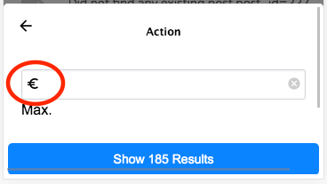

[part_sorting_and_filtering]
= Sorting and Filtering

One of the core features of any database application is the ability to sort and filter results.  Xataface applications come with powerful sorting and filtering features out of the box.  All HTTP requests define a result set in your database.  By following some simple <<part_appendix_url_conventions, URL Conventions>> you can easily craft an HTTP request targetting the exact result set you want.  At a higher level, Xataface also provides a rich user experience for sorting and filtering result sets inside the application. 

This chapter describes the UI components involved in filtering and sorting, how to use them, and how to configure them to suit your needs.

== Sorting Results

To sort a result set, you can simply click on the "Sort" button in the upper left of the list view as shown below:

.List View on desktop.  Click the "Sort" button in the upper left to reveal sorting options.  Note that the list view depicted here is using the "listStyle=mobile" directive so the results are displayed as a list of titles/descriptions rather than a table.
image::images/Image-210820-073755.419.png[]

This will reveal the sort options.

.The sort dialog on desktop allows the user to specify an alternate sort order for the list.
image::images/Image-210820-073946.197.png[]

[TIP]
====
Out of the box, Xataface will provide options to sort on every appropriate field in the table.  The table in the above screenshot only includes two sort options:

. "Date posted: Newest first"
. "Article date: Newest first"

This is because the application includes the following definitions in its fields.ini file:

[source,ini]
----
[date_posted]
    sortable-=1
    
[article_date]
    sortable-=1
----
====

You can "sort" the results by clicking on the appropriate sort option in this dialog.

[discrete]
=== Mobile UI

On desktop, the "sort" dialog slides open from the right of the window.  On mobile, it slides up from the bottom as shown below:

.Sort dialog on mobile device.
image::images/Image-210820-075054.415.png[]

One other nice feature of the mobile UI, is that when you scroll down the page, the "Sort" and "Filter" buttons are changed into floating buttons as shown below:

.Sort and Filter become floating buttons when you scroll down the page.

[discrete]
== Sort option Labels

The screenshots above demonstrate only sorting on date fields.  The labels "newest first", and "oldest" first are used by default on date and time fields.  Text and numeric fields use different labels by default.

.A sort dialog for sorting numeric and text fields.

=== Sort Configuration

Xataface provides sorting out of the box without the need for any configuration, but it is recommended that you configure the sorting behaviour explicitly for each table of your app.  In many cases you may only want to provide sorting on a few key columns.   You can use the "sortable", "sortable-", and "sortable+" fields.ini directives to explicitly mark a field as "sortable".  If no fields in your table are explicitly marked as sortable, then Xataface will make a best guess.  If it finds at least one field that is marked as sortable, then it will simply hand the reigns over to you (i.e. it won't make any fields sortable that you haven't explicitly marked as sortable, in this case).

[discrete]
==== fields.ini Configuration options

sortable::
Set this value to "1" to mark this field as sortable in both ascending and descending order.

sortable-::
Set this value to "1" to mark this field as sortable in descending order only.

sortable+::
Set this value to "1" to mark this field as sortable in ascending order only.

sort.label::
Specifies the label that should be used for this field in the sort dialog.  If this is omitted, it will use a sensible label like "Field Name: A-Z".

sort+.label::
Specifies the label that should be used for this field in the sort dialog for sorting in ascending order only.

sort-.label::
Specifies the label that should be used for this field in the sort dialog for sorting in descending order only.

**Example:**

[source,ini]
----
[date_posted]
    sortable-=1
    
[article_date]
    sortable-=1
----

[discrete]
==== Sort Actions

If sorting on individual fields doesn't provide you with enough flexibility, then you can also define actions in your actions.ini file using the "sort_actions" category.  

TODO: Add documentation on using "sort_actions" category for sorting.

== Filtering Results

To filter a result set, you can simply click on the "Filter" button in the upper left of the list view as shown below:

image::images/Image-210820-081331.232.png[]

This will reveal the filtering dialog as shown below:

image::images/Image-210820-081450.121.png[]

The filter dialog includes a keyword search field, which will perform a search on all eligible columns of the table, followed by options to filter on a selection of fields in the table.  The available fields are determined in a similar fashion to the way that sortable fields are determined.  If you define "filter=1" on *any* field of your application, it will include only those fields that are marked with "filter=1".  If you don't mark *any* fields as filterable, then Xataface will make a best guess at which fields should be filterable - defaulting to all fields except certain obvious ones such as password columns which should not be filterable.

If we follow the flow of the application depicted above, clickin on the "Author" option reveals filter options for the "Author" field.

image::images/Image-210820-082201.672.png[]

You can select one or more authors to filter the results on these authors.  The little parenthesized numbers to the right of the options indicates the number of rows in the current result set that match that author.

TIP: The "Show X Results" button at the bottom is automatically updated as you adjust your filter preferences to show you how many results match your filter.  This is helpful when you're trying to narrow down the results to a managable size, but also not to zero.

[discrete]
=== Mobile UI

As with the "sort" dialog, the "filter" dialog will slide up from the bottom of the window instead of the side when viewed on a mobile device.

.Filter dialog on mobile loads from bottom of the window.
image::images/Image-210820-090239.167.png[]

[#filter_types]
=== Filter Types

Xataface supports a few different filter types.  Use the "filter.type" fields.ini directive to specify the filter type to use for a given field.  If you do not specify this, then Xataface will try to choose the most appropriate filter to use based on the type of field.  The following filter types are supported:

text::
A text field to enter keywords to search for.  This includes options for "exact", "contains", "starts with", and "ends with".  This is the default for VARCHAR, CHAR, and INT columns.
+

range::
Search fields for "min" and "max".  This is the default for FLOAT, DECIMAL, and DATE columns.  Date columns will also provide some options to perform common searches as well.
+
.Range filter on a varchar field.

+
.Range filter on a datetime field

filter::
User can select from current values for the column in the result set, and can see the number of matches per value.
+

min::
Same as the "range" filter type, except it only includes the "Min" field.
max::
Same as the "range" filter type, except it only includes the "Max" field.

=== Filters Configuration

The following are some of the configuration options related to filtering that you can define in your fields.ini files.

filter::
A value of "1" indicates that this field is filterable.
filter.type::
The type of filter to use.  Options include "text", "range", "min", "max", and "filter".  See <<filter_types>>.
filter.label::
The label to use for the filter.  This defaults to the `widget:label` for the field.
filter.icon::
Icon to use in the text field when using the "text" filter type.  This should be the name of a material icon.  See <<material-icons>> for details about material icons in Xataface.  
filter.min.icon::
Optional icon to use inside the "min" field for min and range filters.  The icon should be a valid material icon name.  See <<material-icons>> for details about material icons in Xataface.  
+
.*Example* `filter.max.icon=euro_symbol`

filter.max.icon::
Same as `filter.min.icon` except for the "min" field.
filter.input.type::
Specify the `type` attribute of the `<input>` tag used in the "text", "range", "min", and "max" filter types.  This will be "text" by default in most fields.  It will be https://developer.mozilla.org/en-US/docs/Web/HTML/Element/input/date[date] by default for date fields, and https://developer.mozilla.org/en-US/docs/Web/HTML/Element/input/datetime-local[datetime-local] for datetime fields.
filter.sort::
Used for the "filter" filter type.  This specifies the column to use for sorting the options in the fitler.
filter.placeholder::
Placeholder text used for the "text" filter type.  Placeholder text is only displayed when the field is empty.
filter.min.placeholder::
Placeholder text used the "min" field.  Placeholder text is only displayed when the field is empty.
filter.max.placeholder::
Placeholder text used the "max" field.  Placeholder text is only displayed when the field is empty.
filter.input.*::
Specify HTML attributes on the `<input>` element used in the "text" filter type.  E.g. `filter.input.maxlength=5`
filter.min.input.*::
Specify HTML attributes on the `<input>` element used in the "min" field. E.g. `filter.min.input.maxlength=5`
filter.max.input.*::
Specify HTML attributes on the `<input>` element used in the "max" field. E.g. `filter.max.input.maxlength=5`
filter.vocabulary::
A valuelist that can be used to provide "common" search options.  These are displayed before the text or range fields to allow the user to easily select common searches.

