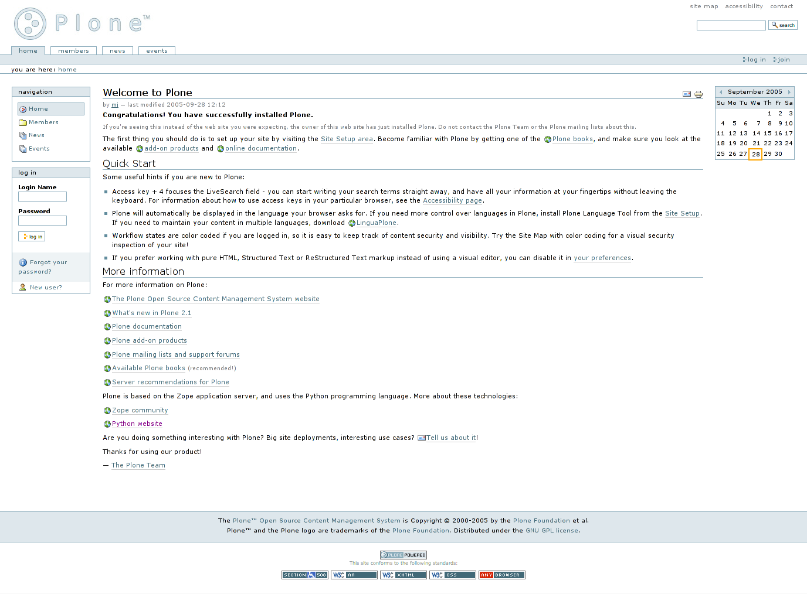

= Preface

== Pre-history of Xataface

Xataface was first released in 2005.  I had just been hired as a web services developer in the Faculty of Applied Sciences at Simon Fraser University, and I was inheriting resposibility for the maintenance and development of a relatively large content management system that had been built in-house, originally in PERL, and later ported to PHP.  

This system, named "Group Content Management System", or GCMS for short, was used to manage information about all of the research groups in the faculty.  It included profiles for faculty members, grad students, labs, research groups, publications and projects.  It included administrative back-ends for administrators to update all of these profiles, and it served as a platform to publish web sites for faculty members and research groups.

The MySQL database, on which it was built, included dozens of tables, and a fairly complex set of relationships.  The PHP code for the application suffered from too many hands in the kitchen, with no central API to manage business rules.  Each form included custom PHP code and SQL commands to handle layout and validation.  It was not "a pleasure" to work on.

At my previous job, in the Faculty of Education,  I had built many similar systems, so I had reached the point where I was a little bored of the tedium involved in creating CRUD applications, as they were known.

NOTE: CRUD stands for "Create Read Update Delete", and it refers to a class of applications where the primary functions involve creating, reading, updating, and deleting records in a database.

In the Faculty of Education we had used FileMaker extensively for our in-house databases.  It made the creation and maintenance of complex databases remarkably simple, and it provided an instant administrative user interface that was friendly for the clerical staff to maintain the database content themselves. I always felt limited by FileMaker though.  

As long as you're playing inside FileMaker's box, it was great.  But if we wanted to integrate these databases into our web site, things got tricky.  At the time, you needed FileMaker server, and the web connector, which both carried expensive licenses.  We did have these products in the Faculty, and we did use the web connector to publish a few databases on the web, but it wasn't performant and you couldn't just use SQL to query the database.  

We used https://github.com/yodarunamok/fxphp[FX.php] for interacting with the FileMaker database, which provided quite a nice abstraction layer, but we couldn't benefit from FileMaker's UI creation tools at all.  We were building our UIs from scratch, essentially, writing our own UI, validation, and queries.  In fact, I created a predecessor to Xataface that was built on FX.php, which generated the UI automatically using some config files, much the way that we do in Xataface.  This worked, pretty well, but, the reliance on Filemaker made our solutions less portable and slower than I would have liked. At this point, we weren't benefiting from FileMaker's UI development strengths at all since I was building the UI entirely in PHP, so I figured, why not try to do the same thing with a free, fast, ubiquitous database like MySQL.

And so, Xataface was born

NOTE: Originally Xataface was called "Dataface", but a Texas computer company named "Dataface" took exception to our name, and sent me a cease and desist letter.  So I changed the name to Xataface

=== The Vision

Most applications that I was building for the faculty had two parts:

1. **The "public" front-end**, which was usually integrated into a public website.  This might be the faculty profiles section of the website where faculty members' publications are displayed.  These pages would be generated using PHP, and pulling data directly from the database.
2. **The administrative back-end**.  This is the interface that allows the clerical staff to update the faculty profiles in the database.  Some applications will have a single user managing all of the content in the database, while others will allow multiple users to update different content.

The public front-end would usually be created using HTML, CSS, and standard PHP, to fetch data from the database and display it. Quite often, the website would already have a template, so it would just be a matter of fetching data from the database and rendering it inside the site's template.  For this portion of the application development, I was happy with the state of existing tools - i.e. vanilla PHP and MySQL to get the job done.  Each project was sufficiently different as to not benefit from a standardized framework.

For the administrative back-end, however, the work was tedious.  You needed to write forms to add new, edit, view, and delete records from each table.  The user interface needed to be friendly for non-technical users, since it would be used by regular folks - secretaries, faculty members, receptionists, etc..  You couldn't just set up a database administration app like PHPMyAdmin.

It seemed to me that, for this type of application, the database schema already included all of the information needed to generate the user interface.  You could look at a table and see exactly what the form would need to look like for editing records on it.  VARCHAR fields should use a text field, TEXT fields should use a textarea, DATE fields should use a date or calendar widget etc...  If we needed to provide additional configuration, such as explicitly choosing a different widget, or adding validation rules, the developer could create config files using a logical naming convention.

The first goal with Xataface was to see how much of the administrative back-end requirements could be achieved using only the database schema.  No configuration files, or custom PHP.

Of course, the first goal cannot be achieved 100%, so, the second goal of Xataface was, to the extent that the first goal cannot be achieved, how much of the administrative back-end requirements could be achieved using only the database schema, and some simple, human-friendly configuration settings.

Unfortunately, the second goal cannot usually be achieved 100%, so, the third goal of Xataface was, to the extent that the second goal cannot be achieved, make sure that the administrative back-end requirements can be fulfilled using as little custom PHP as possible.

The third goal can, in general, always be achieved.  

After each application I develop using Xataface, I do a post-mortem to identify:

1. Features that were implemented PHP which can be achieved using configuration directives. I.e. moving features from the 3rd goal, into the 2nd goal. For example, initially, validation had to be handled using a PHP function, but eventually I added configuration directives for validation such as `validators:required` and `validators:lettersonly`.
2. Features that were implemented using configuration directives which can be achieved using heuristics using only the database schema.  I.e. moving features from the 2nd goal, into the 1st goal.  For example, initially fields marked `NON NULL` in the database can default to use the `validators:required` option, so that the user is forced to provide input.
3. Features that were implemented in PHP which could possibly be packaged as a reusable module.  I.e. reducing the complexity of PHP required to achieve the third goal.

The ultimate goal is to move *everything* into the first goal, but this will likely never fully occur as there will always be some features that can't be automatically derived from the database schema - though with the advent of machine learning, I suppose anything is possible.

[NOTE]
====
**NO CODE GENERATION**

I decided early on, that I didn't want to use code generation.  Most other CRUD frameworks I had experienced used code generation to generate a basic app which would then be customized by the developer.   Code-generation sounds great at first, but it quickly becomes unmaintainable.  The first app requirements are almost never the final requirements. If you generate PHP code for an app based on the database schema, and then you need to add a column or two, you'll need to regenerate the code - which will cause you to lose any modifications you made in the mean time.

Xataface, instead uses conventions and configuration.  If you add a field to the database, you don't need to regenerate anything.  Xataface will automatically include that field in the app from then on.
====

== The Evolution of Xataface

The first project that Xataface was applied to was the Group content management system (GCMS) of the Faculty of Applied Sciences.  This was the system that was used to manage the websites for faculty members, research groups, and publications.  The database was already built, and there was an existing administrative back-end that was, in my opinion, hard to work with.  I replaced this administrative back-end entirely using Xataface.  The application itself (not counting the code inside Xataface), contained almost no PHP code, and handful of configuration files.  The underlying database was left untouched.  The result was an application that was orders of magnitude easier to maintain, and, at the same time yielded a better user experience.

.The original Dataface "List" view. This view showed the results of a query in a table.
image::images/Image-280320-091647.625.png[]

.The "Details" view in the GCMS application.  This view allowed the user to edit a single record. Originally there was no "view" tab (read only details view), only a "main" tab that allowed editing a record.  Later on, I would add a "View" and "Edit" tab in the "Details" view.
image::images/Image-280320-091749.102.png[]

.The "Find" tab in the GCMS application.  The find tab allowed searching on all fields in the table.
image::images/Image-280320-092637.616.png[]

.The "Publications" tab in the GCMS application.  This is a "relationship" tab, as it shows only the publications related to a particular profile.  One of the key innovations of Xataface was its ability to define relationships, and have the application UI take advantage of these by providing *add*, *remove*, *view*, and *search* capabilities on those relationships.
image::images/Image-280320-092823.655.png[]

After unrolling this "rewrite" of GCMS, I decided to release Xataface (then Dataface) to the world as an open source project.  I created a project on SourceForge, set up a website for it, wrote a "Getting Started" tutorial, and then returned to my day job, developing web applications or the faculty.

=== Influence of Plone on Xataface

At the time that I was developing the first version of Dataface, we were using the  https://www.plone.org[Plone] content management system for the faculty's website.  If you're familiar with Plone (circa 2005) you'll recognize the tabs, lists, and navigation menus from the GCMS screenshots.  That's because I used the plone stylesheet as a basis for Xataface's styles.  I really liked the way Plone looked, and the stylesheet had many of the UI elements that I needed for Xataface.  I needed tabs - Plone had nice looking tabs.  I needed tabular lists.  Plone has nice looking sortable lists.  I needed navigation menus.  Etc...  Some of these elements have persisted to present day.  Xataface 2.0 included a new default theme, "g2", that introduced a totally new stylesheet, but developers could still "opt out" of the "g2" theme and use the original plone theme.
Xataface 3.0 finally eliminates the original theme (nearly) entirely, but if you dig you can likely still find some elements of that original Plone theme.

.Plone content management system circa 2005.  The initial release of Xataface used the Plone stylesheet, and many aspects of the design can still be found in the Xataface of today, if you look closely.

[NOTE]
====
From Wikipedia:

Plone is a free and open source content management system built on top of the Zope application server. Plone is positioned as an "Enterprise CMS" and is commonly used for intranets and as part of the web presence of large organizations. High-profile public sector users include the U.S. Federal Bureau of Investigation, Brazilian Government, United Nations, City of Bern (Switzerland), New South Wales Government (Australia), and European Environment Agency.[2] Plone's proponents cite its security track record[3] and its accessibility[4] as reasons to choose Plone.
====

Aside from the stylesheet, Plone also inspired some other aspects of Xataface's design.  In particular, Xataface's use of actions (e.g. the actions.ini file) to inject menus, buttons, and functionality into the UI are directly pulled from Plone.  

=== Influence of FileMaker on Xataface

I've already discussed the fact that FileMaker was a key inspiration for Xataface.  I liked the way that FileMaker allowed mere mortals to both create and manage relatively complex databases. It was impressive that an office assistant,  with no programming skills whatsoever, could build a fully-functional database application with a nice user interface in a few hours.  To do the same thing with PHP and MySQL would take a software developer weeks, and it likely still would have been missing features that the FileMaker app provides out of the box.

The Xataface "Details", "Find", and "List" tabs were an answer to FileMaker's "Details", "List" and "Find" modes. 

The one mode that Xataface didn't provide an answer for is the "Layout" mode, which is the mode of FileMaker that allows users to design their own forms using a drag and drop palette of widgets and a canvas.  Xataface, instead, just used HTML for its views.

One day, I'd like to add such a tool to Xataface, but, frankly, it's difficult to do well, and time is almost always better spent extending Xataface's other features.

=== Outgrowing the Mould

At the beginning, Xataface was just intended to be an open source alternative to FileMaker.  It didn't take long, however to start growing in its own direction.  Today it has become a full-featured platform on which arbitrary data-driven web applications can be built.

Early on, I added support for modules, custom actions, and pluggable authentication.  These foundational elements enabled grown into application types not originally envisioned.

Xataface was being downloaded thousands of times per week from SourceForge, and developers were contacting about a diverse range of applications that they were building.  Over the next few years, I used Xataface as the foundation for many side projects including:

. An auction application, https://github.com/shannah/webauction[WebAuction], which has hosted hundreds of online auctions for non-profit organizations ranging from the United Way, to the SFU Plant Sale.
+
.WebAuction used to host the annual SFU platsale was written with Xataface.
image::images/Image-290320-090051.779.png[]
. A church library application, LibrarianDB,  for managing the books in a church library.
+
.LibrarianDB, developed with Xataface, was developed to help manage books in a church library
image::images/Image-290320-090701.286.png[]
. A general content management system for a website ("Little Content Management System" or LCMS).
. A registration system for people to apply for sessional instructor, and TA positions in the faculty.
. Survey Builder, an application for creating and hosting surveys online.
+
.A survey built and hosted by SurveyBuilder.
image::images/Image-290320-091221.806.png[]
+
.Administrative back-end for SurveyBuilder.  This uses the g2 theme.
image::images/Image-290320-091301.571.png[]
+
.Editing the survey content for SurveyBuilder in the Xataface back-end.  This used the CKeditor module for WYSIWYG HTML editing.
image::images/Image-290320-091403.237.png[]

Over the years, Xataface has added countless features that improve the developer and user experience alike. I have enjoyed building it, and I sincerely hope that you enjoy using it to build your own creations.

