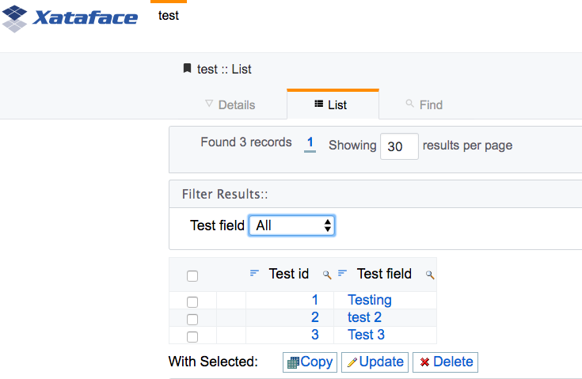
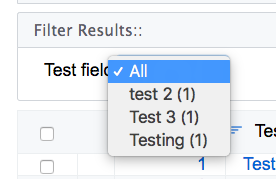

== Adding Option to Filter Result LIst

[discrete]
=== Problem

You want to add a drop-down list for the user to select filters for the result set.

[discrete]
=== Solution

Use the `filter` directive in the fields.ini file on any field that you want the filter to be added for.

.Field definition in fields.ini file using the filter directive.
[source,ini]
----
[test_field]
  filter=1
----

Now, if you navigate to this table's list view, you'll see a drop-down list at the top of the results where you can select all of the distinct values in the `test_field` column.

.List View when a filter field defined.

.Expanding the filter list, you can see all of the distinct values for the test_field column.

If you select one of the options, it will filter the results to only show those results that match the filter.